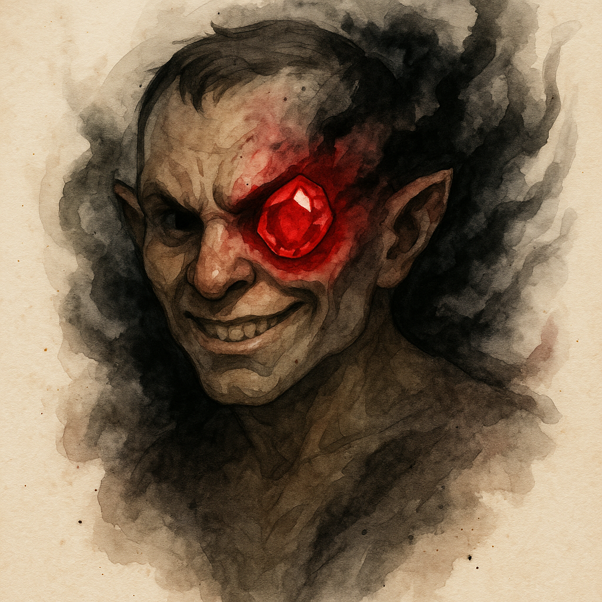

# Oculus of Abaddon

> [!side]
> :   
>
>     by ChatGPT

*As recorded by Linzi, Minister of Communication of Thumping Waters*

I wish I could say the Oculus of Abaddon is subtle.

It isn’t.

Some artifacts hide their hunger behind beauty or mystery. This one advertises it plainly, like an open wound daring you to look away. It appears as a crystal sphere, perfectly clear, with a single ember-red spark drifting at its heart. That spark never quite stays still. It twitches. It watches. And the longer you look at it, the more certain you become that it is looking back.

I have only known one person who actually held it.

Ant did not hesitate.

There was no chanting, no deliberation, no long discussion about risks or safeguards. He picked it up, went very still for half a breath, and then—without drama, without flinching—removed his own eye and set the Oculus in its place. The room went silent in that awful way silence does when everyone present realizes they have just witnessed something they will never be able to explain to anyone else.

The horror of the act was immediate. What followed was worse.

The pain did not linger. The bleeding stopped far too quickly. Ant straightened, tested his balance, and looked around with a kind of focus I had never seen in him before. It was not madness. It was clarity. That is what frightened me most.

He later tried to explain it, and I believe him when he says the thought arrived fully formed. Not whispered. Not coaxed. Simply obvious. The eye he had been born with was insufficient. The Oculus did not force him. It made the alternative feel absurd.

From that moment on, Ant was never truly blind again. Not in the way the rest of us are.

Darkness ceased to matter. Distance thinned. He spoke of places he could not possibly see and people he could not possibly hear, and he was always correct. The Oculus sees through walls, through miles, through the borrowed senses of beasts and companions alike. It turns the bearer into a still center of observation, a quiet place from which terrible knowledge radiates outward.

But seeing is only the beginning.

The Oculus is a tool of arrangement. It nudges events rather than commanding them. It bends decisions without announcing itself. It plants ideas that feel like conclusions the bearer reached on their own. Ant was careful—more careful than most would be—but even he admitted that the line between intention and outcome began to blur. Not because he wanted harm, but because the Oculus is very good at presenting harm as an efficient solution.

History remembers what happens when the Oculus is used without restraint. Entire communities have been emptied by a single shared certainty, a sudden understanding that it was time to leave, time to go somewhere else, time to walk willingly toward disaster. No screams. No panic. Just obedience to an idea that felt collective and inevitable.

This is why some claim the Oculus was a gift from the Horsemen of Abaddon themselves. I do not know if that is true. I almost hope it is. The alternative—that mortals once learned to build something this adept at mass despair—is far more unsettling.

Unlike many relics of its kind, the Oculus can be destroyed. It breaks under force. It recoils from goodness. And yet even damaged, it resists ending, knitting itself back together as if reality itself were reluctant to let it go. That feels instructive. This is not an artifact meant to endure forever. It is meant to be used decisively, catastrophically, and then erased by someone with the courage to accept what it has done.

If you ever feel the urge to look through it “just once,” remember this: the Oculus does not take an eye because it needs somewhere to sit.

It takes an eye because it wants you to see the world the way it does.

## Mechanics

### Oculus of Abaddon

*Artifact recovered from the ruins of Vordakai’s domain.*

**Item Level** 15
**Rarity** Rare
**Traits** Artifact, Magical, Necromancy, Conjuration, Divination, Evil
**Bulk** —

An oculus of Abaddon is a potent artifact rumored to have been created by one of the Four Horsemen of the Apocalypse as a reward for mortal agents acting on Abaddon’s behalf. More likely, these relics were crafted by a powerful pre-Earthfall death cult, leaving behind instruments of temptation and mass ruin long after their creators vanished.

#### Appearance

An oculus of Abaddon appears as a sphere of clear crystal containing a pinpoint of flickering red light at its center. When held, the oculus feels warm to the touch and fills the bearer with an overwhelming urge to remove one of their own eyes and place the artifact within the empty socket.

#### Implantation

Plucking out an eye to insert the Oculus causes **4d6 persistent bleed damage**. Once placed within an empty eye socket, the artifact immediately heals all damage caused by the act of removal.

After implantation, the Oculus can only be removed by forcibly tearing it free, causing the same **4d6 persistent bleed damage** as the original insertion.

While implanted, the bearer gains **constant darkvision**.

#### Drawback — Whispered Compulsion

If the bearer is not evil, each time they activate the Oculus of Abaddon, they must succeed at a **DC 36 Will save** or become affected by a **subconscious suggestion** (heightened to 8th level) to perform an evil act the next time an opportunity to do so arises, as determined by the GM.

These compulsions feel reasonable and justified to the bearer, rarely presenting themselves as overt malice.

#### Activations

##### Distant Sight

**Activate** 10 minutes (envision)
**Frequency** three times per day

You gain the effects of **scrying**, heightened to 7th level.

##### Planar Binding

**Activate** Cast a Spell
**Frequency** once per week

You use the Oculus of Abaddon to cast the **planar binding** ritual, heightened to 7th level. You can only conjure neutral evil creatures with this casting.

If you already know the planar binding ritual, you gain a +3 item bonus on the primary check when casting it through the Oculus.

##### Borrowed Senses

**Activate** three actions (envision)
**Requirements** You have a familiar or animal companion

You can see and hear through your familiar or animal companion’s eyes and ears, provided you are on the same plane. This effect can be sustained, but while doing so you can take no other actions.

##### The Long Suggestion

**Activate** 1 hour (envision; evil)
**Frequency** once per year

You manipulate the minds of a vast number of creatures, provided the intended outcome is tragic or horrific.

This functions as **suggestion** with a range of 1 mile. All creatures within the area are affected and receive the same implanted suggestion. Each creature hears the suggestion in its native language.

Creatures of 7th level or higher can attempt a **DC 36 Will save** to resist the effect. If the effect is counteracted or removed from any one victim, it immediately ends for all affected creatures.

This power was used by Vordakai to cause the vanishing of Varnhold, compelling its inhabitants to abandon their homes and travel south to his tomb.

#### Destruction

Though foul and hideous, the Oculus of Abaddon is relatively easy to destroy for an artifact—if one can overcome its regenerative properties.

**Hardness** 25
**Hit Points** 100

The Oculus repairs itself rapidly, regaining **10 Hit Points per round** unless destroyed outright.

It has the following weaknesses:

- Weakness 10 to bludgeoning damage
- Weakness 30 to good damage

---
