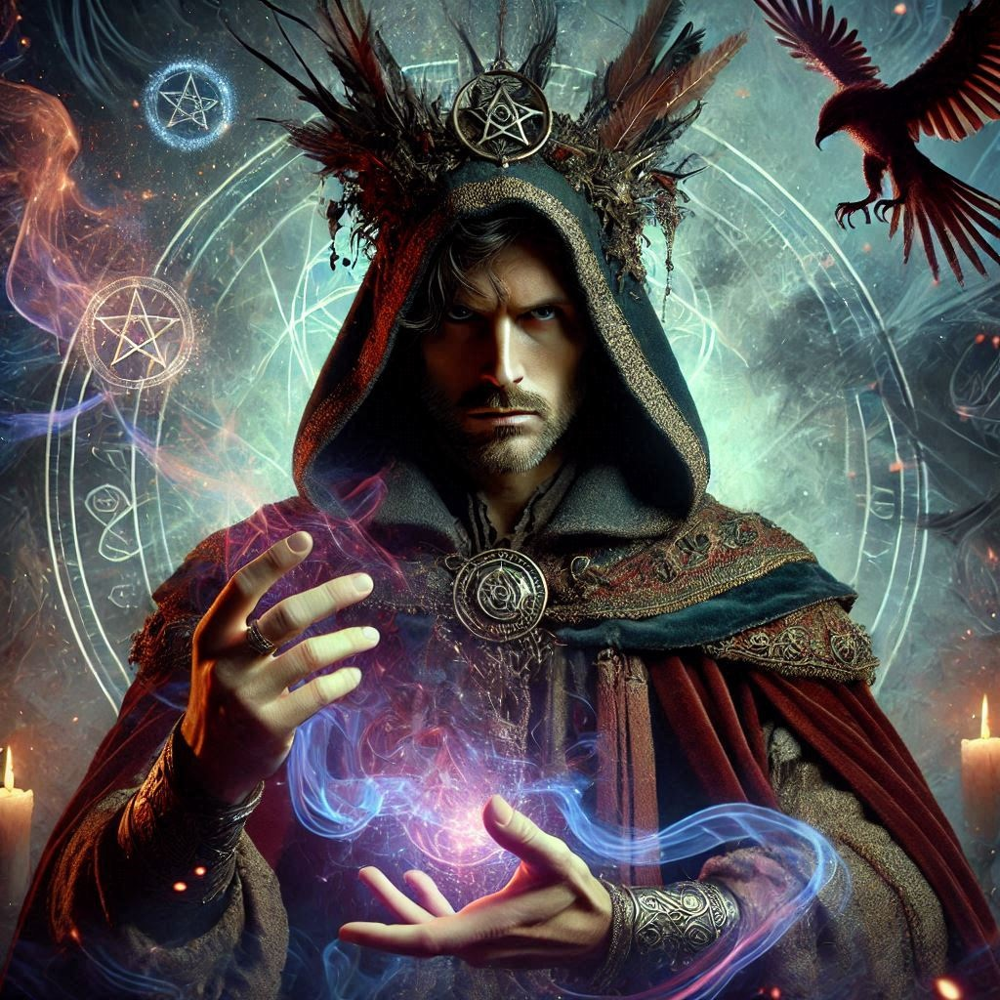

# Leif Darkwood

*Former adventurer in Otari and one of the early explorers of the Abomination Vaults*

Leif Darkwood was a spellcaster and adventurer who joined the effort to investigate the dangers beneath Gauntlight. Though perhaps best remembered by his companions for his enthusiastic reliance on *electric arc*, Leif's involvement in Otari's troubles extended beyond the ruins themselves. He had taken on a personal obligation to Keeleno Lathenar, the owner of the Otari Market, and promised to uncover the fate of the werewolf Jaul Mezmin.

## Finding Jaul

Thirty years before Leif's arrival in Otari, Jaul Mezmin had been a druid associated with the Gozren worshipers at Stone Ring Pond. Unknown to his companions, Jaul was also a werewolf. During one of his transformations, he lost control and killed Keeleno's wife, Ayla Lathenar.

Jaul was pursued after the killing and driven from a cliff into the ocean, but his body was never recovered. Keeleno never accepted that this proved the werewolf was dead. Decades later, still mourning Ayla and convinced that her killer had survived, he entrusted Leif with finding Jaul and settling the matter.

Leif never had the opportunity to fulfill that promise.

## The Abomination Vaults

Leif accompanied the adventurers exploring the Abomination Vaults beneath Gauntlight, where he served as one of the party's spellcasters. His tendency to answer problems with *electric arc* became enough of a habit to be remembered as one of his defining characteristics.

His final expedition took him into the deeper levels of the Vaults, where the party encountered the powerful fiendish creatures serving as gaolers of an infernal prison. During a chaotic retreat, Leif became separated from the others and was cornered by one of the gaolers. Unable to escape, he was killed.

Later encounters with additional gaolers confirmed just how dangerous the creatures were and the role they played as wardens within that portion of the Vaults.

## A Soul in Gauntlight

Leif's death was not the end of his connection to Gauntlight.

The party eventually learned that his soul had never passed into the afterlife. Like other victims of the lighthouse's malign power, Leif's spirit had become trapped within Gauntlight itself. His essence was being slowly consumed, transformed into fuel for the ancient structure and the evil that sustained it.

The revelation made his death more than another casualty of the expedition. Even after his companions escaped the encounter that killed him, part of Leif remained imprisoned in the place they were fighting to destroy.

## Legacy

Leif died with unfinished business in Otari. His promise to Keeleno remained unfulfilled, and the question of Jaul Mezmin survived him. The werewolf was eventually discovered alive, vindicating Keeleno's decades-long belief that his wife's killer had survived the fall from the cliffs.

For Leif's surviving companions, however, his more immediate legacy remained tied to Gauntlight. He was one of their own claimed by the Abomination Vaults, and the discovery that even death had not freed him gave them another personal reason to see the lighthouse's power broken.

And, among those who adventured beside him, it is difficult to remember Leif Darkwood without remembering *electric arc*.
