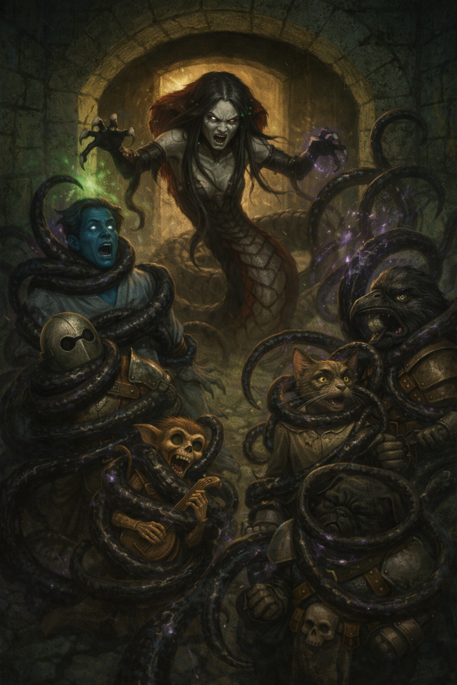

# A Brief Lesson in Indoor Voices

> [!side]
> :   

Vethris had been having an excellent nap.

Not a deep one—those were a mistake—but a proper, coiled half-sleep where the stone was warm, the air was still, and the vaults had the decency to keep their nonsense at a respectful distance. Her body was wrapped in itself, scales pressed to stone, breath slow and even.

Then the vaults started being loud.

At first she ignored it. That was the rule. The Abomination Vaults were never quiet—they groaned, they whispered, they leaked. Noise meant nothing. Noise was background. If she reacted every time something screamed or clanged, she’d never rest at all.

She tightened her coils and let out a slow, annoyed breath through her nose.

The noise escalated.

Steel rang. Mud slurped wetly. Someone shouted something triumphant, which was always a bad sign. And under it all—thin, reedy, whining—were the Children of Belcorra. Those half-preserved little failures, shrieking and scrabbling and playing at purpose like they always did.

Vethris’s hood twitched.

*“Oh, for fuck’s sake,”* she muttered.

She waited. Counted heartbeats. Tried to sink back down.

Then something exploded into pieces, and one of the Children screamed in that awful, high pitch they used when they realized—again—that pretending to be important did not make them durable.

Vethris hissed, long and venomous.

*“Useless,”* she growled. *“Every single one of you.”*

She shifted, coils sliding against stone. The nap was gone now—ruined beyond recovery. Another crash followed, closer this time, and someone laughed.

A living laugh.

Her eyes snapped open.

*“That’s it. That’s fucking it.”*

She uncoiled and slithered toward the door, hood flaring as she went. Every sound beyond it grated—mud churned by boots, sloppy spellwork, the Children yelling about games and mothers and unfair turns. She hated all of it. She hated that they couldn’t even die quietly.

She stopped before the door.

Paused.

For just a moment, she considered leaving it closed. Letting the noise resolve itself. Death, at least, had manners.

Then something struck the door from the other side.

Her jaw tightened.

*“Oh no,”* she said softly. *“Absolutely not.”*

She surged forward and tore the door open with a violent snap of her coils, stone shrieking as it swung wide—

And Vethris reared up, hood spread, voice cracking like a whip through the chamber:

***“Shut. The fuck. Up.”***

