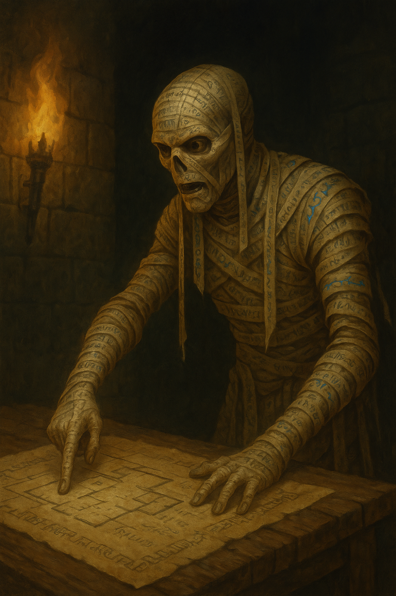

# Chafkhem’s Warning

> [!side]
> :   

### The Mummy’s Warning

The mummy’s bandaged hands trembled slightly as he traced a curling glyph into the dust, the last remnants of his containment circle unraveling. Pale light guttered out, leaving only the green-blue shimmer of the heroes’ torches reflecting off his desiccated skin.

“So,” he rasped, voice like sand dragged over glass, “you’ve done it. The worm has fallen.” He looked up, the hollow sockets of his eyes gleaming faintly gold. “I should have liked to see Jafaki’s face when the knife went in. Did it even have one, in the end? No matter. You have done what I could not in five centuries.”

He stood, bones creaking like dry reeds, and gestured for them to follow him to the cluttered desk that had served as his prison companion for untold years. The parchment there was brittle, layered and scratched with thousands of marks, but his hand hovered over it with reverence.

“Do you even understand what this place was?” he said, voice hardening. “Belcorra Haruvex’s vaults were not merely a tomb for her madness—they were a factory. The upper halls were her own sanctum, a monument to vanity. But here—” he jabbed a finger toward the floor, “—these middle levels were the forge where she shaped monsters and soldiers for her grand war upon the surface. We trained them in my Arena below. I broke their bodies until they learned to fight like beasts. And when they broke too easily, they went below—to Jafaki.”

He spat the name like a curse. “That one was no soldier. It found her in the Darklands, crawling with its brood. It offered service and science, and Belcorra, fool that she was, mistook hunger for loyalty. The sixth level was once my auxiliary chambers, beast pens, training stores. She gave it to the seugathis to turn into their laboratory. They called it refinement. I called it blasphemy. They made horrors in glass vats and then sent the survivors back to me for testing. Failures went back to Jafaki for recycling. The cycle was elegant, efficient—and damned.”

He turned away, pacing, his wrappings whispering. “Then Belcorra fell. Her death should have ended all of it, but of course nothing in this cursed pit ever dies clean. Her devils squabbled for command. Urevian—her contract devil, a phistophilus of no small arrogance—claimed the right to rule. He built a prison below us, complete with all the hellish trappings he so adores. But the worms rebelled. Jafaki killed the bone devil Tarkannah and claimed the laboratory for itself. Urevian tried to press the attack, but neither side could finish the other. The stalemate lasted centuries—devils in their infernal redoubt, seugathis festering in their labs, and my Arena left as a midden heap between them.”

He gave a bitter laugh. “Do you know what happened then? The Darklands found out. Word spread—‘Jafaki the fleshweaver can make you perfect.’ Arrogant fools came crawling up from below, begging to be improved. The seugathis took them, of course. The failures wandered the halls or drank themselves into madness in that pit they called a tavern. The Twisted Brew, they named it. A place where the unmade toasted their future disfigurement. Hah.”

He leaned heavily on the desk, the cords of his neck creaking. “All of it continued because no one ever burned the roots. You have done what I could not. And now, perhaps, this place can finally settle into the dust.”

Straightening, he drew a long breath that whistled through the cracks of his ribs. “Take these,” he said, sliding a piece of parchment across the desk. “The map of the Arena level—every passage, every secret door, and the word that silences the trap at the eastern end. My last service to this graveyard. I am leaving it behind.”

He looked to the corridor, where the shadows of the Vaults waited like a patient sea. “Belcorra is dead again, I hope? Then the rest will follow. But mark me: if she has risen, if her shade still stirs this ruin, then the war she dreamed of may not yet be finished. The devils will remember their contracts. The worms will remember their hunger.”

Chafkhem’s voice softened to a near whisper. “And the next time the Vaults wake, it will not be for Absalom. It will be for you.”

---

### The Cleric’s Question

It was dizzying what information the mummy provided to their group. August Shepard was stuck on the part that Belcorra's shade could still haunt this ruin—and that her aim could well be to raise an army to overwhelm the entire isle. In service to Nhimbaloth, this force would likely attack in body, mind, and soul. It would make what happened in the graveyard above the library pale in comparison. The implications were staggering.

The cleric couldn't worry about that. It was too big. Step by step. The Roseguard found a way to stop this. They would too. One problem at a time.

“Thank you for your knowledge.” August Shepard struggled to find a respectful way to refer to Chafkhem. He quickly settled on one choice and hoped it did not offend. “Ancient one, if Urevian is a contract devil, do you know the nature of the contract he is bound by? And also, is there anything Urevian would value that we could use to have him cease his activities and return to his plane of existence? Hopefully something other than our souls?”

---

### The Price of a Devil’s Freedom

The mummy’s golden eyes flickered, their light dimming as if August’s question had drawn him back into old, unpleasant memories.

“So,” Chafkhem murmured, “you begin to grasp it. The ghost that built this place was a tyrant, but the devil she bound was a craftsman of contracts. His name was Urevian, and his prison is his own ambition.”

He straightened, the motion slow and deliberate, every shift of bandage whispering like dry parchment. “When Belcorra forged her bargain, she promised him a soul—a *Rajani* soul. The Roseguard’s swordswoman, Vol Rajani, was the one he sought. She was meant to be the payment for his service, the coin to buy his return to Hell. But when Belcorra fell, she died too soon, and Urevian was left with a contract unfulfilled and chains he could not break. You see the elegance of it? He cannot leave without that soul, or the nearest living blood to it. The terms bind him more surely than any magic circle could.”

He stepped closer to August, voice dropping to a rasping whisper that still filled the hall. “The line has endured. There is still a Rajani—**Carman Rajani**. Belcorra’s devil has spent centuries watching that bloodline decay, waiting for the last ember to gutter out so he can snatch the smoke. The contract’s wording is precise but cruel: *if not Vol, then her final descendant.* That is the soul Urevian craves. With it, his debt is settled, his duty ends, and he can crawl back to Hell with clean hands.”

Chafkhem’s hollow gaze lingered on August. “No treasure or oath will serve. You cannot bribe him with gold, nor flatter him with faith. A contract devil bargains only in exact terms. The only way to be rid of him is to grant him his payment—or destroy him before he collects.”

He looked past the cleric, to the darkened tunnels that led deeper into the Vaults. “If you yield Carman Rajani, he will depart. The barrier will fall, and his legions will follow him into the pit that spawned them. If you deny him, you will face him in battle. Not his servants. *Him.* And he has had centuries to sharpen his cunning and his claws.”

The mummy began to gather his papers, each sheet crumbling faintly at the edges. “I have no wish to see that day. I have spent too many lifetimes among these walls, watching ambition rot into hatred. My vengeance is complete. Jafaki is dead. The balance is settled.”

He paused at the doorway, the faint green torchlight throwing his shadow long across the floor. “So choose, mortal. Give the devil his coin, or take up your blade. There is no third road.”

He turned, already fading into the dark. “And remember this, cleric—devils don’t lie when the truth will damn you just as well.”

