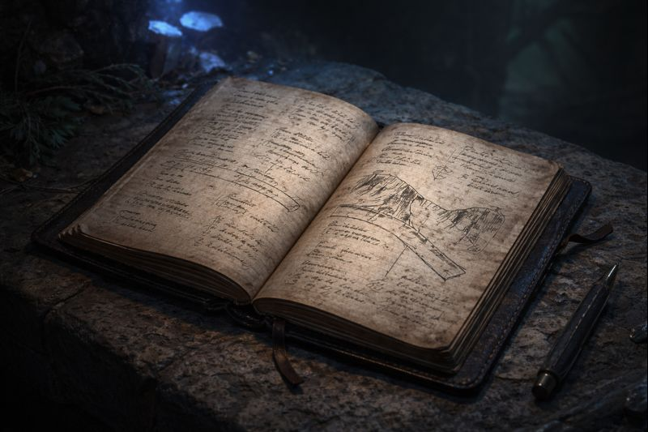

# Field Notes from the Lower Vaults · Unscheduled Activity · Chasm Watch, Third Rotation

> [!side]
> :   

“…the creature had the advantage.”

“It should have ended there.”

“It didn’t.”

“They entered the shed.”

A pause.

“…how long?”

“Long enough.”

“They came back out.”

“All of them?”

“Yes.”

Another pause.

“They didn’t flee.”

“No.”

“They withdrew. Ordered. Together.”

“…surface folk don’t usually do that.”

Silence.

“Where are they going?”

