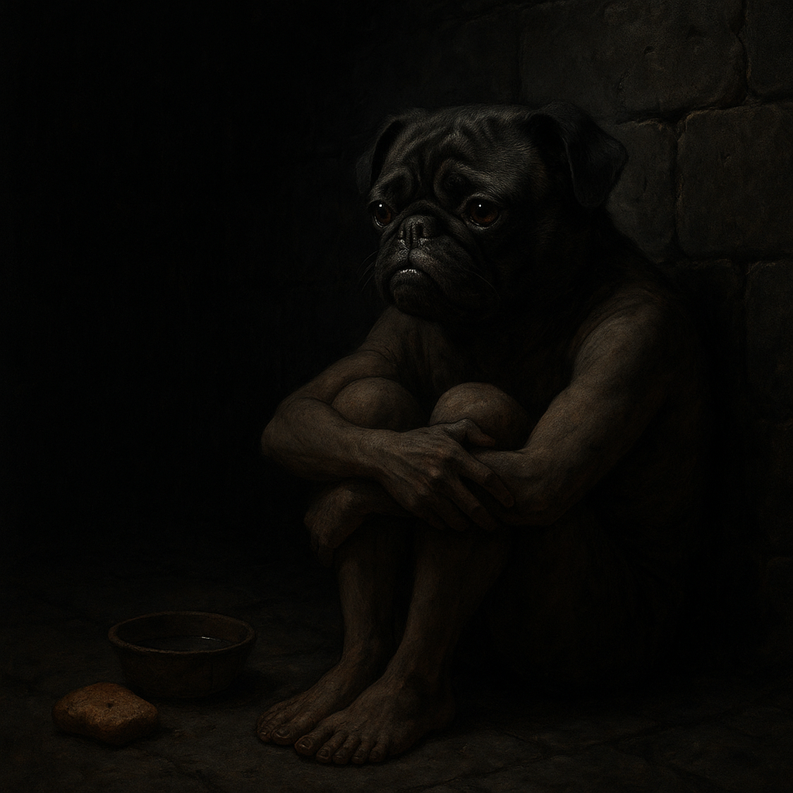

# Madness Approaches

> [!side]
> :   

…stone. Breathing with me.
Walls sweat. Drip-drip like blood.
I count them. Lose count. Start again.

Footsteps. No—heartbeat. My own? Too loud. Not mine.
Something listens. Just past the door.
It laughs, quiet, like bone against bone.

Food hits the floor. My food. Wrong. Smells of me.
They took it from my pack. They know my hands. My hunger.
Mocking me.
I chew anyway. Salt of my own sweat.

The water talks.
Rot on my tongue, whisper in my gut.
*Drink. Drink and change.*
I swallow. I hate myself. I swallow again.

Names flicker.
Theron. Talia. August. Comet. Malaroth.
Shadows wear their voices.
Comet giggles in the corner. *“Come on, Kiri, just laugh, it won’t hurt.”*
Talia hisses, broken. *“Don’t look at me. Don’t look.”*
I press my hands to my ears but the dark is inside my skull.

The cell shifts. Bigger. Smaller.
Breath scrapes my throat raw.
*How long?* The dark says: *Forever.*

I am Kiri.
I am teeth.
I am rage.
When they open the door, I’ll bite out their throat.

But the dark chuckles.
*You’ll never leave. You’re already ours.*

