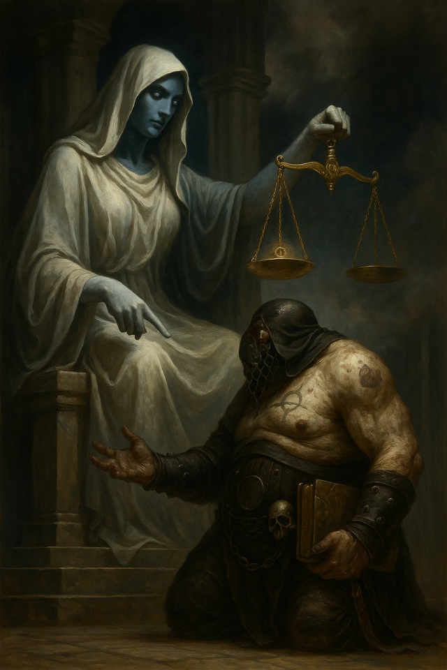

# Malaroth's Judgement

> [!side]
> :   

The dark void of the Boneyard stretches endlessly in every direction—an eerie plain of cracked gray stone beneath a violet-black sky that churns like storm clouds suspended in time. Countless souls await judgment in solemn silence, watched by psychopomps cloaked in shadow and bone.

Malaroth’s soul, twisted and strange, flickers like a faulty lantern among them. His fleshwarp nature marks him as unnatural. His soul is stitched with scars—evidence of his tampering with death, evidence he cannot hide.

He is summoned.

The spiral throne of Pharasma, goddess of birth, death, and fate, rises before him. Her eyes—one a void, one a star—burn through the layers of his soul like wind stripping bark from a dying tree.

"You know what you are," she says, her voice neither cruel nor kind, but absolute. "You defied the flow of the River. You raised corpses, twisted the remnants of lives, clung to what must be let go."

Malaroth does not flinch. “I know,” he says, voice hoarse. “I agree.”

Her gaze sharpens, the silence deepening. Even the wind stops.

“But I’ve seen what happens when no one does what I did. I’ve seen the world collapse into a darkness that feeds on souls unjudged, unsorted, lost forever in undeath.”

“You speak of a future,” she says, leaning forward, curiosity and condemnation mingling. “But the future is mine to weigh.”

“I do not ask forgiveness,” Malaroth whispers. “Only a chance. One more.”

She rises slowly, the stone of her throne cracking beneath her feet as she towers over him. “Necromancers come here begging for mercy, claiming noble purpose. You are no different.”

“But I don’t want mercy,” he says, fists clenched. “I want to die when my work is done. Burn me, judge me, cast me into the deepest pit. But not yet. Not while Belcorra still walks. Not while she threatens all life.”

A pause.

Then—

A blinding spear of blue-white light strikes through the sky. Time fractures. Pharasma turns sharply, scowling toward the intrusion.

“A tether,” she says, disdain curling her lips. “Your body still calls. Mortal fools interfering again.”

From below, a beam of divine magic—powerful, desperate—reaches up to Malaroth’s drifting soul. His friends have succeeded. Somewhere in Absalom, a high priest calls him back.

Pharasma raises a hand to sever the tether.

Then pauses.

“Your soul is damned, necromancer,” she says. “But not yet claimed. Return, knowing this: you walk my edge. One more misstep…”

And she lets go.

Malaroth screams—not from pain, but truth—as he is pulled back into his flesh.

Malaroth jolts upright on the stone altar, gasping. His skin is cold, his mind torn. Around him, his companions exhale in relief. The cleric stumbles back, sweat streaming down his brow.

“You were nearly lost,” the cleric murmurs.

Malaroth stares upward, silent.

He says nothing of the spiral throne, of judgment deferred.

