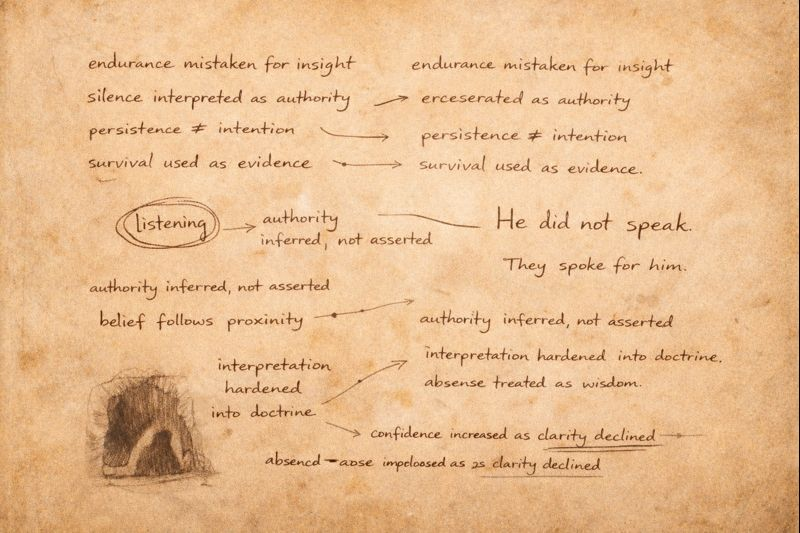

# Morlibint's Dossier: The Cult of Urthagul

> [!side]
> :   

*Extract from the Morlibint Dossier*

The group now referring to itself as the **Cult of Urthagul** did not arrive in the Farm seeking revelation, communion, or purpose. All available evidence suggests they arrived seeking distance—distance from a calamity deeper below, distance from pursuit, and distance from whatever circumstances had rendered their previous home untenable. Their initial occupation of the upper caverns appears to have been pragmatic, cautious, and unremarkable, marked by the same concerns that govern most displaced peoples: shelter, food, and defensibility.

Belief followed later.

The caligni’s discovery of the gug known as Urthagul appears to have been incidental rather than intentional. The creature lairs within a cavern already characterized by unusual acoustic and psychological effects, and it is difficult to determine whether Urthagul was drawn to this space or merely endured within it. What is certain is that prolonged exposure to the cavern alters perception, dampening emotional extremes while encouraging fixation, interpretive thinking, and a misplaced sense of internal coherence. That Urthagul had persisted in this environment for decades—perhaps far longer—was sufficient for some among the caligni to interpret endurance as insight and silence as authority.

I find no evidence that Urthagul sought worship, guidance, or even acknowledgment.

He does not issue instruction. He does not correct error. He does not meaningfully acknowledge those who gather around him. He listens, insofar as the term is applicable, and even this may be projection rather than action. The caligni supplied the rest: meaning, structure, and reverence, assembled gradually through repetition and proximity rather than doctrine or revelation.

Over time, this interpretive process produced division. Some among the caligni embraced Urthagul as a mystic presence, convinced that his continued existence within the cavern constituted evidence of communion or insight. Others remained skeptical, viewing the gug as a dangerous but essentially incidental inhabitant of a dangerous place. This disagreement did not erupt into overt conflict, but it hardened into separation, with those inclined toward belief remaining near the cavern while those inclined toward caution withdrew to more defensible, comprehensible spaces.

*Those who listened stayed.*
*Those who doubted left.*

The practices of the Cult of Urthagul reflect this origin. Their rites emphasize repetition rather than doctrine: ritual hunts, meditative stillness, and the recitation of phrases they claim were “heard” rather than taught. Members who linger longest near Urthagul exhibit a consistent pattern of increasing confidence paired with decreasing clarity. Certainty intensifies even as comprehension erodes, a progression I have observed often enough elsewhere to regard it as diagnostic.

Belcorra’s response to the cult is particularly instructive. She neither attempted to co-opt the caligni nor sought to eliminate them. Instead, she restricted their movement and isolated their shrine, allowing their practices to continue undisturbed while preventing their influence from spreading. This suggests she did not regard the cult as allies or adversaries, but as a localized complication—one best contained rather than engaged.

I do not believe the Cult of Urthagul serves Belcorra, nor do I believe it meaningfully opposes her. It persists because the Farm permits persistence, and because proximity to certain influences encourages belief even in the absence of instruction. The caligni were not deceived by Urthagul so much as shaped by the same conditions that shaped him, responding to endurance, silence, and altered perception with conclusions drawn too quickly and held too firmly.

*They listened.*

*They heard something.*

**What they understood, if anything, remains uncertain.**

*— Morlibint*

[Morlibint's Dossier: The Drow in the Farm](Morlibint%27s%20Dossier-%20The%20Drow%20in%20the%20Farm.md)

