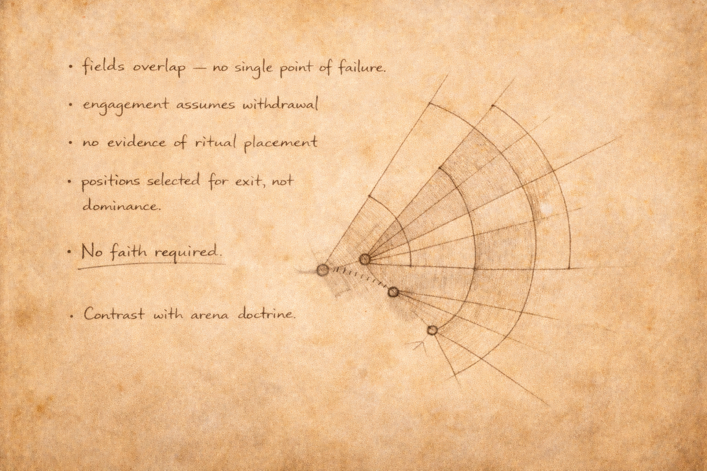

# Morlibint's Dossier: The Drow in the Farm

> [!side]
> :   

*Extract from the Morlibint Dossier*

The drow presence within the Farm is limited, deliberate, and notably restrained. Unlike most factions encountered in these caverns, the drow do not appear to be remnants of Belcorra Haruvex’s original designs, nor creatures drawn inward by her return. Their positions are placed for observation rather than control, and their movements suggest caution rather than ambition.

This distinction is significant.

Available evidence suggests that the drow of Yldaris established forward positions within abandoned Children of Belcorra structures as watch posts rather than fortifications. These spaces were not adapted for expansion or defense in depth, but for surveillance: lines of sight preserved, access points limited, and engagement avoided unless provoked. Curtains drawn where transparency would otherwise invite attention.

They are present, but they are not invested.

  

Belcorra’s influence thrives on investment—emotional, ideological, or devotional. The drow display none of these. They do not worship. They do not speculate. They do not interpret silence as instruction or endurance as authority. When faced with uncertainty, they withdraw rather than supply meaning where none is offered.

Reports from members of the New Roseguard indicate that the drow are willing to negotiate passage, exchange information, and even accept assistance, but only insofar as such interactions serve their immediate security concerns. Belcorra is not spoken of as a queen, a god, or a legend. She is treated as a destabilizing presence—dangerous, real, and ultimately irrelevant to the drow’s long-term survival.

This attitude may be cultural. Drow communities distant from major houses tend to value continuity over conquest. They are adapted to hostile environments without requiring dominion over them. Where others reshape themselves to fit Belcorra’s systems, the drow refuse participation entirely.

It is noteworthy that the drow do not feature prominently in Belcorra’s recovered writings as subjects of correction, improvement, or punishment. She demanded submission from many subterranean peoples, yet the drow remain largely absent from her recorded preoccupations. This absence suggests either a negotiated boundary or a mutual decision to remain irrelevant to one another.

If so, it may represent the most successful resistance observed within the Farm.

The drow do not oppose Belcorra directly. They do not sabotage her systems. They simply decline to become part of them. In an environment where suffering is refined into purpose and proximity hardens into belief, such refusal may constitute the most stable form of defiance.

*— Morlibint*

[Morlibint's Dossier: The Farm Redux](Morlibint%27s%20Dossier-%20The%20Farm%20Redux.md)

