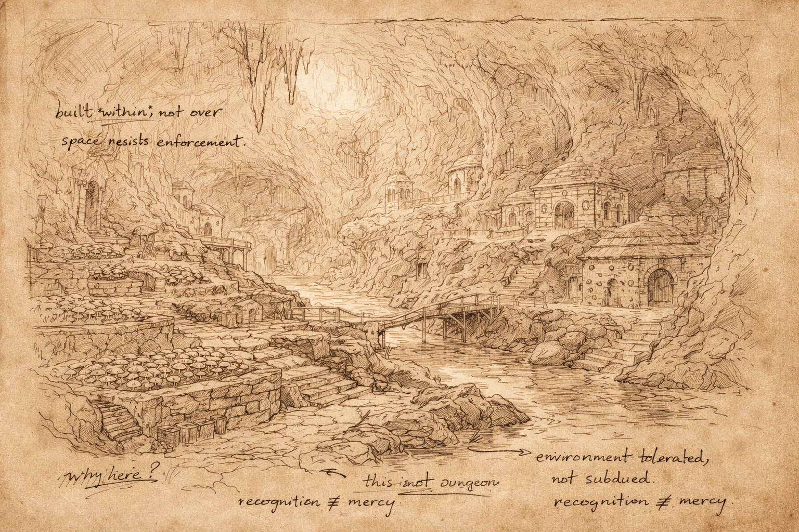

# Morlibint's Dossier: The Farm

> [!side]
> :   

*Extract from the Morlibint Dossier*

At a certain depth beneath Gauntlight, the Abomination Vaults cease to behave like a dungeon.

This is not a metaphor.

Passageways widen. Stone gives way to water, fungus, and open caverns whose dimensions resist easy ownership. Sound carries differently here. Light behaves poorly. Paths are suggested rather than enforced. Even the air feels less contained.

This region is commonly referred to as **the Farm**, though the name is misleading. Belcorra did construct portions of this place—fields of subterranean growth, planning chambers, access corridors, and storage—but she did so within vast, preexisting caverns rather than reshaping them entirely.

**This distinction is critical.**

Where the upper Vaults impose order upon space, the Farm accommodates it. Where earlier levels refine, test, and punish, this place tolerates. Belcorra’s presence here feels measured, even cautious. She does not discipline the environment into a system. She allows it to remain an ecosystem.

I do not believe this reflects mercy.

I believe it reflects recognition.

Whatever influence permeates this depth—whatever provokes fixation, inspires belief, or alters behavior—it does not yield easily to command. Belcorra’s constructions cluster near it without enclosing it. Her servants tend its margins. Her overseers watch rather than intervene.

*She positioned herself near power.*

*She did not attempt to master it.*

This choice explains much of what follows. The groups that persist within the Farm do not resemble soldiers, experiments, or administrators. They resemble *residents*. They adapt. They linger. They endure. Each, in their own way, responds to proximity rather than authority.

To understand the Farm, one must abandon the assumption that every space exists to be used.

**Some spaces exist to be survived.**

*— Morlibint*

  

[Morlibint's Dossier: The Children of Belcorra](Morlibint%27s%20Dossier-%20The%20Children%20of%20Belcorra.md)

