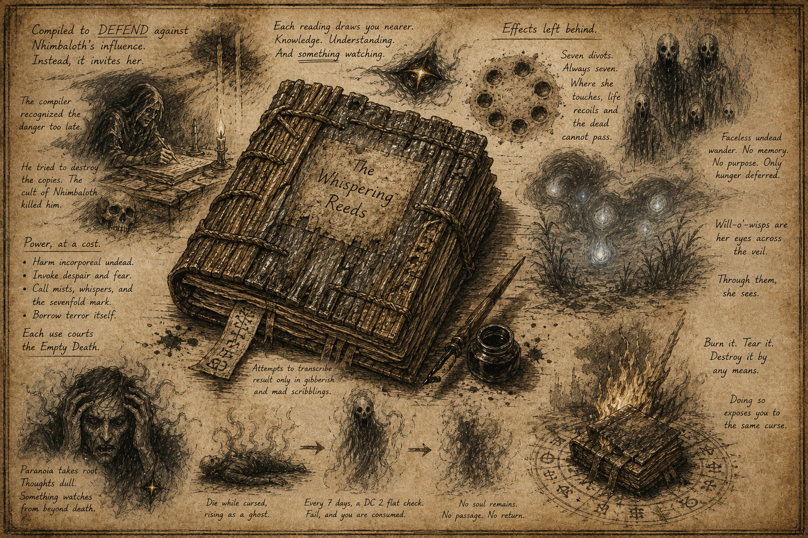

# Morlibint's Dossier: The Whispering Reeds

> [!side]
> :   

*A dangerous text, best catalogued and left unread. Inclusion in this archive is for completeness, not recommendation.*

Of all known texts associated with Nhimbaloth, none is more insidious than *The Whispering Reeds*.

At first glance, it is unremarkable—a swollen, reed-bound tome, its pages warped by age and damp, filled with parables, myths, and scattered accounts of encounters with the so-called Empty Death. The anonymous compiler, writing in a tone that begins as scholarly and ends in something closer to quiet desperation, claims the work was intended as a defense: a collected body of knowledge that might allow others to recognize and resist Nhimbaloth’s influence.

It is difficult to imagine a more complete failure of intent.

The book does not merely describe Nhimbaloth. It aligns the reader with her.

# On Study and Subtle Corruption

Prolonged study produces subtle but unmistakable effects. At first, the reader finds themselves unusually adept at identifying creatures and phenomena tied to death—incorporeal undead, wisps, and other entities that exist at the edge of the River of Souls. Patterns emerge. Connections sharpen. The text seems, in a limited and carefully measured way, useful.

This is how it begins.

With continued exposure, the tone shifts—not in the text itself, but in the mind of the reader. Thoughts become crowded, difficult to hold in place. Paranoia takes root, accompanied by the persistent and increasingly convincing sensation that something is observing from beyond the boundary of death. Not metaphorically. Not philosophically. Observing.

Many dismiss this as a side effect of studying disturbing material.

Those who do not tend to survive longer.

# Practical Applications

The book’s more deliberate uses are far more dangerous. Certain passages, when spoken aloud, exert a tangible effect on the world. Incorporeal undead can be harmed, their essence torn away in patches that mirror the now-familiar pattern of seven evenly spaced voids.

In more advanced applications, the reader may evoke localized manifestations—mists, whispers, and those same unnatural divots appearing across ground, vegetation, and even living flesh. Victims caught within such phenomena experience overwhelming despair, often accompanied by a lingering vulnerability to further emotional or mental influence. These effects are not illusions in any conventional sense. They leave traces. They linger.

There are also passages that allow the reader to channel more direct expressions of terror—despair, fear, paranoia, and, in extreme cases, visions so potent they can kill. These effects do not feel like spells. They feel… borrowed.

Each use deepens the connection.

# The Empty Death

This progression is not without cost. Repeated or careless use of the text exposes the reader to what has come to be called the *Empty Death*—a curse, though that term lacks precision. The afflicted experience a pronounced dulling of thought and a fixation on the idea that something is watching them from the far side of death. This state can persist for a full day, during which judgment is impaired and resistance to further influence is weakened.

In most cases, the subject recovers.

In some, the effect proves transitional rather than temporary.

Those who die while under the influence of the Empty Death do not pass on. Instead, they rise as ghosts—twisted reflections of themselves, hostile and unmoored. This condition is not stable. At regular intervals, most consistently observed in cycles of seven days, the ghost’s existence begins to fail. Some endure. Some do not.

Those that do not are consumed.

Completely.

No trace of the soul remains. It does not return to the River of Souls. It does not reach the Boneyard. It does not linger or reform. It is erased so thoroughly that restoration is, for all practical purposes, impossible. Only the most extreme applications of magic—effects so powerful they border on the theoretical—have any chance of reversing such a loss.

# History and Proliferation

The history of *The Whispering Reeds* offers little reassurance. The compiler, having recognized the danger too late, attempted to halt further dissemination and destroy existing copies. This effort drew the attention of Nhimbaloth’s followers, who ensured it would not succeed. The compiler was assassinated, and the book—predictably—survived.

Fewer than two dozen copies are believed to remain.

Attempts to reproduce the text have universally failed. Transcriptions degrade into nonsense—gibberish, fragmented phrases, or meaningless symbols. Whether this is an inherent property of the book or a deliberate limitation imposed by forces opposed to Nhimbaloth is unknown. The result is the same: the knowledge resists copying, but not use.

# Destruction

The book itself is not indestructible. It can be burned, torn, or otherwise destroyed by entirely mundane means.

Doing so, however, exposes the one responsible to the same curse the text propagates.

It is, in its way, a perfect instrument.

A book that cannot be safely studied, cannot be reliably duplicated, and cannot be eliminated without consequence. It invites use, punishes restraint, and ensures that those who attempt to end it become part of its influence.

# Conclusion

If there is a lesson to be drawn from *The Whispering Reeds*, it is not that knowledge is dangerous.

It is that some knowledge is not passive.

It notices when it is being read.

[Morlibint's Dossier: Closing Remarks](Morlibint%27s%20Dossier-%20Closing%20Remarks.md)

