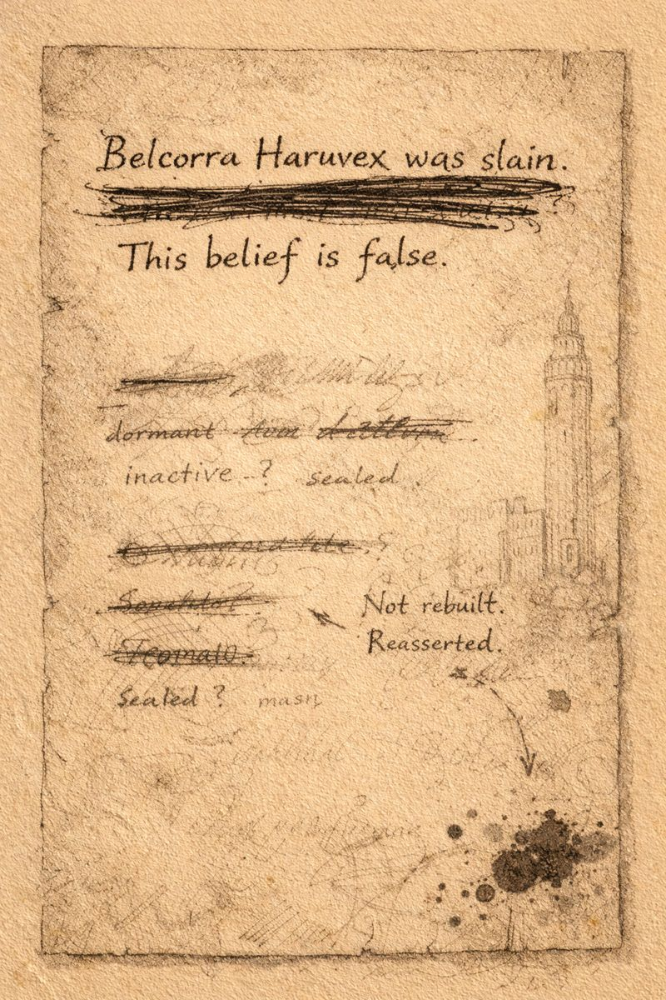

# Morlibint’s Dossier: Corrective Annotation

> [!side]
> :   
>
>     by ChatGPT

### Later Findings

**This belief is false.**

Two years ago, on the five-hundredth anniversary of her family’s exile, Belcorra Haruvex awoke as a ghost deep beneath Gauntlight Keep.

The Abomination Vaults were never empty. Generations of creatures lived, fought, and adapted there in her absence.

Belcorra did not rebuild.

**She reasserted control.**

Gauntlight is active once more.

*Stories persist because they are useful. Systems persist because they work.*
  

[Morlibint’s Dossier: The Roseguard](Morlibint%CE%93%C3%87%C3%96s%20Dossier-%20The%20Roseguard.md)

