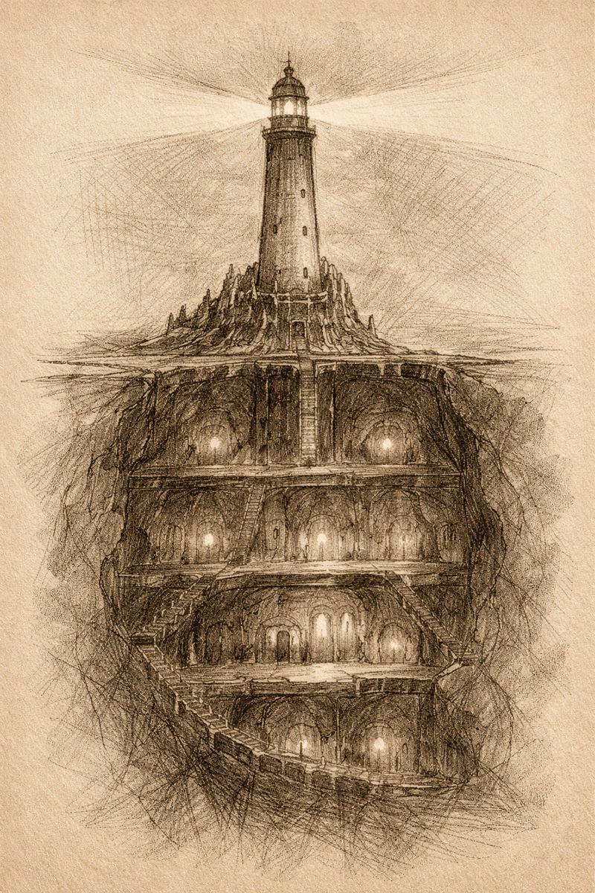

# Morlibint’s Dossier: Gauntlight and the Abomination Vaults

> [!side]
> :   

### Construction and Purpose

At the age of seventeen, Belcorra Haruvex returned in secret to the Isle of Kortos.

There, along a remote stretch of wooded coast, she constructed a magical lighthouse she named **Gauntlight**. The structure was erected directly above a subterranean shrine to Nhimbaloth known as the **Empty Vault**—a structure whose origins predate recorded history.

Using powerful magic, Belcorra opened passages through the earth to reach the shrine. Beneath Gauntlight, she excavated a vast dungeon complex she called the **Abomination Vaults**.

Her intent, stated plainly in surviving correspondence, was to draw subterranean monsters and aberrations into her control and use Gauntlight’s magic to unleash them upon **Absalom**.

This was not a fortress.

**It was an engine.**

Belcorra enforced order within the Vaults using will-o’-wisps, bound devils, and powerful lieutenants. Drow and urdefhans encountered in the region were offered a single choice: fealty or death.

*Architectural notes recovered from the Vaults are precise, iterative, and disturbingly patient.*
  

[[Morlibint's Dossier/Morlibint’s Dossier- On the So-Called Cult of the Canker|Morlibint’s Dossier: On the So-Called Cult of the Canker]]

