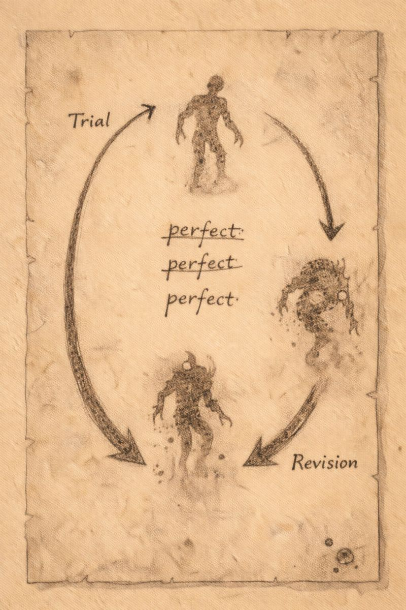

# Morlibint’s Dossier: On the Fleshwarping Laboratories

> [!side]
> :   
>
>     by ChatGPT

### The Question of Improvement

Belcorra Haruvex encountered the seugathis in the Darklands while constructing the Abomination Vaults. Contemporary notes describe them as eager—too eager—to serve.

They promised improvement.

Belcorra accepted.

### Many Paths Toward One Word

The sixth level was repurposed into laboratories. Here, the seugathis pursued not a single method, but many: fleshwarping, selective breeding, reanimation, and even early construct work. This breadth does not appear accidental.

Belcorra demanded a single outcome: a *perfect soldier*.

She did not define the term.

### Creation and Testing

The laboratories and the arena functioned as one system. Creations that survived the seugathis’ alterations were sent upward to fight. Those that failed in combat returned below for further refinement.

Success ascended.

Failure descended.

This cycle repeated until nothing recognizable remained.

### Administration and Rebellion

After Belcorra’s death, oversight of this level initially fell to a bone devil named Tarkannah. Evidence suggests this arrangement was short-lived.

The seugathis resisted constraint. Their leader, Jafaki, orchestrated a rebellion and killed Tarkannah, claiming the laboratories as their own.

This act did not end conflict. It froze it.

A stalemate developed between devils below and fleshwarpers above, punctuated by exchanges of resources, failed creations, and living subjects.

### The Warped Brew

One chamber on this level deserves special note. Once a dining hall for Belcorra’s gladiators and guests, it became a tavern known as the *Warped Brew*.

Here, creatures awaiting experimentation gathered to drink, gamble, and speculate about what they might become. Some hoped for power. Others hoped simply to survive the knives.

The tavern was managed by an urdefhan named Vischari, who made herself indispensable. Discipline was lax. Ambition was not.

The existence of such a place suggests that, over time, fleshwarping became normalized—anticipated, even desired.

That normalization concerns me more than the experiments themselves.

### Jafaki

Jafaki pursued perfection for centuries. Good soldiers were insufficient. Great soldiers were insufficient. The word that recurs in their notes—again and again—is *perfect*.

What constituted perfection appears to have shifted over time. The goal remained.

Jafaki and their retainers are now dead, killed by the adventuring party. Among their final works was an experiment involving a living subject bound to occult machinery, sustained in a state of perpetual suffering.

I record this not for shock, but for clarity.

Perfection, as Jafaki understood it, did not include mercy.

### Suppositions

The fleshwarping laboratories were not a deviation from Belcorra’s vision.

They were its logical extension.

Belcorra did not seek monsters who would obey her.

**She sought monsters who would survive her enemies.**

### Personal Note

The arena tested what creatures could endure.

The laboratories tested what they could become.

Between them, Belcorra built a closed system where suffering produced refinement and refinement justified suffering.

That the system persisted after her death may be the most damning evidence that it worked.

*— Morlibint*
  

[Morlibint’s Dossier: On the Prison Level and Infernal Presence](Morlibint%CE%93%C3%87%C3%96s%20Dossier-%20On%20the%20Prison%20Level%20and%20Infernal%20Presence.md)

