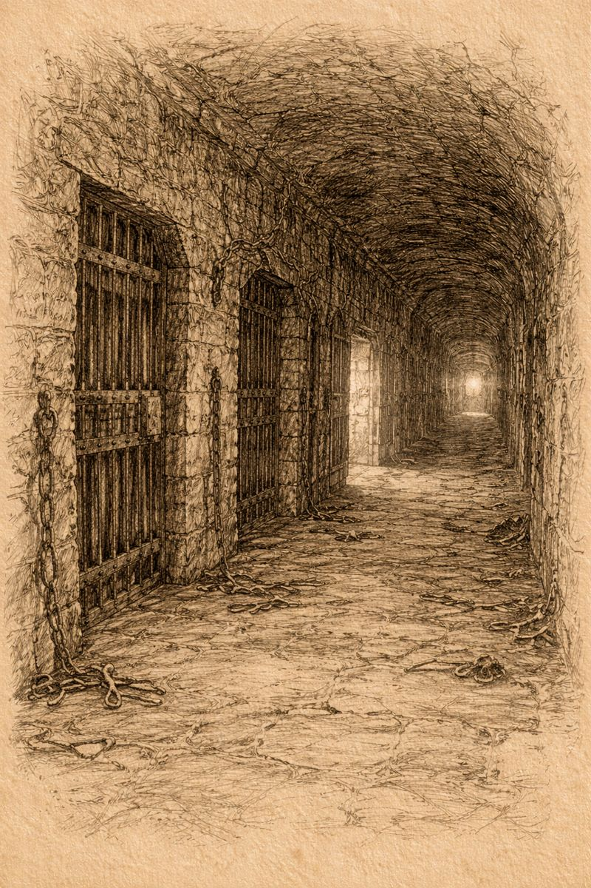

# Morlibint’s Dossier: On the Prison Level and Infernal Presence

> [!side]
> :   
>
>     by ChatGPT

### What Can Be Observed

There exists a level of the Abomination Vaults that does not align cleanly with Belcorra Haruvex’s usual methods.

It is structured as a prison.

This alone is unusual. Belcorra did not favor long-term confinement. Creatures who displeased her were typically repurposed, consumed, or discarded. The decision to build and maintain a prison suggests a compromise—perhaps imposed, perhaps negotiated.

No written records survive on this level. No ledgers. No orders. No correspondence.

If such documents once existed, they were either removed deliberately or never committed to parchment in the first place.

### Infernal Involvement

Multiple accounts—including testimony from Talia Nightclaw of the New Roseguard—indicate the long-term presence of a devil identified as **Urevian**.

The nature of his role is unclear. He appears to have exercised authority over portions of the Vaults, but not uncontested authority. His presence is consistent with infernal administration, yet his behavior—based on observation rather than documentation—suggests reluctance rather than enthusiasm.

He did not behave as a conqueror.

He behaved as something constrained.

### Signs of Fracture

The Vaults’ middle depths show evidence of prolonged internal conflict.

This conflict does not appear to have been a single war, nor a clear rebellion. Instead, it resembles a long-standing tension between distinct groups occupying different levels, each maintaining territory without decisive advance.

Barriers, collapsed passages, and obstructed routes appear less like fortifications and more like attempts to limit interaction.

It is difficult to determine whether this fragmentation began with Belcorra’s death or merely intensified afterward.

### The Stasis Chambers

One chamber on this level contains a series of transparent pillars holding motionless creatures, preserved outside the normal passage of time.

The purpose of these chambers is unknown.

They may have been intended as weapons, reserves, deterrents, or bargaining tools. None of these explanations can be confirmed. That the creatures were preserved rather than destroyed implies a desire to delay decision rather than resolve it.

One chamber failed. The others did not.

I do not know what this distinction means.

### Ysondkhelir

Scattered references—mostly indirect—mention a being from Leng called **Ysondkhelir**.

He is described as a planner, a watcher, or a strategist, though no plans survive and no strategies can be identified. The maps recovered from this level are detailed but contextless, depicting surface regions without clear intent.

It is possible Ysondkhelir was never interested in warfare at all.

It is equally possible that he understood warfare differently.

Ysondkhelir has since been destroyed on this plane and returned to Leng, rendering further inquiry impractical.

### Peripheral Entities

A will-o’-wisp known as **Sacuishu** was observed moving freely through this level, apparently without challenge.

No record explains her presence. No testimony clarifies her allegiance.

That she was permitted to observe at all suggests either indifference or confidence on the part of those present.

### What I Cannot Prove

I cannot prove who controlled this level.

I cannot prove why preparations continued when no invasion followed.

I cannot prove that Belcorra’s return resolved any of the tensions evident here.

I cannot prove that the devil wished to remain.

### What I Suspect

This level was not a command center.

It was a holding pattern.

Something essential was missing—authority, permission, or conclusion. Until that absence was addressed, everyone involved remained in place, preparing for an action that never quite arrived.

### Personal Note

This floor feels less like a battlefield and more like a paused argument.

Everyone involved appears to have been waiting for someone else to decide what came next.

I am left with the uneasy sense that the decision was eventually made elsewhere—and that the consequences have only recently begun to surface.

*— Morlibint*
  

[Morlibint’s Dossier: Servants and Survivors](Morlibint%CE%93%C3%87%C3%96s%20Dossier-%20Servants%20and%20Survivors.md)

