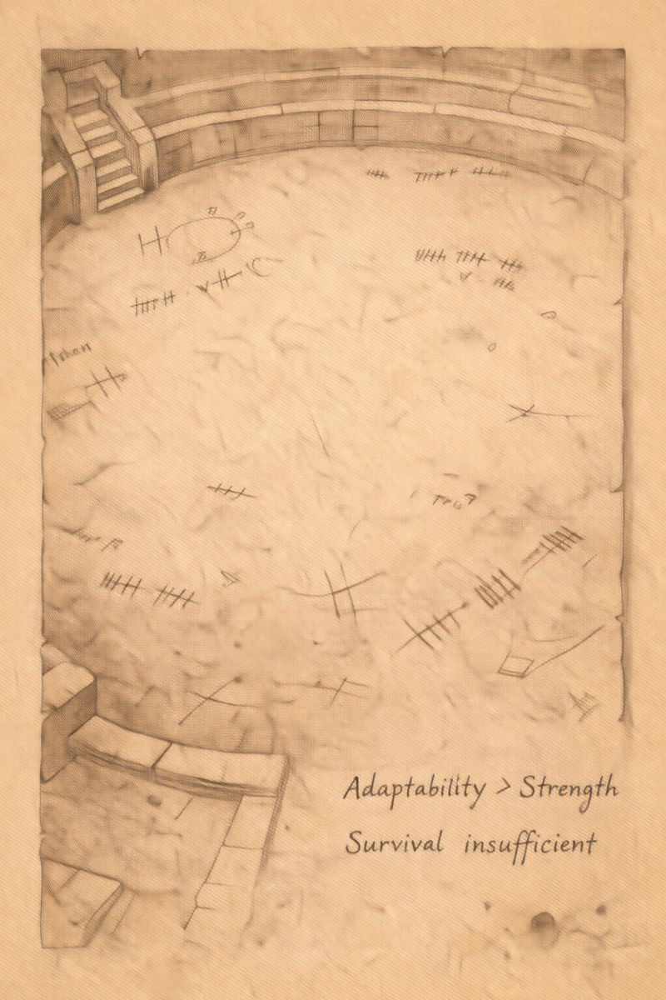

# Morlibint’s Dossier: On the Training Grounds

> [!side]
> :   
>
>     by ChatGPT

### Work Made Visible

The upper reaches of the Abomination Vaults appear personal. The deeper reaches appear experimental. Between them lies what I can only describe as the *workplace*.

Belcorra Haruvex designed the middle levels not for living, nor for study alone, but for refinement. Raw violence was insufficient for her purposes. Predators, aberrations, and bloodthirsty creatures were plentiful in the Darklands, but ferocity without discipline is unreliable.

Thus, she built places to teach violence how to behave.

### The Arena

At the heart of the fifth and sixth levels lies a massive arena and its attendant training grounds. Its scale suggests ambition beyond entertainment. This was not spectacle for Belcorra’s amusement, though she may have enjoyed it. It was selection.

Creatures fought not merely to survive, but to be noticed. Victory granted status, access, and the right to lead others. Defeat did not necessarily mean death—though it often did—but it always meant repurposing.

Those who proved resilient, adaptable, or clever were elevated. Those who failed were removed from consideration.

The arena did not produce champions.

**It produced data.**

### Resolve as a Resource

The arena also appears to have served another function: the testing of resolve. Prisoners, captives, and displeasing servants were brought here not simply to die, but to be observed under pressure.

Belcorra seems to have been less interested in whether a subject survived than in *how* they failed.

Fear, desperation, pride, obedience—these traits recur in marginal notes far more often than strength or speed.

### After Belcorra

When Belcorra died, the arena did not fall silent.

Infighting continued. Training became ritualized. Later, the space was repurposed again—used less for preparation and more as a dumping ground for failed experiments from below.

This suggests that, even without its architect, the arena’s logic remained intact.

### Supposition

I suspect the training grounds were never meant to produce an army directly.

They were meant to reveal which kinds of monsters were worth further investment.

Creation occurred elsewhere.

*— Morlibint*
  

[[Morlibint's Dossier/Morlibint’s Dossier- On the Fleshwarping Laboratories|Morlibint’s Dossier: On the Fleshwarping Laboratories]]

