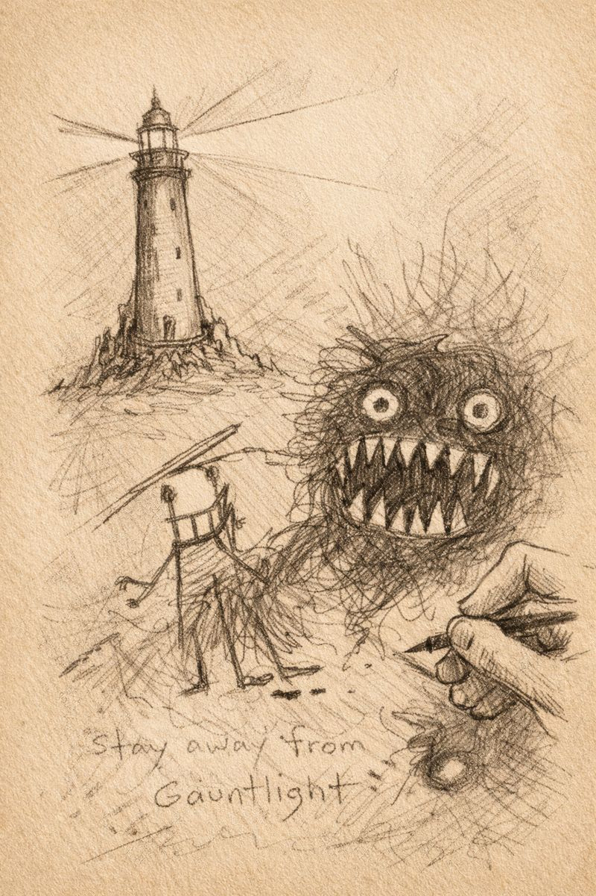

# Morlibint’s Dossier: Otari Folklore

> [!side]
> :   
>
>     by ChatGPT

### The Nursery Rhyme

> When the fog is creeping,
> And the moon is low;
> When the town is sleeping,
> Gauntlight starts to glow!
>   
>
> That’s when she arises
> For her midnight lunch.
> Naughty kids are prizes
> For her teeth to crunch.
>
> But if you obey me,
> And obey the rules;
> You’re safe from Belcorra;
> She just eats the fools!

  

This rhyme is widely known among the parents of Otari and is often sung to children to discourage wandering and misbehavior.

As a result, nearly every resident of Otari grows up with a mixture of fear, respect, and curiosity toward the Fogfen and the old lighthouse at its heart.

As adults, most come to accept that Belcorra was slain long ago and that Gauntlight is no longer a source of real danger—only a ruin, long picked over and home to pests.

For nearly five centuries, Belcorra existed only in stories.

  

[[Morlibint's Dossier/Morlibint’s Dossier- Corrective Annotation|Morlibint’s Dossier: Corrective Annotation]]

