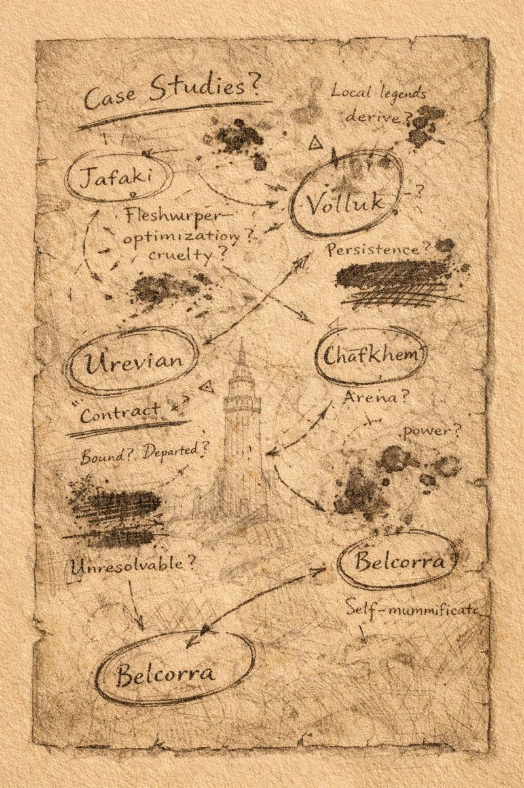

# Morlibint’s Dossier: Servants and Survivors

> [!side]
> :   
>
>     by ChatGPT

### Case Studies

**Jafaki**, a seugathi fleshwarper, optimized cruelty into process. He was killed by the current adventuring party.

**Volluk Azrinae**, a drow exile and former apprentice, pursued persistence without restraint and became a worm that walks. He too was destroyed.

Local Fogfen legends of a silent figure moving through the mist may trace back to Volluk’s activities. This is unproven.

**Urevian**, a bound devil, treated Belcorra as a contractual problem and has since departed Gauntlight.

**Chafkhem**, the Vaults’ arena administrator, survived Belcorra’s fall through self-mummification and spite. He has also left the Vaults.

None of these figures were loyal.

**All of them were instructive.**

  

[[Morlibint's Dossier/Morlibint’s Dossier- Wisps, Fog, and Dreams|Morlibint’s Dossier: Wisps, Fog, and Dreams]]

