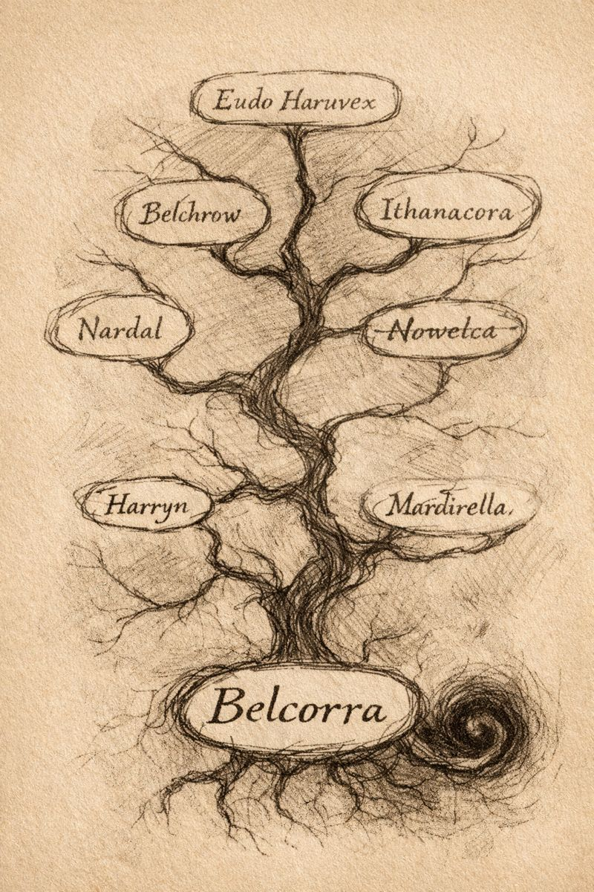

# Morlibint’s Dossier: The Haruvex Lineage

> [!side]
> :   
>
>     by ChatGPT

### Corroborated History (Pre-Gauntlight)

The Haruvex family tree both sprawls and surges with sorcery. Multiple branches exhibit a persistent **aberrant bloodline**, long treated within the family as a mark of prestige rather than danger.

Generations of Haruvexes practiced intra-family marriage to strengthen this lineage. Five centuries ago, the most powerful among them resided openly in **Absalom**, protected by wealth, influence, and discretion.

Behind closed doors, however, the Haruvexes made obeisance to **Outer Gods**, including **Nhimbaloth, the Empty Death**. Their worship involved abhorrent rites and ritual sacrifice. When evidence of these practices surfaced, Absalom’s authorities acted decisively.

In **4219 AR**, the Haruvex family was expelled from the Isle of Kortos. Their estates were seized. Their protections vanished.

Belcorra Haruvex was **six years old**.

Recovered correspondence makes clear that Belcorra was not merely a child of the family, but its culmination. She was told daily that she was Nhimbaloth’s harbinger—the family’s greatest hope for power and restoration.

Most exiled Haruvexes died in poverty.

**Belcorra did not.**

*This section is drawn from Absalom civic records and confiscated genealogical materials, and is the least tainted portion of this dossier.*
  

[Morlibint’s Dossier: Gauntlight and the Abomination Vaults](Morlibint%CE%93%C3%87%C3%96s%20Dossier-%20Gauntlight%20and%20the%20Abomination%20Vaults.md)

