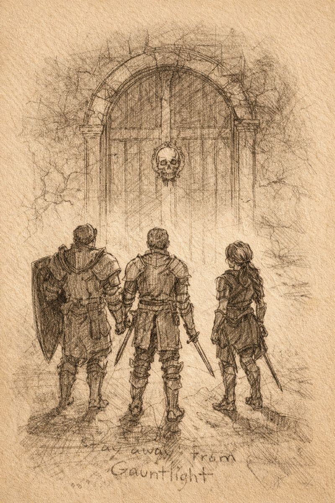

# Morlibint’s Dossier: The Roseguard

> [!side]
> :   
>
>     by ChatGPT

### An Incomplete Victory

In **4244 AR**, the adventuring company known as the **Roseguard** investigated rumors surrounding Gauntlight.

They confronted Belcorra Haruvex within Gauntlight Keep and killed her. During the battle, Belcorra slew the rogue **Otari Ilvashti**.

Grieving their fallen companion, the Roseguard sealed the keep and withdrew from Absalom. They founded a small port settlement nearby, naming it **Otari** in his honor, and retired there.

They never discovered the deeper levels beneath Gauntlight.

**They never knew the Abomination Vaults existed.**

This omission defines everything that followed.

*Roseguard memorials and early Otari town records agree on this point with remarkable consistency.*
  

[[Morlibint's Dossier/Morlibint’s Dossier- The Haruvex Lineage|Morlibint’s Dossier: The Haruvex Lineage]]

