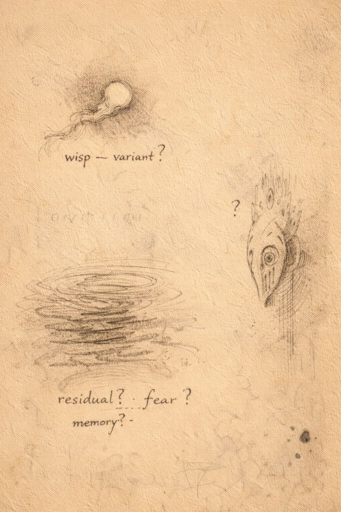

# Morlibint’s Dossier: Wisps, Fog, and Dreams

> [!side]
> :   
>
>     by ChatGPT

### Highly Conjectural

Belcorra made extensive use of will-o’-wisps as servants and ritual components. Some display behavior inconsistent with known varieties.

Evidence suggests wisps communicate through Fogfen swamp water, which may function as a passive recording medium for fear and memory.

Additionally, an unrelated denizen of Leng known as **Ysondkhelir** preyed upon the dreams of Dorianna Menhemes. There is no proof Belcorra summoned it.

There is proof she made the environment such entities find appealing.

**This is not coordination.**

**It is convergence.**

  

[Morlibint's Dossier: The Farm](Morlibint%27s%20Dossier-%20The%20Farm.md)

