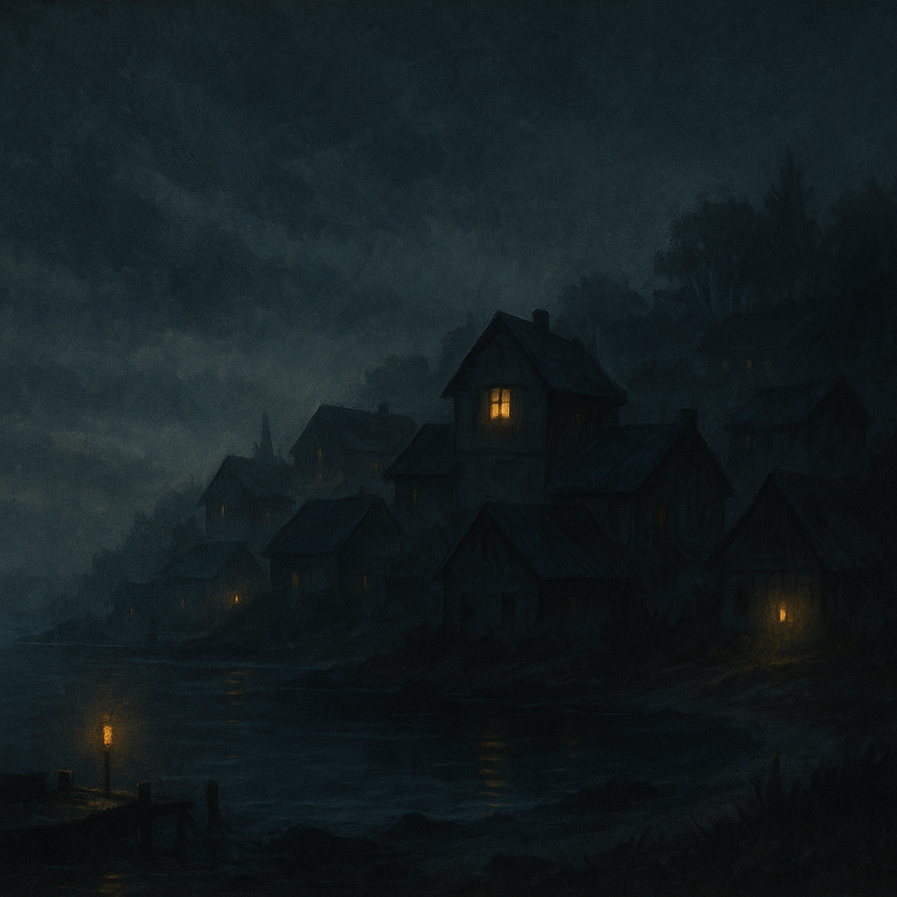

# Otari Sleeps Uneasily

> [!side]
> :   

### [Otari](../../../Locations/Inner%20Sea%20Region/Otari.md)

  

The tide rolled in black and slow, as if the sea itself were reluctant to touch [Otari](../../../Locations/Inner%20Sea%20Region/Otari.md)’s shore. Lanterns burned later than usual along the docks—thin flames trembling in the salt-wet wind. The fishermen couldn’t explain why they lingered, only that the water felt… wrong. Not dangerous—just wrong in that quiet, familiar way that sets a person’s teeth on edge.

  

In her cramped rooms above the Dawnflower Library, Vandy Banderdash hunched over her desk, surrounded by half-finished reports. Strange little incidents had accumulated: unsettling chills near the graveyard, a child swearing she’d seen a drifting figure outside her window, a human femur turned up in a fishing net cleaner than it had any right to be. Nothing conclusive, nothing actionable—just enough to start the mind whispering. Vandy muttered a prayer for patience, then another for vigilance, then continued scribbling notes she hoped she’d never need.

  

Across town, Morbilint’s shop glowed well past midnight. The door stood cracked for ventilation while he perched on a stool sorting components into precise, suspiciously over-prepared little bundles. He checked his warding salts twice, recalibrated the circle beneath the floorboards, and frowned at a stack of jars as if daring them to misbehave. There was no crisis. No warning sign. Just a feeling in the scales at the back of his neck that the town’s calm wasn’t entirely honest.

  

Farther up the hill, Oseph Menhemes paused outside Dorianna’s door. She slept peacefully now—no twitching fingers, no gasps, no echo of the horrors that once gripped her. He should have been content. Instead he found himself drifting back to the hallway each night, listening, making sure. Fear has a long half-life, especially in a father’s heart. He rested a hand on the doorframe, then forced himself to walk away.

  

Near the mill, a pack of stray dogs paced and circled the fence line. They barked toward the swamp, quieted, and barked again—caught in that uncertain place between instinct and memory, unable to settle.

  

At the edge of town, Wrin Sivinxi stood outside her shop with a mug of bitter herbal tea. She let the steam curl upward and watched the sky, the treeline, the lighthouse—everything that wasn’t changing, which somehow made it harder to look away. Otari had been through a season of strange events, and even when the world held still, the mind didn’t. She sipped, made a face at the taste, and kept watch anyway.

  

Most of Otari slept through the unease, wrapped in blankets and borrowed calm. But the town as a whole seemed to hold its breath—not because anything stirred, but because it remembered what it felt like when something did.

  

In the quiet hours before dawn, the night hovered heavy and expectant.

  

The kind of quiet that makes a person wonder whether the world is resting… or waiting.

