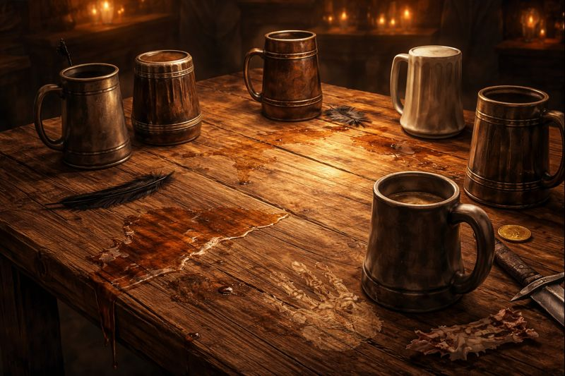

# Second Chances, Served Warm

> [!side]
> :   
>
>     by ChatGPT
>
> ---
>
> *Ascension Day*
>
> Observed on 11 Kuthona, Ascension Day commemorates the moment Cayden Cailean passed the Test of the Starstone and ascended to godhood—an event notable chiefly because he was profoundly drunk at the time and never meant for it to happen.
>
> As a result, the holiday is rarely planned. It emerges organically in taverns, roadside camps, and kitchens late at night, marked by shared drinks, reckless stories, and toasts to survival rather than devotion. Formal prayers are uncommon; gratitude, when offered at all, is casual and unpolished.
>
> Ascension Day is less about faith than fortune. Those who observe it—worshippers and nonbelievers alike—tend to reflect on narrow escapes, foolish risks that somehow paid off, and the strange, stubborn luck of still being alive.
>
> ---

The Crook’s Nook wasn’t trying to celebrate anything.

It was just loud in the way it always was—too many voices, mismatched stools, the smell of grease and spilled ale ground into the floorboards. The party drifted in out of habit more than intention, armor loosened, weapons leaned where they could be watched without being held. Dinner first. Breathing second. Reflection never scheduled.

Someone—nobody ever quite remembered who—noticed the paper lanterns strung crookedly over the bar. Someone else clocked the extra kegs. The bartender shrugged and said, “Ascension Day. Seemed rude not to open another barrel.”

That was enough.

Mugs appeared. Not reverently. Not ceremonially. Just… there.

August lifted his drink halfway, paused, then gave a humorless little laugh.

*“Still not sure how we’re standing,”* he said. *“We should've been turned into a cautionary mural.”*

Malaroth snorted, metal mask tilted back just enough to drink.

*“Luck,”* he said. *“Or incompetence on their part. I’m comfortable crediting either.”*

Talia didn’t raise her mug right away. Her fingers traced the rim, eyes unfocused.

*“I remember thinking,”* she said quietly, *“that if I survived, I’d never complain about being cold again.”*

A beat.

*“…still going to complain. Just less.”*

Kiri’s smile showed teeth that hadn’t always been there.

*“I didn’t think I’d come back,”* she said. *“Not like this.”*

She took a sip anyway.

*“But I came back.”*

Comet’s skeletal fingers tapped the mug, listening to the sound it made.

*“Dying was loud,”* he said after a moment. *“Coming back was… quieter.”*

Then, brighter:

*“Beer still tastes good, though. That feels important.”*

Theron rolled his shoulders, feathers rustling where skin used to be.

*“I don’t recommend reincarnation,”* he said. *“Very disorienting. New balance. New knees.”*

A pause.

*“But I’m alive. That seems like something you don’t argue with.”*

For a while, nobody spoke. The tavern noise filled the gap—laughter, clattering plates, a badly sung verse to a song nobody remembered the words to.

August raised his mug again, this time all the way.

*“Not followers,”* he said. *“But… if luck’s listening.”*

Malaroth clinked his cup against it.

*“To surviving stupid decisions.”*

Talia added hers.

*“To getting back up.”*

Kiri’s followed.

*“To being changed and still choosing to stay.”*

Comet grinned, empty sockets bright with tavern light.

*“To second chances. And thirds. Apparently.”*

Theron finished it, simple and unadorned.

*“To being here.”*

No prayer. No sermon. Just six mugs, raised a little crooked, in a bar that hadn’t planned for divinity but made room for it anyway.

Somewhere, a god who once got drunk and stumbled into eternity would have approved—not because they believed in him, but because they were alive, laughing, and willing to toast the sheer, reckless improbability of it.

