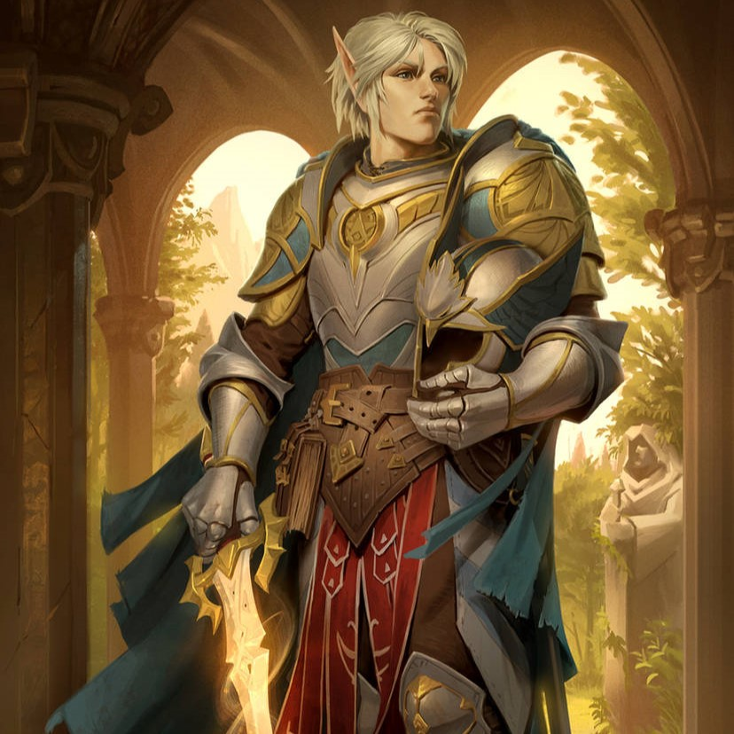

# Fitzroy

> [!side]
> Firstname
> :   Fitzroy
>
> Lastname
> :   Fulgrim III
>
> Nickname
> :   The Falcon
>
> Age
> :   19
>
> Eyes
> :   Blue
>
> Hair
> :   Blonde
>
> Skin
> :   Fair
>
> Gender
> :   Male
>
> Rpgalignment
> :   Lawful Good

### From the Journal of Linzi

Fitzroy Fulgrim the Third—paladin, noble, knight, and occasional walking headache. Don’t get me wrong, he’s one of the bravest and most principled men I’ve ever met, but he’s also got a skull harder than a troll’s kneecap. To Fitz, there’s right and there’s wrong, and the space in between might as well be a myth. He sees the world like a heraldic banner—bright colors, clean lines, no smudges allowed. Which is fine, until you realize the rest of us are living in the mud, trying to keep our boots from sticking.

When he’s on your side, there’s no one more steadfast. He’ll charge headlong into a losing fight because it’s the right thing to do. But if you cross him—or worse, if you do something he thinks crosses Erastil’s will—well, good luck convincing him you had a reason. Fitz doesn’t compromise, and he doesn’t forgive easily. I’ve seen him glare at a man so hard he nearly repented on the spot.

Still, there’s something to admire about that kind of conviction. He doesn’t bend because he truly believes bending would break him—and maybe he’s right. Fitzroy is a reminder that in a world of shifting loyalties and easy lies, someone still believes in absolutes. It’s frustrating, inspiring, and a little terrifying… all at once. But that’s Fitz. Our knight in shining armor—polished to a fault and utterly unyielding.

