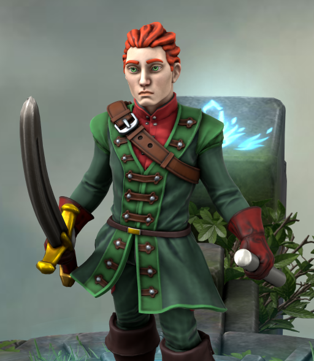

# Seamus

### From the Journal of Linzi

Sean Charleton O’Finnigan McGee—Seamus, to anyone who’s ever heard his fife or his laugh—is the most charming contradiction I’ve ever met. He dresses like a soldier fresh from inspection, every button gleaming and boot polished, but the man himself is pure chaos in motion. A bard, a swashbuckler, and a diplomat by accident more than design, he lives somewhere between heroism and hubris. He can turn a duel into a dance, a tavern brawl into a negotiation, and a diplomatic summit into a drinking contest. Somehow, it all works out—usually in his favor. Probably because when he flashes that grin and starts playing his fife, even his enemies forget what they were angry about.

We’ve been together for more than two years now, though calling it “together” makes it sound much calmer than it is. Seamus and I are like two verses in a song written in different keys—sometimes discordant, sometimes perfect, always loud. Our worst fight was over money, of course. He accused me of embezzling funds from the treasury—which, to be fair, I did—but I only did it to buy the kingdom a printing press! He saw theft; I saw civic enlightenment. The printing press still isn’t assembled, and every time he passes the pile of gears and typebars, he sighs and says, “A symbol of our love, that—half built, but full of potential.” I can never tell if he’s being poetic or petty. Probably both.

For all his flair, Seamus hides a heart so big it barely fits in that polished uniform. He’s reckless, sentimental, and absolutely infuriating—but he listens when I talk about freedom, about truth, about why stories matter. And when I’m quiet, he plays for me: soft, lilting tunes on his fife that sound like laughter bottled in wind. He’s chaos wrapped in discipline, charm wrapped in scars, and though I’ll never admit it to him directly, he’s the verse I didn’t know my story was missing.
