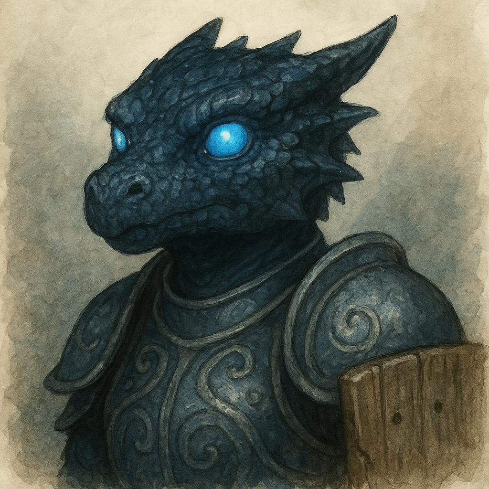

# Velka

### From the Journal of Linzi

Velka says that words are like rivers—they can carve through stone if they flow long enough. I told her that’s ridiculous, because words don’t have gravity, and she said, “Yours do.” I haven’t quite recovered from that one yet.

She’s a hard one to understand, this kobold philosopher with her driftwood shield and her black trident. I expected a zealot when she first arrived—a swamp-soaked preacher muttering about tides and judgment. What I found instead was a thinker. A patient one, even. She listens before she argues, and when she does argue, it’s like wrestling fog: frustrating, humbling, and somehow good for the soul. Together we’ve spent more nights than I can count with ink-stained fingers, debating Hanspur’s freedom versus the Republic’s laws, and always finding the same truth: both matter, so long as people are kind.

We even wrote a pamphlet together—*The River and the Road: Conversations on Freedom*. She claims I made it too cheerful. I claim she made it too wet. The people loved it anyway. Velka calls me “a song that learned to walk,” which is possibly the nicest and strangest thing anyone’s ever said to me. I call her “the Republic’s philosopher with muddy feet,” because if anyone’s going to keep our kingdom’s soul from sinking, it’s her.
