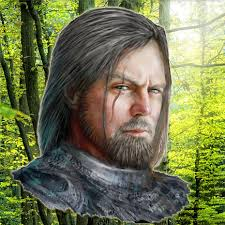

# Akiros Insmort

Fallen Paladin. Silent Blade. Man of Contradictions.

Akiros Insmort is a brooding, battle-hardened warrior with the haunted bearing of a man who’s lost his way—and perhaps found something darker in the void left behind. Once a devout paladin of Erastil, Akiros turned from his faith after a betrayal that shattered more than just his convictions. He cast aside the tenets of his order, his title, and his god, choosing instead a life of violence, lawlessness, and mercenary work.

Quiet but imposing, Akiros speaks little and listens closely. His code may be broken, but his discipline remains. In combat, he moves with a grim efficiency, a sword-hand trained by divine purpose and now fueled by something colder. He bears no sigils of his past, only old scars and a permanent scowl.

Those who meet him find a man shaped by failure, held together by a rigid sense of personal penance. He rejects pity, distrusts redemption, and offers no explanations. Yet behind his silence lies a deep well of conviction—twisted by pain, perhaps, but still intact.

Whether he is destined to fall further or claw his way back toward the light is a question only time, and the choices of others, can answer.
