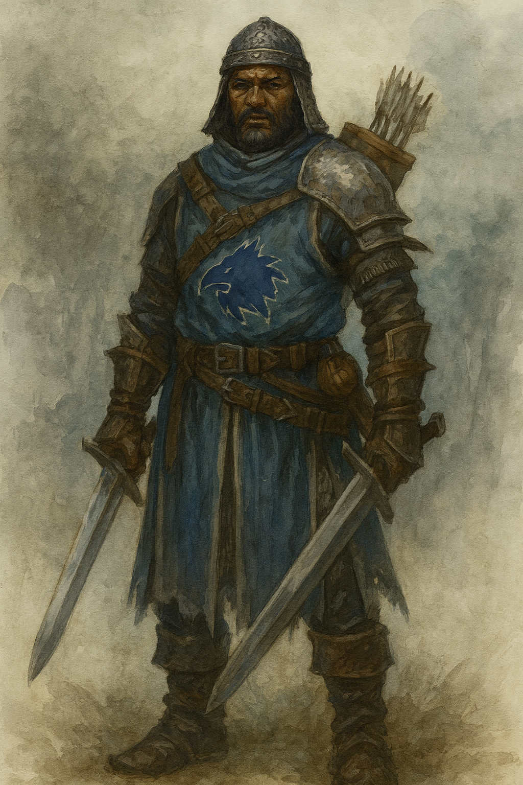

# Ameon Trask

Ameon Trask served as Baron [Hannis Drelev](Hannis%20Drelev.md)’s chief enforcer and military lieutenant. A hard-eyed mercenary elevated above his station by Drelev’s patronage, Trask wielded authority with the blunt efficiency of a man who believed fear was more reliable than loyalty. He was the figure most citizens of [Fort Drelev](../../../Locations/Inner%20Sea%20Region/River%20Kingdoms/Stolen%20Lands/Thumping%20Waters/Settlements/Fort%20Drelev/Fort%20Drelev.md) associated with the regime’s daily brutality—public beatings, disappearances, and the iron-fisted enforcement of curfews and conscriptions.

  

Unlike Drelev, who hid behind silks and excuses, Trask embraced his role openly. He drilled the elite guard, oversaw interrogations, and maintained order through intimidation. Though not a sadist, he was ruthlessly practical; if violence preserved control, then violence was the correct answer. Many in Fort Drelev came to fear his presence more than the baron’s proclamations, for Trask’s arrival often meant punishment was already decided.

  

Trask dined with Drelev and the inner circle on the night the Tubthumpers stormed the banquet hall. When the battle erupted, he met the assault head-on, coordinating the defense even as the heroes’ opening spells turned the tide instantly. Trask tried to pin down [Ally](../Characters/Ally%20Grainger.md) before she could escape the melee and later attempted to cut her down entirely—actions that would seal his fate in more ways than one. His aggression drew the focused ire of [Ant](../Characters/Ant.md) Grainger, who fought with a fury born of seeing his wife nearly killed.

  

As Drelev fled the hall and chaos spread, Trask remained in the fight out of stubborn loyalty or sheer refusal to accept defeat. [Matteo](../Characters/Matteo.md), Ally, and Ant overwhelmed him in the final exchange. Trask’s last attempt to finish Ally—hoping to “force another election in [Thumpington](../../../Locations/Inner%20Sea%20Region/River%20Kingdoms/Stolen%20Lands/Thumping%20Waters/Settlements/Thumpington/Thumpington.md),” as he taunted—failed. Her chromatic ray took the final breath from his lungs.

  

Ameon Trask’s death marked the collapse of Drelev’s enforcement ring. Without him, the elite guard fractured, their cohesion shattered. For the people of Fort Drelev, his fall was more than the end of a soldier; it was the end of the fear that had governed every street and square.
