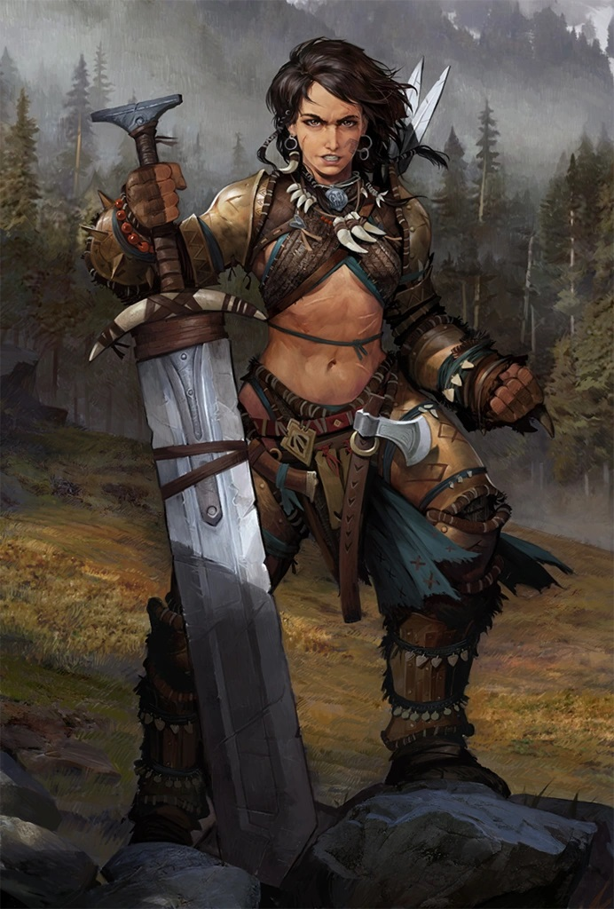

# Amiri

> [!side]
> :   Influence Level: 2

*Barbarian of the Realm, Reluctant Hero, Unapologetic Badass*

Amiri is a towering, battle-hardened woman of the Realm of the Mammoth Lords, known as much for her massive sword as for her total disregard for decorum. She wears armor scavenged from dozens of battles—hides, bones, scars, and all—and the blade she carries is comically oversized to most, but wielded by her with terrifying ease.

Amiri doesn’t mince words. She’s blunt, fierce, and often dismissive of those she sees as soft or self-important—especially types like [Tartuccio](Tartuccio.md) or [Linzi](Linzi.md) who talk more than they fight. But over time, she's come to tolerate (and maybe even grudgingly respect) those who stand their ground, especially the stubborn and the bold.

Though never officially part of the Tubthumpers, Amiri has crossed paths with them repeatedly. She once made a bet with Mairi over who would slay Tuskgutter first—losing with good grace and gifting the party a +1 dagger for their victory. Later, she agreed to lead settlers to found [Tatzlford](../../../Locations/Inner%20Sea%20Region/River%20Kingdoms/Stolen%20Lands/Thumping%20Waters/Settlements/Tatzlford/Tatzlford.md), lending her name and axe to the frontier cause, even if she'd never admit she cared about the place.

Amiri respects strength, action, and people who don’t waste time. She may never sit through a council meeting or write a decree, but when the monsters come—and they always do—Amiri will be the first to stand on the front lines, grinning.

