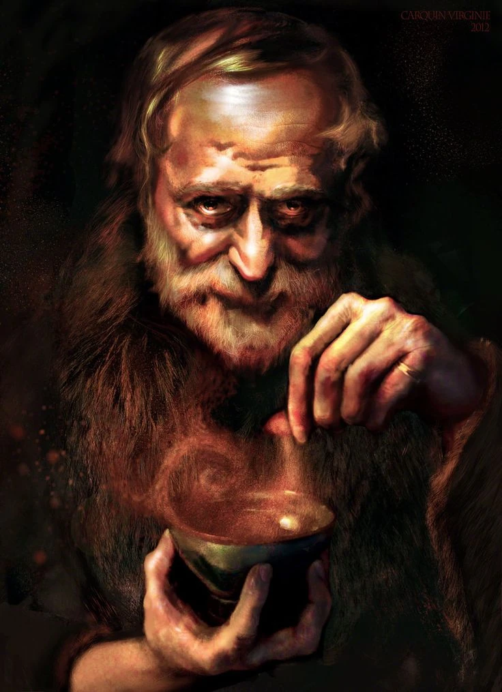

# Bokken

*Eccentric Hermit · Alchemist of the Greenbelt · Reluctant Ally*

Tucked away in a crooked shack on the edge of the Greenbelt, Bokken is the kind of man who would rather talk to bubbling flasks than people. A jittery recluse with wild eyes and a beard that looks half-scorched from misfired experiments, Bokken speaks in fast, clipped bursts, like he’s afraid someone might interrupt him—or worse, linger.

Though his social skills leave much to be desired, Bokken is a skilled alchemist, and his potions are widely sought after by those brave enough to find his hut. Most of his wares go to Oleg's Trading Post, but he’s not above selling directly—so long as you’re not too chatty, too clean, or too curious. Ask the wrong question, and he’ll wave you off like a bad smell. Ask the right one, and you might find yourself with a surprisingly potent tonic—or roped into one of his side quests involving rare herbs, exotic beast glands, or, once, an entire shipment of fangberries.

Beneath the grime and grime-stained robes is a man who’s seen hardship. Those who dig deep enough may learn of his lost brother or his reasons for choosing isolation. But most don’t. Bokken prefers it that way.

He’s not your friend. But he’s not your enemy either. In the wilderness, that counts for something.
