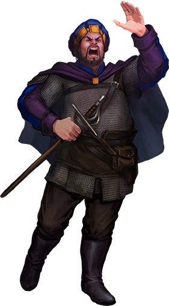

# Grigori

*Provocateur · Orator · Martyr (to some)*

Grigori arrived in [Thumpington](../../../Locations/Inner%20Sea%20Region/River%20Kingdoms/Stolen%20Lands/Thumping%20Waters/Settlements/Thumpington/Thumpington.md) with a silver tongue and a sharpened agenda. A bard of considerable charm and talent, he quickly rose to notoriety by delivering impassioned public speeches that questioned the authority, competence, and morality of the Tubthumpers. Cloaking himself in the mantle of the people’s voice, he appealed to the fears and frustrations of settlers who felt overlooked or oppressed. His words spread like wildfire—incendiary, seductive, and dangerously effective.

Though he never raised a blade or cast a spell in violence, Grigori's rhetoric struck at the heart of the fledgling republic. Whispers of outside influence—perhaps even espionage—followed him, though no proof was ever made public. Still, the unrest he incited was undeniable.

After a tense investigation and growing pressure from a rattled government, Grigori was found guilty of subversion and incitement. He was hanged in the capital square of Thumpington. To some, his death was justice served—a necessary defense of the republic. To others, it was the silencing of a man who dared speak too loudly.

In death, Grigori became what he may have always wanted to be: remembered.
