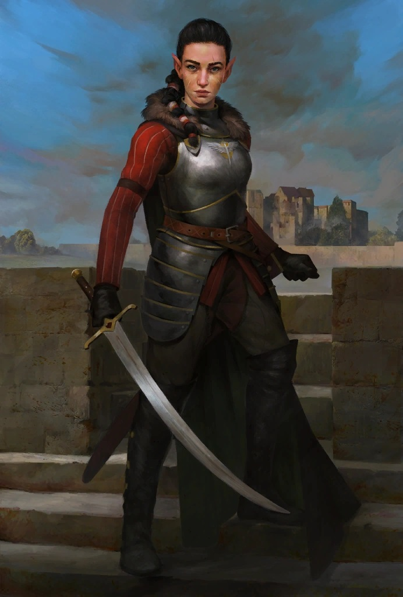

# Jamandi Aldori

*Swordlord of [Restov](../../../Locations/Inner%20Sea%20Region/Brevoy/Restov.md) · Champion of Independence · Master Duelist*

Jamandi Aldori is the blade behind Restov’s boldest ambitions. A famed aiuvarin (half-elf) practitioner of the Aldori school of dueling, she carries herself with the precision and restraint of a true master — never wasting a movement, never wasting a word. Her name commands respect across the [River Kingdoms](../../../Locations/Inner%20Sea%20Region/River%20Kingdoms/River%20Kingdoms.md), not only for her unmatched swordsmanship but for her keen political mind.

Jamandi is the unofficial leader of the [Aldori Swordlords](../../../Groups/Aldori%20Swordlords.md) and a tireless advocate for Restov’s independence. She dreams of a self-sufficient, sovereign power unshackled from [Brevoy](../../../Locations/Inner%20Sea%20Region/Brevoy/Brevoy.md)’s imperial oversight — one where diplomacy is backed by blades, and strong leaders rise from merit, not bloodlines. She sees the [Stolen Lands](../../../Locations/Inner%20Sea%20Region/River%20Kingdoms/Stolen%20Lands/Stolen%20Lands.md) as the key to that future: a place where new rulers can rise under her patronage, loyal not to Brevoy, but to the ideals of Restov and the Aldori way.

Though fiercely pragmatic, Jamandi rewards success and loyalty. She watches closely how her chosen champions govern, fight, and compromise — and she is not above reminding them that the sword cuts both ways.

To serve Jamandi is to carry both privilege and pressure. Her vision is vast, her expectations high, and her sword always within reach.
