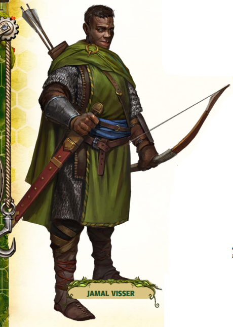

# Jamel Visser

*Leader of the Embeth Travelers · Master Huntsman · Keeper of Story and Song*

Jamel Visser is the charismatic and capable leader of the Embeth Travelers, a diverse band of hunters, guides, scouts, and storytellers who roam the edges of the Embeth Forest and beyond. Known for his silver-streaked hair, sharp eyes, and deep, resonant voice, Jamel carries himself with the confidence of someone who’s survived countless brushes with death — and has a good tale to tell about each one.

Though he once hunted alone, Jamel now sees strength in fellowship. Under his guidance, the Embeth Travelers have become a respected (if slightly unpredictable) presence in the [Stolen Lands](../../../Locations/Inner%20Sea%20Region/River%20Kingdoms/Stolen%20Lands/Stolen%20Lands.md) — offering aid, wisdom, and the occasional sharp arrow to those in need. He is known to mediate disputes, deliver warnings about emerging threats, and pass down local legends in exchange for food, firelight, and good company.

Jamel Visser values tradition but embraces change. In the past year, he has turned his attention to the Kingdom of Thumping Waters, seeing in its leaders — the Tubthumpers — the potential for lasting order and balance in a land that has long lacked both. He even restored a long-abandoned hunting lodge, now known as Embeth Lodge, where adventurers and nobles alike gathered for a grand hunt hosted under his banner.

Though a friend to the kingdom, Jamel remains his own man. He walks where duty calls and stories rise — always seeking the next chapter, the next danger, and the next reason to raise a cup beneath the stars.
