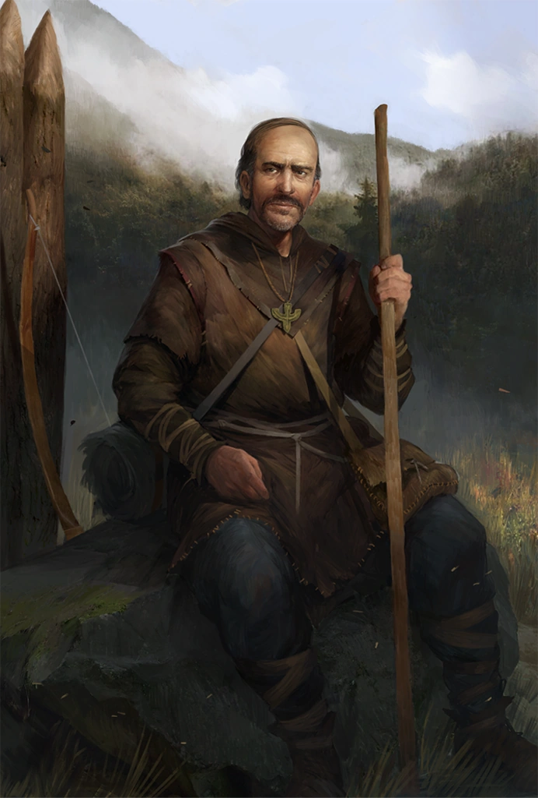

# Jhod Kavken

*Wandering Cleric of [Erastil](../../../Rules/Deities/Erastil.md) · Exile of Galt · Seeker of Redemption*

Once a humble village priest in Galt, Jhod Kavken now walks the wilds of the [Stolen Lands](../../../Locations/Inner%20Sea%20Region/River%20Kingdoms/Stolen%20Lands/Stolen%20Lands.md) as a hunter, healer, and servant of Erastil, god of family, tradition, and the hunt. Quiet, weathered, and devout, Jhod bears the weight of past sins and the hope of future redemption in equal measure.

Years ago, driven by fear and a desire to protect his flock, Jhod helped lead a lynch mob against a suspected werewolf that had terrorized his village. Though the man was not the true culprit — a worg was caught hours later — it was discovered that the executed man was a bandit spy. This murky outcome spared Jhod from excommunication, but not from consequence. The church of Erastil sanctioned him and imposed exile.

Jhod accepted the verdict with humility and sorrow. He wandered north, through Numeria and into [Brevoy](../../../Locations/Inner%20Sea%20Region/Brevoy/Brevoy.md), until he received a vision from Erastil himself: a ruined temple hidden in the wilds, guarded by an ancient, wrathful bear. Compelled by this dream, Jhod made his way south to Oleg’s Trading Post, where he encountered the newly chartered adventurers of Thumping Waters — the Tubthumpers — whom he believed could help fulfill his divine mission.

Since that day, Jhod has stood beside the heroes in times of peril, lending his bow, his prayers, and his wisdom. The lost temple has been found and cleansed, but Jhod remains in the region, quietly tending to the spiritual needs of frontier folk and helping maintain the delicate balance between civilization and the wild.

To some, he is just another wandering cleric. But to those who know his tale, Jhod Kavken is a man seeking atonement — not through penance alone, but through action, faith, and the hope of earning peace with the god he once failed.
