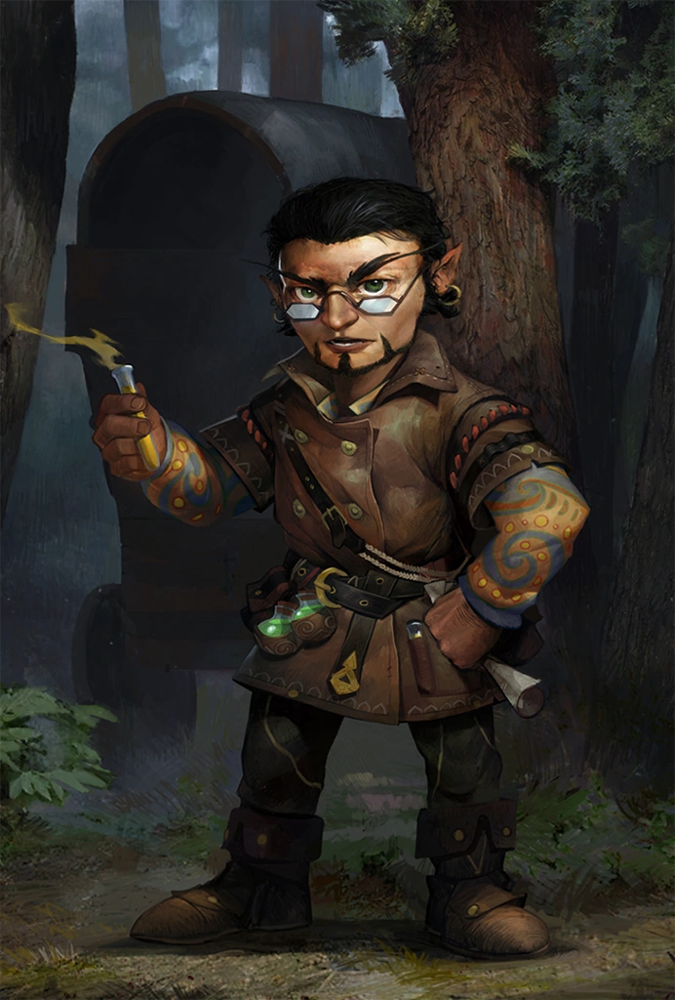

# Jubilost Narthropple

*Minister of the Treasury · Explorer Extraordinaire · Legend in His Own Mind*

The name Jubilost Narthropple is known to every truly educated person in Avistan—or so Jubilost insists. And if you don’t know his name? Then perhaps you aren’t truly educated. A prolific explorer, cartographer, author, and insufferable braggart, Jubilost is one of the most irritatingly brilliant gnomes in the [Inner Sea Region](../../../Locations/Inner%20Sea%20Region/Inner%20Sea%20Region.md).

Whether producing illustrated atlases of uncharted wilderness, scathing critiques of urban plumbing infrastructure, or recipe books for frontier gourmands, Jubilost has a knack for doing everything loudly, confidently, and better than you (according to him). His ego is vast, his wit sharper than his tongue, and his command of obscure languages is almost as extensive as the number of people he’s managed to offend.

Despite his overbearing nature, Jubilost’s skills are undeniable. He and his band of surveyors were among the first to chart the dangerous wilds surrounding the [Stolen Lands](../../../Locations/Inner%20Sea%20Region/River%20Kingdoms/Stolen%20Lands/Stolen%20Lands.md), and it was through this work that he eventually crossed paths with the Tubthumpers. Though not a founding member of Thumping Waters, he quickly positioned himself at the center of things—as Minister of the Treasury, of course. Where better to place one’s trust than in the hands of someone who definitely understands money better than anyone else?

In truth, Jubilost has grown invested in the success of the republic. He might grumble and complain (and draft resignation letters no one reads), but his work is thorough, his economic foresight sharp, and his loyalty—though obscured by arrogance—real. Whether navigating budget deficits or the Bloom Curse, Jubilost always has a plan. Whether it’s a good plan is another matter entirely.

Of course, the real tragedy is that not enough statues have been commissioned in his honor. Yet.
