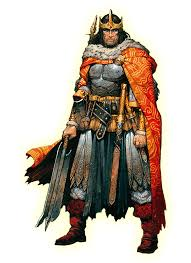

# King Castruccio Irrovetti

Once a flamboyant exile from Numeria, Castruccio Irovetti has ruled the River Kingdom of [Pitax](../../../Locations/Inner%20Sea%20Region/River%20Kingdoms/Stolen%20Lands/Thumping%20Waters/Settlements/Pitax/Pitax.md) for over half a decade. Publicly, he styles himself as a patron of the arts and a philosopher-king, filling the capital with theaters, statuary, and performance halls. His court is famed for elaborate masquerades and daring debates, where flattery and insult dance hand in hand.

Beneath this cultural façade, however, rumors swirl. Whispers tell of disappearances, secret alliances with foreign powers, and brutal crackdowns on dissent. Some say Irovetti funds assassins to silence critics; others claim he toys with forbidden technologies and Numerian relics.
