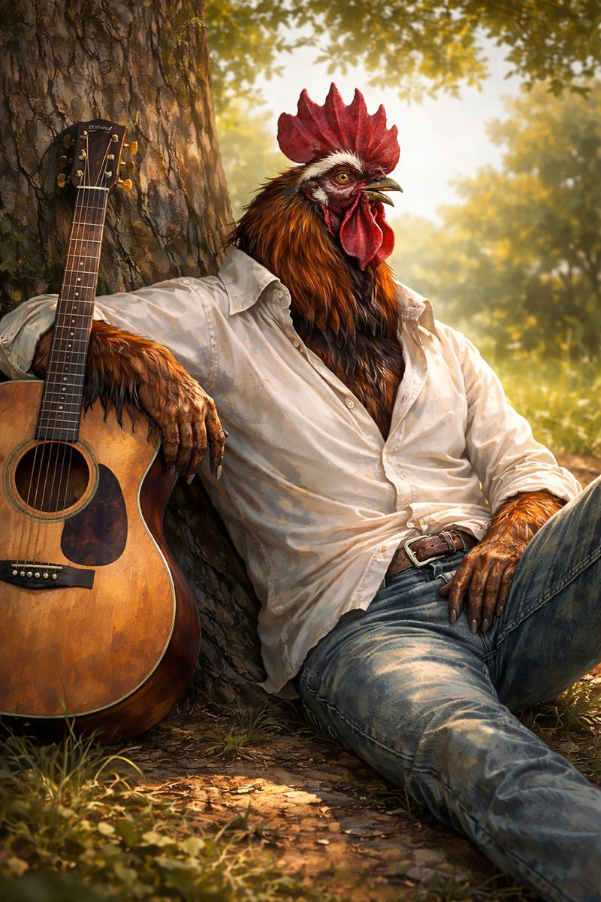

# Leroy

### Leroy, Called “The King”

Awakened rooster, musician, and cultural icon of Almas, Andoran
  

#### Appearance

Leroy is a large, well-kept rooster with vibrant plumage and an alert, expressive bearing. On stage, he favors flamboyant attire inspired by Andoren performance fashion—most famously a fitted white jumpsuit with decorative stitching and a wide collar—tailored to accommodate wings, tail feathers, and dramatic movement. Offstage, he dresses simply, often carrying his guitar himself and drawing attention only after it is already too late to avoid.
  

#### History

Born an ordinary rooster on the outskirts of Almas, Leroy was awakened under circumstances that have since become the subject of generous embellishment and unhelpful mythmaking. What is known with certainty is that he demonstrated musical talent shortly thereafter and began performing publicly within the city. His early shows blended traditional rural work songs with unfamiliar rhythms and a confident stage presence that felt startlingly modern.
  

Over the past two years, Leroy’s reputation has grown rapidly throughout Andoran. His performances draw large crowds, his songs circulate widely, and his most famous piece, \*Sun Do Shine\*, has taken on near-hymnal status among listeners with Sarenrite leanings. Despite his fame, Leroy has resisted patronage, formal religious affiliation, or political endorsement, preferring short tours and limited engagements to permanent residence or institutional backing.

In Desnus of 4714 AR, Leroy visited [Thumpington](../../../Locations/Inner%20Sea%20Region/River%20Kingdoms/Stolen%20Lands/Thumping%20Waters/Settlements/Thumpington/Thumpington.md) for a brief, sold-out series of performances, marking his first appearance in the [Stolen Lands](../../../Locations/Inner%20Sea%20Region/River%20Kingdoms/Stolen%20Lands/Stolen%20Lands.md). The visit was widely regarded as a cultural milestone for the young kingdom.

#### Personality

Leroy is confident without arrogance, warm without theatrical excess, and notably reserved offstage. He speaks little between songs and avoids commentary that might be mistaken for instruction or prophecy. His performances emphasize reassurance, shared endurance, and the quiet dignity of continuing forward.
  

Those who have met him privately describe him as thoughtful, observant, and surprisingly pragmatic, with a dry sense of humor and little patience for spectacle divorced from sincerity.

#### Music and Beliefs

Leroy’s work draws heavily from rural Andoren musical traditions, reworked through a distinctive modern style characterized by confident guitar work, deliberate pacing, and emotional restraint. His most famous song, \*Sun Do Shine\*, carries clear Sarenrite overtones—centering on renewal, perseverance, and light—without functioning as doctrine or sermon.
  

While aware of his species’ short natural lifespan, Leroy does not dwell on mortality in public. Instead, his music reflects an emphasis on presence, attention, and the value of being heard while one has something worth saying.

#### Notable Associations

During his Thumpington visit, Leroy performed an impromptu collaboration with [Seamus](../Characters/Seamus.md), Minister of Intelligence, whose fife accompaniment was widely praised. The performance has since become a favored anecdote in local retellings of the concert.
  

#### Current Role

Leroy continues to tour Andoran and neighboring regions on a limited schedule, favoring short residencies over extended engagements. He remains one of the most recognizable cultural figures in Almas and is widely regarded as a symbol of modern Andoren identity—rooted in tradition, but unafraid of change.
  

#### Status with Thumping Waters

A celebrated guest and respected cultural figure. Leroy holds no formal ties to the republic, but his visit is remembered fondly and frequently referenced as evidence that Thumping Waters has become a place worth traveling to, even for those with many options.
