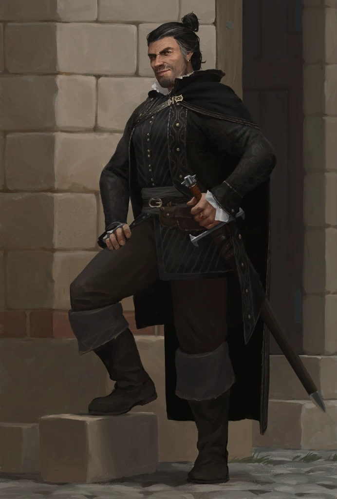

# Maegar Varn

*Charming Noble · Restless Visionary · Lost Too Soon*

Maegar Varn bore the confidence of a man born to lead. With his sharp eyes, salt-and-pepper hair tied in a practical knot, and the Varn family blade at his side, he cut a dashing figure among the [River Kingdoms](../../../Locations/Inner%20Sea%20Region/River%20Kingdoms/River%20Kingdoms.md)' lesser nobility. A scion of House Varn and a chartered explorer of the [Nomen Heights](../../../Locations/Inner%20Sea%20Region/River%20Kingdoms/Stolen%20Lands/Nomen%20Heights/Nomen%20Heights.md), Maegar was never content with idleness. At the Feast of Heroes, he spoke often—and proudly—of his plans for a new settlement called Varnhold, already charted and sketched out in detail back home.

He had no shortage of ambition, but it was tempered by a disarming charm. Maegar was quick to toast a rival’s success and quicker still to offer advice or aid. For all his noble bearing, he treated most folk with warmth and an easy grin. He dreamed of a thriving community nestled at the base of the [Dunsward](../../../Locations/Inner%20Sea%20Region/River%20Kingdoms/Stolen%20Lands/Nomen%20Heights/Dunsward.md), a beacon of order and prosperity in the untamed wilds.

That dream ended in silence.

When Varnhold vanished without a trace, Maegar vanished with it. No messenger fled the calamity. No bodies lay in the streets. Just a hollow village and the unsettling absence of its people. It was the Tubthumpers who would eventually uncover the truth—but by then, Maegar’s fate had been sealed.

He is remembered in Thumping Waters not just as a neighbor and fellow chartered lord, but as a man who believed in carving civilization from chaos. A man who sought to build something that would last.

He was, in the end, simply the first to fall.
