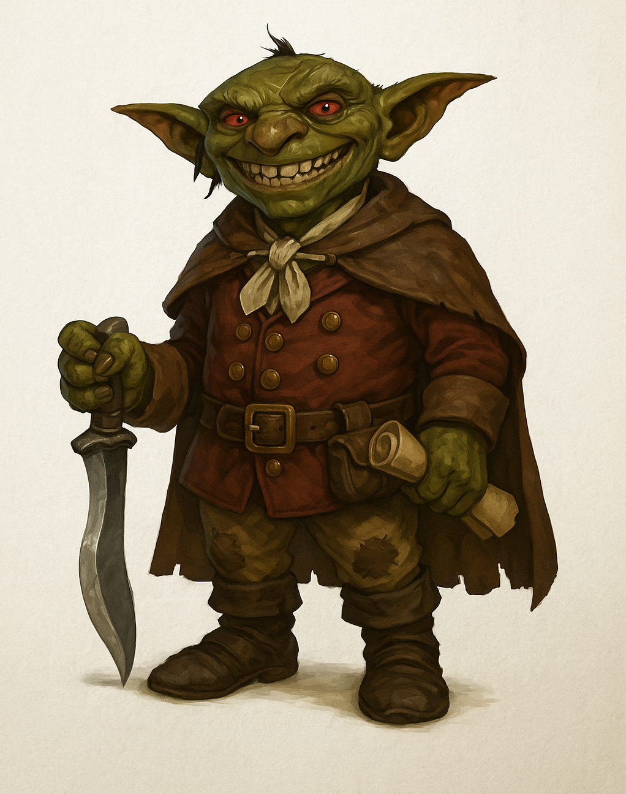

# Nok-Nok

> [!side]
> :   Influence Level: 8

*Compiled by the College of Letters and Public Record, [Free University of Thumping Waters](../../../Locations/Inner%20Sea%20Region/River%20Kingdoms/Stolen%20Lands/Thumping%20Waters/Settlements/Thumpington/Free%20University%20of%20Thumping%20Waters.md), with archival assistance from [Greengripe](../../../Locations/Inner%20Sea%20Region/River%20Kingdoms/Stolen%20Lands/Thumping%20Waters/Settlements/Greengripe/Greengripe.md), the [Ministry of Communication](../../../Locations/Inner%20Sea%20Region/River%20Kingdoms/Stolen%20Lands/Thumping%20Waters/Ruling%20Council/Ministry%20of%20Communication.md), the [Ministry of Defense](../../../Locations/Inner%20Sea%20Region/River%20Kingdoms/Stolen%20Lands/Thumping%20Waters/Ruling%20Council/Ministry%20of%20Defense.md), and surviving members of the Republican armies*

> No explosions before breakfast.
>
> — Standing order of Governor Nok-Nok

Nok-Nok was a goblin adventurer, governor, military commander, and one of the earliest friends of the Republic of Thumping Waters. He first introduced himself beneath [The Old Sycamore](../../../Locations/Inner%20Sea%20Region/River%20Kingdoms/Stolen%20Lands/Greenbelt/Kamelands/The%20Old%20Sycamore.md) as a hero before his companions possessed much evidence that the title was deserved. Over the years that followed, he helped rescue Mikmek, fought beside the founders, transformed Greengripe into a prosperous goblin settlement, organized Nok-Nok's Irregulars, and died protecting his soldiers during the War of the River Kings.

Nok-Nok spent much of his life insisting that he was destined to become a great goblin hero. His accounts of particular adventures were not always constrained by chronology, proportion, or the presence of other witnesses. His final claim requires no qualification. Nok-Nok was a hero.

  

### At a Glance

**Ancestry:** Goblin

**Homeland:** The [Greenbelt](../../../Locations/Inner%20Sea%20Region/River%20Kingdoms/Stolen%20Lands/Greenbelt/Greenbelt.md)

**Later Residence:** Greengripe

**Status:** Deceased; killed in action east of [Fort Drelev](../../../Locations/Inner%20Sea%20Region/River%20Kingdoms/Stolen%20Lands/Thumping%20Waters/Settlements/Fort%20Drelev/Fort%20Drelev.md)

**Titles:** Hero of the Mite Warrens; Governor of Greengripe; Commander of Nok-Nok's Irregulars

**Known For:** Defiant optimism, goblin civic leadership, twin kukris, military bombardiers, enthusiastic demolition

**Unofficial Office:** Chief of Fun and Fire Safety

**Most Famous Order:** *No explosions before breakfast*

  

### Appearance and Equipment

Nok-Nok was a wiry goblin with scarred green skin, quick hands, and a grin broad enough to suggest either delight or an event requiring immediate supervision. He dressed in a patchwork of leather armor, trophies, useful equipment, and objects selected principally because he believed they made him look heroic. The overall effect was chaotic, but his stance possessed the practiced balance of an experienced knife-fighter.

He fought with paired kukris. One was a magical cold-iron weapon given to him by [Seamus](../Characters/Seamus.md). Nok-Nok valued the blade as more than an effective weapon. To him it was visible proof that the founders of Thumping Waters regarded him as a companion and trusted him to stand beside them against dangers that required cold iron.

Later public depictions frequently show Nok-Nok in the bright red sash and beer-mug-shaped iron helmet worn by his Irregulars. These images accurately represent his military command but should not be mistaken for his ordinary dress during the Republic's earliest years.

  

### The Hero beneath the Old Sycamore

Nok-Nok first entered the Republic's history before the Republic existed. The adventurers later known as the Tubthumpers encountered him near the Old Sycamore during the conflict between the mites beneath the tree and the kobolds of the Sootscale tribe.

He declared himself a hero immediately. He then supplied evidence.

Nok-Nok helped the adventurers fight through the mite warrens, rescue the kobold Mikmek, recover the Sootscales' stolen sacred statue, and expose the deception surrounding the false kobold leader [Tartuk](Tartuk.md). Those actions contributed to the end of the mite conflict and to the founders' first lasting alliance with the people who would establish [Sootscale Valley](../../../Locations/Inner%20Sea%20Region/River%20Kingdoms/Stolen%20Lands/Thumping%20Waters/Settlements/Sootscale%20Valley/Sootscale%20Valley.md).

Nok-Nok thereafter styled himself the Hero of the Mite Warrens. He repeated the title frequently, especially in circumstances where introductions might otherwise have been shorter. The name began as self-promotion and became an accepted description of his part in events beneath the sycamore.

  

### Companion of the Founders

Nok-Nok continued to appear throughout the Republic's early history wherever danger, excitement, or the possibility of applause could be found. He fought beside the Tubthumpers against creatures of the Greenbelt and proved himself a brave, loyal, and unconventional companion.

His retellings generally increased the number of enemies and the centrality of his own decisions. Attempts to correct him were often incorporated into later versions as dialogue spoken by an unnamed and less perceptive companion. Yet witnesses who disputed the scale of Nok-Nok's achievements rarely disputed his willingness to place himself in danger for his friends.

Nok-Nok had once worshipped [Lamashtu](../../../Rules/Deities/Lamashtu.md), the Mother of Monsters. He also spoke openly of becoming a goblin hero-god like the legendary figures raised above ordinary goblinkind. His later life moved away from the role his old faith and the wider world expected him to occupy. Whether he abandoned every element of his earlier devotion is a private religious question the surviving record cannot answer. What is clear is that he increasingly measured heroism through loyalty, protection, laughter, and the flourishing of his people.

  

### Governor of Greengripe

Nok-Nok's greatest peacetime achievement was Greengripe. What began as a ramshackle goblin camp among the trees of the Greenbelt developed under his leadership into one of the Republic's most prosperous and distinctive settlements. Greengripe became known for alchemy, brewing, smithing, trade, invention, and the large-scale production of alchemical goods.

Nok-Nok governed through a mixture of personal familiarity, spectacle, boasting, improvisation, and genuine administrative ability. He visited workshops, encouraged inventors, knew many citizens by name, and took particular delight in the schemes and pranks of Greengripe's children. He defended the settlement against outsiders who dismissed it as an unruly camp and demanded that its people receive the same recognition as other citizens of the Republic.

His preferred unofficial title was *Chief of Fun and Fire Safety*. The first responsibility suited him naturally. His qualifications for the second remained a subject of civic debate. His most famous standing order was posted upon the town hall door:

**NO EXPLOSIONS BEFORE BREAKFAST**

Enforcement was inconsistent. The order itself survived him.

Greengripe under Nok-Nok demonstrated that goblin citizenship did not require goblins to abandon their culture and imitate their neighbors. The settlement remained loud, humorous, unpredictable, experimental, and occasionally combustible. It was also productive, loyal, organized according to its own character, and increasingly important to the national economy.

  

### Defiant Optimism

Nok-Nok was rowdy, boastful, unpredictable, and deeply loyal. He treated humor as a weapon equal to either kukri and regarded many rules as invitations to negotiate, reinterpret, or rewrite the rule in larger letters.

He described his philosophy as *defiant optimism*: laughter used as armor against fear. Pranks were signs of affection, festivals were acts of civic confidence, and an explosion that harmed no one was usually evidence of successful planning. The philosophy did not deny danger. It refused to allow danger exclusive control over the emotional life of those confronting it.

> Laughter is the best armor against fear.
>
> — Nok-Nok

Nok-Nok's confidence frequently bordered upon absurdity, but its effect upon others was real. He was born into a world that commonly treated goblins as monsters, nuisances, or enemies. He spent his life demonstrating that they could be neighbors, craftspeople, soldiers, officials, builders, and heroes without first ceasing to be goblins.

  

### Greengripe and Sootscale Valley

Relations between Greengripe and Sootscale Valley were not always peaceful. Greengripe's habit of treating pranks as diplomacy tested the patience of [Chief Sootscale](Chief%20Sootscale.md), particularly when damaged property, frightened livestock, or alchemical residue accompanied the joke.

Relations improved after [Kereek](Kereek.md) assumed leadership of Sootscale Valley. Kereek did not share Nok-Nok's enthusiasm for chaos, but the two leaders developed a working respect founded upon their responsibility to their communities. Ordinary disputes continued without threatening the political friendship between the settlements.

The relationship became one example of the Republic's larger challenge: neighboring peoples did not need identical customs to share laws, roads, security, and citizenship. They did need reliable ways to repair harm and determine when an alleged prank had ceased to be funny.

  

### Nok-Nok's Irregulars

During the War of the River Kings, Nok-Nok organized Greengripe's alchemists, brewers, tinkerers, scouts, and demolition experts into a military bombardier company known as Nok-Nok's Irregulars. Outsiders initially regarded the formation as entertainment wearing helmets. Its performance corrected that assessment.

The Irregulars wore bright red sashes and iron helmets shaped like beer mugs. They marched to drums made from repurposed kegs and followed a doctrine summarized as *dazzle, disorient, detonate*. Their methods relied upon alchemical bombardment, noise, confusion, mobility, and an intimate professional understanding of which objects were likely to explode.

When [Pitax](../../../Locations/Inner%20Sea%20Region/River%20Kingdoms/Stolen%20Lands/Thumping%20Waters/Settlements/Pitax/Pitax.md) attempted to invade while the Republic's rulers were returning from the Rushlight Tournament, the Irregulars fought in the defense of Willowfen. Their bombardments helped break an invading force containing mercenaries, mammoth-riding giants, and wyverns before it could establish a lasting foothold.

The victory earned the Irregulars the respect of commanders who had questioned their discipline, including High Marshal [Valerie](Valerie.md). Nok-Nok took fierce pride in his soldiers. He joined their drills, inspected their munitions, learned their strengths, and insisted that no one under his command face a danger he would refuse himself.

  

### The Battle East of Fort Drelev

Nok-Nok died during the Republic's campaign against Kob Moleg and the Tusker Riders. Five Republican armies engaged four formations of mammoth cavalry east of Fort Drelev. The battle became the Republic's gravest military defeat of the war. The [Thumpington](../../../Locations/Inner%20Sea%20Region/River%20Kingdoms/Stolen%20Lands/Thumping%20Waters/Settlements/Thumpington/Thumpington.md) Rangers, Lizardfolk Defenders, Safety Third Cavalry, and Nok-Nok's Irregulars were destroyed as effective formations. The Nomen Scouts alone escaped intact.

The Irregulars held one of the most dangerous positions upon the field. When their formation collapsed beneath the enemy advance, Nok-Nok could have attempted to escape. He refused to abandon the soldiers who had followed him from Greengripe.

Witnesses reported that he remained behind, fighting to protect his people and buying time for anyone still capable of withdrawing. It would have surprised few citizens had Nok-Nok died attempting something reckless, spectacular, and unnecessarily explosive. Instead, he died defending his soldiers.

> I questioned Governor Nok-Nok's methods often. I never questioned his courage. He understood that soldiers do not fight for formations, regulations, or lines drawn upon a map. They fight for the people standing beside them and the homes waiting behind them. His Irregulars followed him because they knew he would never ask them to face a danger he would not face himself. In the end, he proved them right.
>
> — High Marshal Valerie

Nok-Nok had spent much of his life declaring himself a hero. In his final moments, he did not die seeking recognition, applause, or proof of his own importance. He died because his soldiers were still in danger.

No exaggeration was required.

  

### Immediate Memorials

Greengripe honored its fallen governor with fireworks. For one night, no one was expected to enforce the prohibition against explosions before breakfast. The town retained his standing order afterward, along with the festivals, workshops, civic habits, and philosophy of defiant optimism he had helped establish.

The fallen Irregulars are remembered with Nok-Nok as Republican soldiers rather than as curiosities or comic figures. Their service at Willowfen and sacrifice east of Fort Drelev secured their place in the military history of Thumping Waters. Surviving records preserve the names of individual soldiers wherever they can be established.

  

#### Greengripe Amphitheatre

The Greengripe Amphitheatre opened in Thumpington during the Victory Festival of 6 Gozran, 4715 AR. It is dedicated to Nok-Nok and the members of the Irregulars who died in the war. The memorial was built as a place for music, comedy, public gathering, and celebration rather than as a silent monument separated from ordinary life.

> May every cheer raised within the Greengripe Amphitheatre remind us that the freedom to celebrate was purchased by those willing to stand in its defense.
>
> — Memorial dedication

The decision reflects Nok-Nok's own understanding of courage. Remembering the dead does not require the living to surrender laughter. The amphitheatre ensures that both remain part of the public life they defended.

  

### Legacy at the Free University

When the Free University of Thumping Waters was chartered in 4716 AR, one of its four founding colleges was named Nok-Nok College of Practical Arts and Civic Service. The college teaches field medicine, alchemy, emergency response, wilderness survival, defensive construction, settlement administration, scouting, and other disciplines most valuable when an orderly plan has failed and people still require help.

Its principal practical hall is the Irregulars' Workshop. Classrooms open into work yards, treatment rooms, kitchens, reinforced laboratories, and storage bays where students learn by building, repairing, testing, and responding to controlled emergencies. The name honors Nok-Nok's soldiers as well as the students whose experience does not fit conventional academic categories.

The college's unofficial motto is *A Hero Stays*. Faculty explicitly warn that the phrase is not an instruction to pursue a glorious death or remain in a position where survival would permit greater service. It describes the responsibilities of leadership: preparation before danger, presence during it, and responsibility for the people who must live afterward.

  

#### The Nok-Nok Irregulars Fellowship

The Nok-Nok Irregulars Fellowship admits and supports students whose abilities would often be missed by conventional academies. Fellows may come from poor households, remote settlements, displaced communities, military service, unconventional apprenticeships, or peoples historically excluded from advanced education.

Selection considers courage, ingenuity, loyalty, service, practical ability, and potential rather than wealth or academic polish. The fellowship provides tuition, lodging, meals, books, and preparatory instruction. Recipients are collectively known as the Irregulars and are expected to return some benefit to a community through teaching, healing, building, research, public work, or another form of service they choose.

The fellowship expresses one of the clearest lessons drawn from Nok-Nok's life: unusual people should be given an opportunity before catastrophe forces them to prove their value.

  

#### University Traditions

Nok-Nok College uses a battered shield before a rising firework as its emblem. Its highest student distinction is the Last to Leave Medal, awarded for protecting, supporting, or accepting responsibility for others rather than for examination rank.

Students of the college call themselves Irregulars. University ceremonies held at the Greengripe Amphitheatre frequently include fireworks, which has required the repeated clarification that historical commemoration does not itself repeal Thumpington's municipal safety laws.

These traditions preserve Nok-Nok as more than a commander who died well. They remember the governor who built a settlement, the companion who made courage ridiculous enough to approach, and the goblin who refused to accept the future others had assigned him.

  

### The Hero Nok-Nok Intended to Become

Nok-Nok once spoke of becoming a goblin hero-god. No recognized church has declared his apotheosis, and the Free University has found no reliable evidence that his spirit acquired divine power after death. Shrines, stories, invocations, and requests for luck do exist, particularly among goblins who see his life as proof that heroism and goblin identity need not contradict one another.

Whether these practices will remain civic remembrance, develop into ancestor veneration, or become something resembling an organized cult cannot yet be established. Scholars should neither manufacture a god from affection nor dismiss the religious meaning communities create around their dead.

The historical conclusion requires less speculation. Nok-Nok began as a strange goblin beneath an old tree, announcing to a group of adventurers that he intended to become a hero.

He was right.

