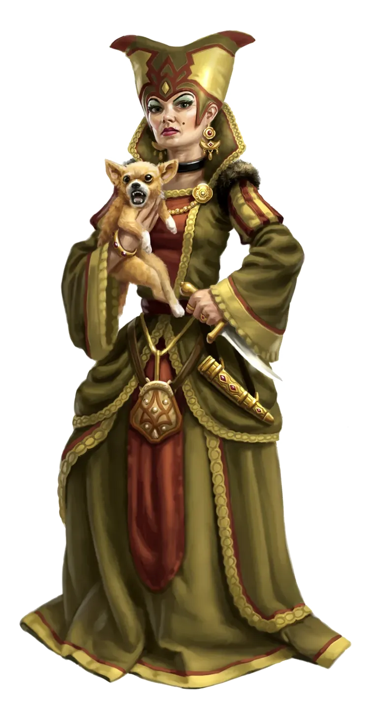

# Pavetta Stroon-Drelev

Pavetta Stroon-Drelev is the wife of the late Baron Hannis Drelev and sister to the wizard Imeckas Stroon. Born into minor Galtan nobility, Pavetta grew up accustomed to comfort, deference, and a life where someone else was always to blame. Her marriage to Hannis Drelev brought her status, but not the stability or admiration she imagined. Long before the Tubthumpers arrived, Pavetta had retreated into the insulated luxury of the keep, surrounded by fine furnishings, silks, and her beloved lapdog, Jewel.

  

Pavetta is not cruel in the way her husband was, but she is deeply self-centered and profoundly disconnected from the suffering of her people. Under Drelev’s rule she avoided public affairs, preferring to delegate responsibility to her brother or the baron’s advisers. While not directly responsible for the worst of Drelev’s policies, she benefitted from them and rarely questioned their cost.

  

During the assault on [Fort Drelev](../../../Locations/Inner%20Sea%20Region/River%20Kingdoms/Stolen%20Lands/Thumping%20Waters/Settlements/Fort%20Drelev/Fort%20Drelev.md), Pavetta was caught entirely off guard when a fleeing guard burst into her chambers—only to be cut down before her eyes. Confronted by the Tubthumpers, she panicked, called for her brother, and made desperate appeals to preserve her status. Ultimately, the party chose to allow Pavetta to retain a limited, supervised authority within the keep. She now rules provisionally under strict terms imposed by the leadership of Thumping Waters, and her continued position depends heavily on her ability to demonstrate genuine concern for her people.

  

Whether Pavetta rises to this challenge or retreats back into fearful self-preservation remains to be seen. For the first time in her life, she must act not as a sheltered noblewoman, but as a ruler accountable to those she once ignored.
