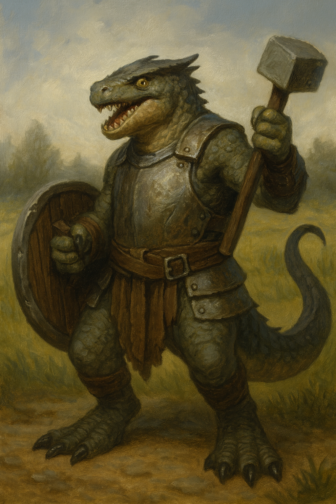

# Prazil

*Big Club · Small Thoughts · Loyal Heart*

Prazil is a hulking, green-scaled kobold whose enormous club is only slightly more dangerous than his clumsy enthusiasm. Towering over most of his kin, Prazil has never been the brains of any operation—but when it comes to smashing, bashing, or loyally standing behind someone smarter than him, he’s unmatched.

Once a servant of the would-be Troll King Hargulka, Prazil’s fate changed when he escaped captivity alongside the red-scaled schemer Kereek. Though Kereek treats him like a half-witted lackey, Prazil doesn’t seem to mind. He laughs when Kereek insults him, cheers when Kereek gloats, and would almost certainly throw himself into danger at a single barked command.

That loyalty has not gone unnoticed.

After the fall of Hargulka and the clearing of the troll-infested hills, Prazil and Kereek joined the Republic of Thumping Waters, where Prazil’s brute strength was finally seen as an asset rather than a joke. He’s since become a fixture in the kingdom’s ranks of oddball heroes—usually standing just behind Kereek, grinning through broken teeth, ready to swing something very large at whatever threatens his friends.

He doesn't talk much. When he does, it’s usually about lunch. Or smashing.

And maybe—just maybe—how lucky he feels to finally belong somewhere.
