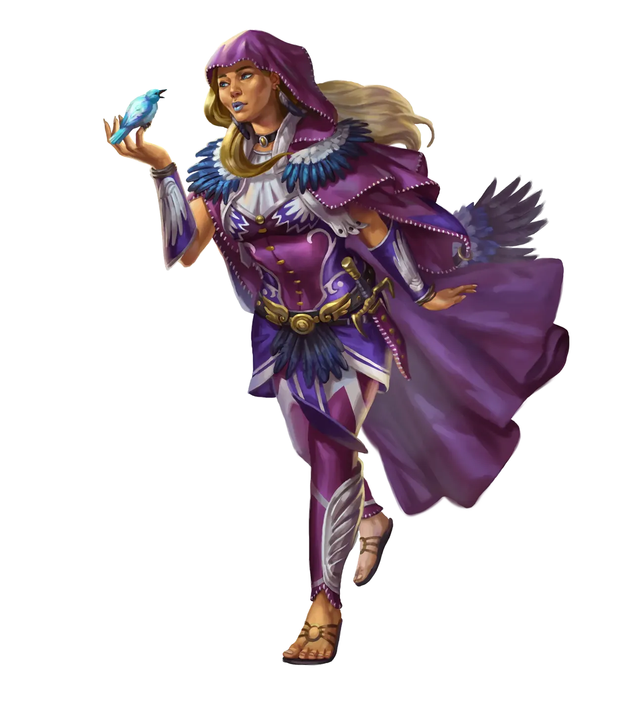

# Quintessa Maray

Lady Quintessa Maray is a Galtan socialite, spellcaster, and political intriguer who served as Baron [Hannis Drelev](Hannis%20Drelev.md)’s favored mistress and informal adviser. With beauty, poise, and a talent for reading people’s weaknesses, she wove herself into Drelev’s inner circle not through loyalty, but through opportunity. Beneath her polished manners lies a calculating mind and a willingness to use magic to shape outcomes to her advantage.

  

Quintessa arrived in [Fort Drelev](../../../Locations/Inner%20Sea%20Region/River%20Kingdoms/Stolen%20Lands/Thumping%20Waters/Settlements/Fort%20Drelev/Fort%20Drelev.md) under the guise of a visiting noblewoman, but quickly made herself indispensable to the baron. Skilled in enchantment, illusion, and social manipulation, she became Drelev’s confidante in matters both political and personal. While she rarely issued direct commands, her influence permeated the keep—soft words here, a suggestion there, and occasionally a well-placed spell to quiet inconvenient dissent.

  

Though she shared Drelev’s appetite for luxury, she lacked his brutish insecurity. Quintessa preferred subtler tools. She entertained dignitaries, calmed volatile nobles, and ensured information flowed exactly where she wanted it. Those who underestimated her often found themselves subtly steered toward her goals or quietly removed from the baron’s good graces. In another life she could have been a diplomat; in this one, she chose to be a power behind the throne.

  

During the Tubthumpers’ assault on the keep, Quintessa fought with lethal efficiency. Her initial force spell nearly killed [Ally](../Characters/Ally%20Grainger.md) outright, and a subsequent enchantment left [Seamus](../Characters/Seamus.md) reeling and stupified, fighting only through instinct. Even as the battle swung against Drelev, she maintained her composure. When it became clear that the banquet hall would fall, she vanished—either through teleportation or invisibility—and escaped the keep entirely.

  

Her disappearance leaves an uneasy question hanging over Fort Drelev: where will she resurface next? Quintessa is not the type to accept defeat gracefully, nor is she sentimental enough to avenge Drelev out of love. But she is opportunistic, ambitious, and entirely capable of reshaping herself for the next stage in her quiet ascent. The [River Kingdoms](../../../Locations/Inner%20Sea%20Region/River%20Kingdoms/River%20Kingdoms.md) may not have seen the last of her.
