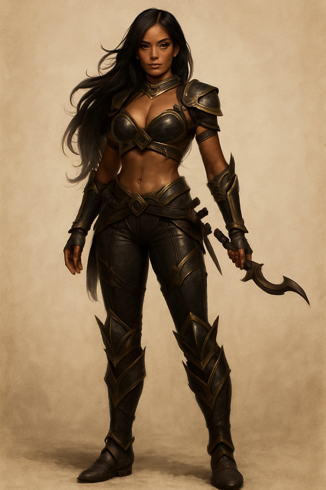

# Satinder Morne

Satinder Morne is one of those people who can make an entire room lean closer just by smiling. They say she runs the *Velvet Corner* in [Fort Drelev](../../../Locations/Inner%20Sea%20Region/River%20Kingdoms/Stolen%20Lands/Thumping%20Waters/Settlements/Fort%20Drelev/Fort%20Drelev.md)—a place that used to be known for its music and laughter before the Baron’s mercenaries claimed every stool and corner table. Now it’s filled with grumbling sellswords, but Satinder still moves among them like she owns the place, and in a way, she does. She keeps her girls safe, the wine flowing, and the soldiers too drunk to notice that they’re whispering secrets to the wrong woman.

  

She’s a cleric of **Calistria**, which tells you most of what you need to know: clever, patient, and sharper than silk looks. There’s mischief in her, but there’s also kindness—the kind that knows the world won’t always be gentle back. She hides her faith behind smiles and perfume, but those who know her say she prays for revenge in the same breath she blesses her patrons. I suppose that’s a kind of holiness too, in a place like Fort Drelev.

  

Her closest friend is **[Kisandra Numesti](Kisandra%20Numesti.md)**. When Kisandra’s family fell from favor, Satinder helped her escape the city. That’s no small thing when the Baron’s spies are everywhere. I’ve been told that when the Tubthumpers arrived, Satinder didn’t hesitate—she gave them shelter, warned them who to trust, and made sure the right ears overheard the right lies. All while pouring another round for the enemy.

  

I haven’t met her myself, but if half of what I’ve heard is true, Satinder Morne is the sort of hero the [River Kingdoms](../../../Locations/Inner%20Sea%20Region/River%20Kingdoms/River%20Kingdoms.md) breed best—one who fights with wit, will, and the nerve to smile while doing it. And if she ever does see Drelev fall, I suspect she’ll toast the moment with the finest wine in her cellar… and not spill a drop.
