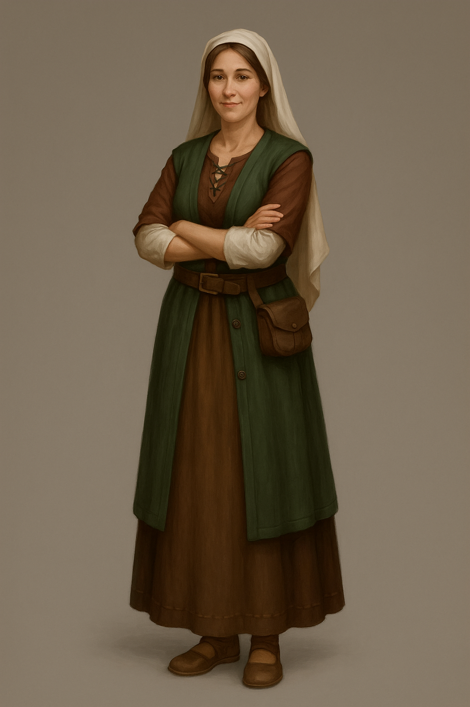

# Svetlana Leveton

### Svetlana Leveton (née Beyavin)

  

Mayor of [Olegton](../../../Locations/Inner%20Sea%20Region/River%20Kingdoms/Stolen%20Lands/Thumping%20Waters/Settlements/Olegton/Olegton.md), Daughter of [Restov](../../../Locations/Inner%20Sea%20Region/Brevoy/Restov.md) Nobility, Partner in Trade and Diplomacy

#### Appearance

  

Once a noblewoman accustomed to the silks of Restov, Svetlana has long since adopted the more practical garb of frontier life. Her bearing remains graceful, and her smile—gentle but steady—speaks to the kindness that defines her. Now in her role as mayor, she favors clean but simple dresses and woven headscarves, presenting herself as approachable rather than lofty.

#### History

  

The daughter of a minor noble family in Restov, Svetlana grew up surrounded by wealth and politics but despised the deceit and manipulation that defined noble life. Lacking the swordplay or scheming to thrive in such an environment, she found herself alienated from her peers, yearning for honesty and purpose.

Her life changed when she met [Oleg Leveton](Oleg%20Leveton.md), a craftsman whose pride and integrity set him apart from the backbiting gentry. Their bond grew into love, and together they left Restov for a new life in the [Stolen Lands](../../../Locations/Inner%20Sea%20Region/River%20Kingdoms/Stolen%20Lands/Stolen%20Lands.md).

The couple established Oleg’s Trading Post, a small frontier outpost that quickly became a lifeline for travelers and settlers. When bandits under the [Stag Lord](Stag%20Lord.md) nearly drove them to ruin, the Tubthumpers arrived, breaking the extortion and toppling the Stag Lord. From that moment, Oleg’s dream of a trading post blossomed into the foundation of a thriving settlement: Olegton.

#### Personality

  

Svetlana is pragmatic, warm, and unshakably kind. Where Oleg can be stubborn and blunt, she softens edges with patience and diplomacy. Her years of navigating Restov’s poisonous social circles taught her caution, but her time in the frontier gave her courage. She values community above ambition and seeks to ensure Olegton thrives as a place of fairness, honesty, and opportunity.

#### Current Role

  

As mayor of Olegton, Svetlana presides over one of the Republic of Thumping Waters’ largest trade hubs. Despite being landlocked, Olegton has become a nexus of commerce, drawing merchants, craftsmen, and caravans from across the republic. Svetlana oversees trade agreements, ensures security along the caravan routes, and fosters Olegton’s growth as a symbol of frontier success.

Though she still sees herself as “just a woman running a trading post,” Svetlana has proven an able and popular leader. She is widely respected by both her townsfolk and the greater republic, embodying the spirit of resilience and cooperation that defines Thumping Waters.

#### Status with Thumping Waters

  

An influential and well-regarded mayor. Svetlana’s diplomatic instincts and integrity have made Olegton a cornerstone of the republic’s economy. She and Oleg are seen as folk-heroes of the frontier, remembered as much for their perseverance as for their partnership.

## Relationships

## Husband

[Oleg Leveton](Oleg%20Leveton.md)
