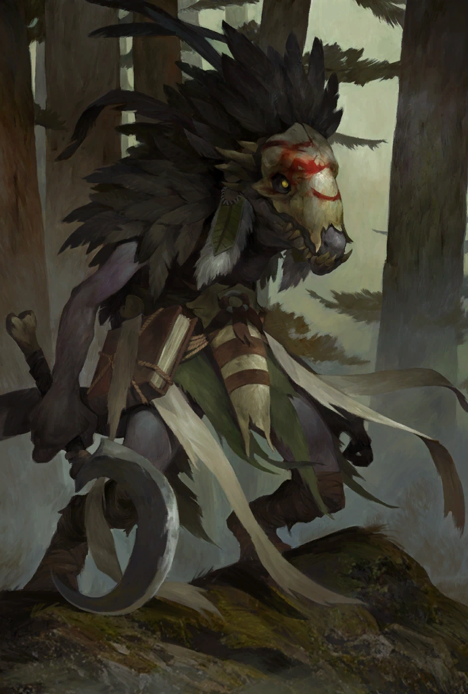

# Tartuk

*Purple Scales · Bitter Spirit · Prophet of Doom*

Once an influencial kobold, Tartuk was slain by his own tribe and the Tubthumpers.

Tartuk manipulated his fellow kobolds through fear, staging “divine punishments” and demanding loyalty to his cruel vision. His true motives are still unknown.

Though he never lived to see Thumping Waters, his name still lingers in the oral histories of the Sootscale tribe—a cautionary tale about false prophets and the price of blind faith.
