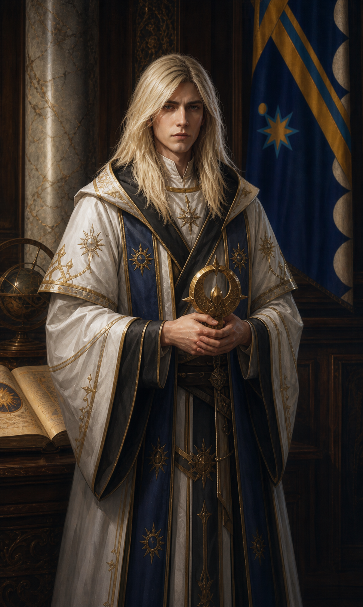

# Tristian

*Compiled by the College of Letters and Public Record, [Free University of Thumping Waters](../../../Locations/Inner%20Sea%20Region/River%20Kingdoms/Stolen%20Lands/Thumping%20Waters/Settlements/Thumpington/Free%20University%20of%20Thumping%20Waters.md), with archival assistance from the Temple of [Sarenrae](../../../Rules/Deities/Sarenrae.md), the [Ministry of Magic](../../../Locations/Inner%20Sea%20Region/River%20Kingdoms/Stolen%20Lands/Thumping%20Waters/Ruling%20Council/Ministry%20of%20Magic.md), and [Linzi](Linzi.md)*

> Power is safest in the hands of someone who keeps asking whom it might hurt.
>
> — Linzi

Tristian is a priest of Sarenrae, healer, counselor, and the present Minister of Magic of the Republic of Thumping Waters. He first came to the [Stolen Lands](../../../Locations/Inner%20Sea%20Region/River%20Kingdoms/Stolen%20Lands/Stolen%20Lands.md) under the guidance of troubling dreams and briefly traveled with the adventurers later known as the Tubthumpers during their campaign against the [Stag Lord](Stag%20Lord.md). Although he soon departed to pursue a calling of his own, he returned to become one of [Thumpington](../../../Locations/Inner%20Sea%20Region/River%20Kingdoms/Stolen%20Lands/Thumping%20Waters/Settlements/Thumpington/Thumpington.md)'s most trusted religious and civic leaders.

His public life has been defined by a gentle manner, a reluctance to exercise authority for its own sake, and an enduring belief that mercy is an obligation rather than an ornament. Recent events have also revealed that the signs surrounding Tristian since childhood were more than metaphor. During the resurrection of [Velka](../Characters/Velka/Velka.md), brilliant golden wings manifested from his back. Tristian now believes himself angelic in nature, though the meaning and limits of that revelation remain subjects of religious inquiry.

  

### At a Glance

**Ancestry:** Human in appearance; recently revealed to possess an angelic nature

**Homeland:** The Padishah Empire of Kelesh

**Current Residence:** Thumpington

**Faith:** Sarenrae, the Dawnflower

**Current Office:** Minister of Magic

**Former Association:** The Tubthumpers

**Known For:** Healing, counsel, curse lore, resurrection, and quiet acts of charity

**Notable Foundation:** Tristian's Dawn

  

### Child of the Dawn

Tristian was abandoned at a temple of Sarenrae while still an infant and raised among the Dawnflower's faithful. His childhood was marked by small miracles, unlikely protections, and an instinctive affinity for divine magic. The clergy interpreted these signs as evidence of Sarenrae's favor. Tristian accepted that conclusion without treating it as evidence of personal importance.

He grew into a soft-spoken and deeply conscientious priest. His faith emphasized healing, honesty, redemption, and the destruction of cruelty that refuses every offered path away from harm. These principles would later shape both his work in Thumpington and his approach to public authority.

  

### The Road to the Stolen Lands

Dreams and distant omens drew Tristian westward. He spoke of an old wrong beneath the soil and of a wounded land calling for healing. In the [Greenbelt](../../../Locations/Inner%20Sea%20Region/River%20Kingdoms/Stolen%20Lands/Greenbelt/Greenbelt.md) he joined the Tubthumpers during the campaign against the Stag Lord, providing healing, divine magic, and moral counsel during the dangerous final stages of their charter.

After the Stag Lord's defeat, Tristian left the company. He explained only that Sarenrae's work for him lay elsewhere. His departure was not a rejection of his companions. He remained connected to the nation they founded and eventually made his home in its capital.

  

### Priest of Thumpington

Tristian became a familiar presence in Thumpington as the frontier settlement grew into a capital. The Temple of Sarenrae under his influence developed as both a place of worship and a center of practical relief. Its clergy provided healing, meals, counsel, instruction, and temporary shelter without requiring suffering people to first present an acceptable theological explanation.

He was especially active during periods of recovery. After the Beast's attack devastated parts of the city, Tristian provided substantial funds for a home and school serving children who had lost family, security, or both. The institution became known as *Tristian's Dawn*, commonly shortened to *the Dawn*. He remains a frequent visitor, usually bringing books, bread, or some other useful thing and rarely announcing himself in advance.

  

### Minister of Magic

When [Mairi](../Characters/Mairi.md) Blackwood left the prime ministership, [Ally Grainger](../Characters/Ally%20Grainger.md) assumed leadership of the government and relinquished the Ministry of Magic. Tristian succeeded her as minister.

The appointment placed a man notably uncomfortable with power in charge of the Republic's magical policy. Tristian oversees magical research, advises the Ruling Council during supernatural emergencies, supervises projects whose risks extend beyond their practitioners, and mediates between arcane institutions, divine communities, and civil law.

He approaches administration as an extension of pastoral care. His first questions are usually who may be harmed, who has been excluded from the decision, and whether a dangerous problem can be resolved without creating a second one. He prefers restraint to spectacle and remedy to punishment, but his gentleness should not be mistaken for indecision. Once convinced that an action is necessary to protect others, he is extremely difficult to move.

  

### The Curse beneath the Scythe Tree

When rumors spread that service to the Republic brought unnatural aging, wasting, and death, Tristian warned the rulers and joined their investigation as an authority on curses. Beneath a great oak shaped like a scythe, the company discovered a ruined shrine once sacred to Shyka, an Eldest of the First World. The site had been defiled with demonic imagery and symbols of Yhidothrus, the Ravager Worm.

Tristian's presence connected the work of the Ministry of Magic with the immediate religious and medical needs of those endangered by the curse. The incident reinforced his conviction that supernatural threats rarely respect the administrative boundaries between magic, faith, history, and public health.

  

### Velka's Return and the Golden Wings

After Velka was killed in battle against the Kingdom of the Cleansed, Tristian personally conducted the ritual that restored her to life. She returned bearing a scimitar-shaped mark upon her arm, which he identified as a sign of Sarenrae.

The miracle also transformed public understanding of Tristian. During the ritual, radiant golden wings manifested from his back. He concluded that he was angelic in nature and observed that this might explain abilities he had previously accepted without understanding, including his ability to see in darkness.

The revelation answered one question and created many others. Tristian does not yet claim to understand what kind of being he is, why he was raised in mortal form, or what purpose lies behind the dreams and protections that shaped his life. The Temple of Sarenrae and the Free University distinguish carefully between what witnesses observed, what Tristian reasonably believes, and what remains unknown.

  

### Appearance and Manner

Tristian is a fair-haired man with warm features, golden-brown eyes, and the composed bearing of someone accustomed to listening through grief. He favors the practical white, cream, and gold vestments of Sarenrae's clergy rather than the elaborate robes that citizens sometimes imagine appropriate to a Minister of Magic.

His newly revealed wings are brilliant gold and have not become an ordinary feature of public appearances. Most citizens still encounter him as they always have: walking between the temple and government offices, listening more than he speaks, and appearing faintly surprised when addressed as *Minister*.

Tristian is patient, compassionate, and intensely private. He redirects praise, apologizes when thanked, and has a gift for making the person before him feel that their words deserve time. His sorrow is harder to read. Friends sometimes notice moments when his expression stills, as though he is listening to something very far away.

  

### Faith, Mercy, and Judgment

Tristian's devotion to redemption does not require him to ignore danger. Sarenrae offers mercy to those willing to turn from cruelty, but her faith also recognizes that the innocent must be defended from those who exploit every opportunity for forgiveness. Tristian therefore seeks alternatives before violence and accountability after harm.

This balance makes him valuable to a government frequently confronted by curses, monsters, hostile magic, and enemies capable of disguising coercion as necessity. He is neither the council's permission to do nothing nor its guarantee that every hard choice is righteous. He is most often the person who insists that a hard choice remain morally difficult.

  

### Tristian's Dawn

Tristian's Dawn is the clearest material expression of his influence upon Thumpington. Founded after the Beast's attack with his financial support, it serves as both a home and a school for children whose lives were disrupted by violence, poverty, or displacement. The institution operates under the protection of the Temple of Sarenrae while remaining woven into the ordinary civic life of the capital.

The name honors Tristian without presenting charity as a debt owed to one benefactor. In Sarenite teaching, dawn is the daily proof that darkness does not possess the future. The school's purpose is not merely to shelter children from what happened to them, but to ensure that hardship does not determine what they are permitted to become.

  

### Linzi's Notes (Definitely Not Official)

> Tristian still apologizes when people thank him. He still looks faintly startled whenever someone calls him "Minister," as if he is waiting for the real one to arrive. And yet he is frighteningly good at the work, mostly because he keeps asking questions no one else wants to ask: Who gets hurt? Who gets forgotten? Can we solve the problem without becoming the problem?
>   
>
> Then he brought Velka back from the dead and grew golden wings.
>
> I would like the record to show that even by our standards, this was a great deal to learn in one afternoon. Tristian took it more calmly than the rest of us. Of course he did. He has spent his whole life believing the dawn was leading him somewhere. Now we know the light was not only in front of him.
>
> If you want a Minister of Magic who will never enjoy having power over someone, put Tristian in the chair. If you want one who will make every comfortable answer uncomfortable again, keep him there.
>
> — Linzi

  

### An Unfinished Revelation

Tristian's life now stands between public service and personal mystery. He is a minister, priest, founder, healer, and proven worker of miracles. He is also a man newly confronted with evidence that his own body and history are not what he believed them to be.

For the moment, he continues as he always has: tending the wounded, advising the council, visiting the Dawn, and following the light he can see while refusing to pretend that it illuminates everything.

## General Details

*An artistic reconstruction of the moment Tristian’s golden wings manifested during the ritual that restored Velka to life. The wings are not ordinarily visible and do not appear in his official council portrait.*

---

## General Details

### Linzi’s Notes (Definitely Not Official)

  

So! Tristian is the Minister of Magic now. I know, I know—if you’d told me that back when we were tromping around the Stolen Lands getting stabbed by bandits and yelled at by owlbears, I’d have laughed and written a song about how impossible it sounded. But here we are.

  

If you’re imagining him striding around in fancy robes, issuing decrees with a stern face and a big chair behind him, stop immediately. That is not how this works. Tristian still apologizes when people thank him. He still listens like every word you say matters. He still looks faintly startled whenever someone calls him “Minister,” like he’s waiting for the real one to show up.

  

And yet—he’s good at it. Frighteningly good. Not because he wants power (he really, really doesn’t), but because he keeps asking the questions no one else wants to ask. Who gets hurt by this? Who gets implicated by this? Can we fix the problem without becoming the problem? It turns out those are excellent questions for someone in charge of magic.

  

I’ve seen generals argue themselves into knots trying to outmaneuver him, only to realize he’s not maneuvering at all. He’s just standing there, holding onto the idea that people deserve better, and refusing to let go.

  

There’s something else, too. Something quieter. Sometimes when he thinks no one is watching, his smile slips just a little, like he’s listening to a song the rest of us can’t hear. I don’t know what that’s about yet. I’ll find out eventually—bards always do.

  

So here’s my official unofficial opinion: if you want a Minister of Magic who will never abuse his power, put Tristian in the chair. If you want one who might someday break your heart doing the right thing… well. You’ve already got him.

  

*— Linzi*

---
