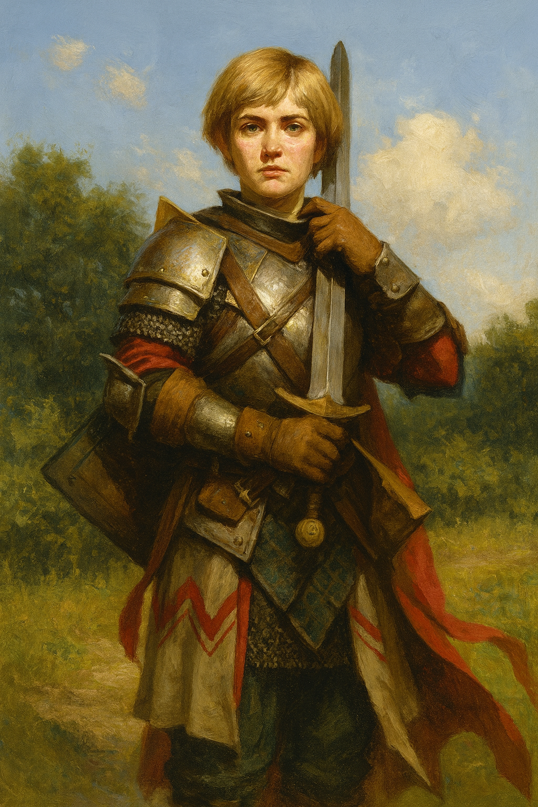

# Valerie

> [!side]
> :   Discovery Skills: Perception, Society, Warfare Lore
>     Influence Level: 3

*Steel-Clad Beauty · Devoted Sword · Unshakable Will*

Valerie is a tall, strikingly beautiful woman with piercing blue eyes and the posture of someone who has never backed down from a fight. She wears her armor like a second skin — always polished, always battle-ready — and speaks with poise, precision, and the kind of clipped formality only noble training or militant discipline can forge.

Once a devout champion of Shelyn, Valerie turned her back on faith after a crisis of conscience, choosing her own code over dogma. Since then, she has walked a narrow path of principle and pride, trusting only in steel, strategy, and her own convictions. She’s polite, unfailingly respectful, but has little tolerance for idle banter or nonsense — and even less for gods who demand unquestioning devotion.

Recently, Valerie was challenged to a duel by her former mentor, Sir Fredero Sinnet. She accepted — not out of pride, but out of duty — and though she lost the fight, she emerged from the encounter with a clearer sense of self. That same day, she and her companions uncovered a hag masquerading as a priestess of [Shelyn](../../../Rules/Deities/Shelyn.md), corrupting the shrine where the duel took place. Valerie was instrumental in slaying the creature and restoring truth to the sacred site, though she scoffed at the idea of divine gratitude.

Her armor bears the scars of that battle now, and her stance is steadier than ever. Valerie remains loyal to the Republic of Thumping Waters and continues to serve as one of its most dependable defenders — a bastion of strength in a land that constantly tests its heroes. She does not pray. But she protects. And that, for Valerie, is the only devotion that matters.

