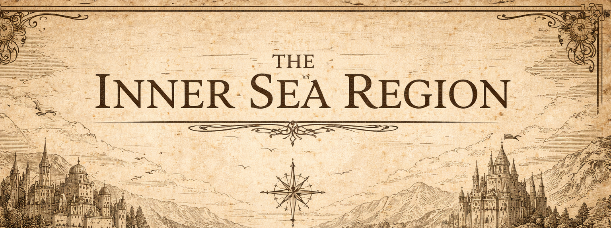

# Session 07: Stag Lord or Bust!!!

> [!side]
> :   
>
>
> ---
>
> <!-- session-gallery:start -->

### From [Linzi](../NPCs/Linzi.md)’s Journal

*An account of events from 3–11 Gozran, 4710 AR; begun at Oleg’s Trading Post and completed from the testimony of those who returned*

The Tubthumpers returned to Oleg’s on the third of Gozran carrying Tuskgutter’s head, which is the sort of entrance that makes everyone stop whatever they are doing—even at Oleg’s, where arriving covered in blood and carrying pieces of something enormous has become distressingly ordinary. They spent the following day resting, repairing their equipment, and speaking with those of us who had gathered at the trading post. After the head was presented and the promised reward collected, [Amiri](../NPCs/Amiri.md) admitted that they had won their wager. She gave them a fine enchanted dagger and told them to use it someday to kill something larger than themselves. Considering the company, I suspect she meant that quite literally.

There were conversations with [Octavia](../NPCs/Octavia.md), [Valerie](../NPCs/Valerie.md), [Tristian](../NPCs/Tristian.md), and me while preparations were made for the next expedition. Tristian agreed to accompany them. Their destination was no secret: they meant to find the [Stag Lord](../NPCs/Stag%20Lord.md)’s fortress and end his rule over the [Greenbelt](../../../Locations/Inner%20Sea%20Region/River%20Kingdoms/Stolen%20Lands/Greenbelt/Greenbelt.md). [Seamus](../Characters/Seamus.md) spoke about it with that calm certainty of his, as though storming a bandit stronghold were merely an unpleasant errand that someone sensible ought to finish. I remember watching him check his equipment and having the peculiar conviction that I was looking at someone who would either become a great hero or give everyone who cared about him a permanently unsettled stomach. Possibly both.

They departed on the fifth. Their first stop was [Bokken](../NPCs/Bokken.md)’s hut, where they delivered the fangberries he had requested. In return, Bokken supplied them with arsenic, a potion to ward against cold, and a stronger healing draught. The arsenic quickly became part of a plan involving poisoned liquor, deceit, and Seamus volunteering to walk alone into the Stag Lord’s fort. I understand why the others agreed to it. I would still like it entered into the record that I consider the entire idea appalling.

Before reaching the [Tuskwater](../../../Locations/Inner%20Sea%20Region/River%20Kingdoms/Stolen%20Lands/Greenbelt/Kamelands/Tuskwater/Tuskwater.md), they discovered the lair of a giant trapdoor spider in the [Rostland Hinterlands](../../../Locations/Inner%20Sea%20Region/Brevoy/Rostland%20Hinterlands.md). The spider was dispatched without much difficulty. Among the remains of its previous victims they found a dead bandit bearing another silver stag amulet. A mysterious map had been hidden in the man’s boot. Both discoveries offered further proof that the Stag Lord’s influence reached well beyond the walls of his fort.

Continuing southwest, the company surveyed two more stretches of wilderness. They found a rickety bridge, which [Mairi](../Characters/Mairi.md) promptly destroyed. I have heard several explanations for why this was necessary, none of which improved appreciably in the telling. Farther south they located a shallow ford, crossed the river, and finally came within sight of the Stag Lord’s stronghold on the northern shore of the Tuskwater.

The fort stood behind a high wooden palisade, surrounded on several sides by an ancient graveyard. The party decided that Seamus would approach openly while pretending to be a survivor from the defeated Thorn River camp. He carried the poisoned liquor and intended to lure some of the bandits away from the fort and into an ambush. The Stag Lord drank from the bottle, but the poison had no noticeable effect upon him. Worse, he gave no indication that he had detected it, leaving Seamus without even the comfort of knowing whether the attempt had succeeded.

Seamus then warned Akiros Ismort, the Stag Lord’s second-in-command, that dozens of armed warriors were only a few miles away. Rather than leading men out to investigate, Akiros concluded that his chances were better behind the fort’s walls. He thanked Seamus for the warning and brought him inside to recover from his supposed escape. Thus Seamus succeeded in entering the fortress and failed entirely to produce the bandits his companions were waiting to ambush.

Outside, Ally, [Ant](../Characters/Ant.md), Mairi, Pyjat, and Tristian waited until it became plain that the plan had gone wrong. They decided to rescue Seamus. The bandits paid less attention to the eastern, western, and southern approaches, so Tristian went toward the northern gate to create a distraction while the others circled around through the graveyard. There they discovered why those approaches were so poorly guarded: the dead surrounding the fort did not remain politely buried.

The fight through the graveyard cost them any hope of surprise. By the time the undead had been overcome, the fort was alerted. The company charged the palisade and then spent an awkward and dangerous interval discovering that climbing a fortified wall while people shoot at you is considerably more difficult than it sounds when described afterward. Tristian abandoned the northern approach and ran to rejoin them as the battle spread along the walls.

Inside the fort, Seamus had begun attempting something even more dangerous than infiltration: persuasion. He learned that Akiros had once been a paladin of [Erastil](../../../Rules/Deities/Erastil.md) and still carried the weight of his fall heavily. Seamus convinced him that opposing the Stag Lord might be the first step toward redemption. Akiros agreed to turn against his master and brought another bandit, Craggen, into the conspiracy. Craggen was killed before he could escape the consequences of that decision, but Akiros survived to make his choice count.

When the fighting began in earnest, Seamus killed Dovan of Nisroch, the Stag Lord’s vicious third-in-command. Akiros turned on his former comrades while the Tubthumpers fought their way into the fortress. Ant’s arrows crossed the courtyard, Ally’s magic broke through the defenders, and Pyjat and Tristian stood with them amid the chaos.

Then Seamus encountered the Stag Lord.

The bandit lord was a deadly archer even through the haze of drink and poison. He drove arrow after arrow into Seamus before the others could reach him, leaving him bleeding on the ground. The poison had failed, the deception had unraveled, and for a terrible moment it seemed that Seamus had gambled his life merely to die inside his enemy’s walls.

Mairi did not permit it.

She placed herself between her fallen nephew and the Stag Lord and surrendered herself to the wolf spirit’s fury. Her face lengthened into a lupine muzzle, her hands became claws, and she attacked with tooth and nail rather than steel. It was not the elegant duel later storytellers will undoubtedly make of it. It was furious, desperate, and close enough that every mistake drew blood. With Ally and Tristian supporting her, Mairi endured the Stag Lord’s attacks and tore through his defenses until at last the lord of the fort fell.

The Stag Lord died on the night of the eleventh of Gozran. The undead did not vanish in a flash of divine judgment, the fort did not burn dramatically into the lake, and no heavenly choir announced that the Greenbelt had been saved. There were only exhausted [Survivors](../../Abomination%20Vaults/Vignettes%20-%20Abomination%20Vaults/Survivors.md), wounded enemies, and the sudden understanding that the man who had terrorized the region would never rise again.

Seamus survived. I am writing that plainly because certain people tell this part of the story with entirely too much suspense. He survived, though he had been brought frighteningly close to death. When they returned and I saw him again, looking battered and insufferably pleased with himself, I very nearly struck him before remembering that heroes are traditionally welcomed home rather than throttled.

The Stag Lord’s death did not create a kingdom that night. A kingdom requires laws, homes, roads, arguments, taxes, and an astonishing number of meetings. But it made such a kingdom possible. Six adventurers and one repentant bandit broke the power that had held the northern Greenbelt in fear. I had suspected before that I was watching the beginning of something remarkable. After the night the Stag fell, I was certain of it.

*—Linzi*

## Session Gallery

            
<!-- session-gallery:end -->

## Article navigation

**Previous:** [Session 06- Introduction to World Anvil](Session%2006-%20Introduction%20to%20World%20Anvil.md)  
**Next:** [Session 08- Founding Day!](Session%2008-%20Founding%20Day%21.md)
