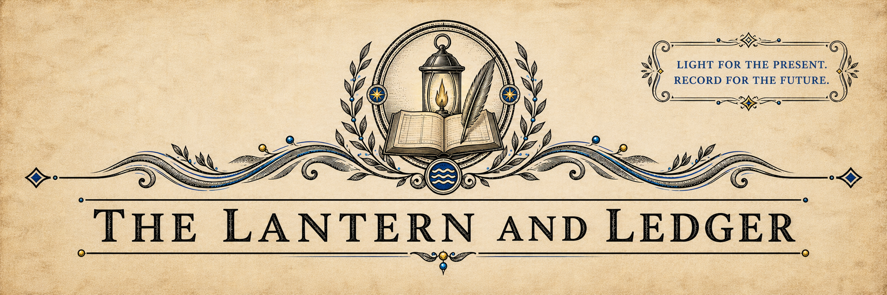

# Session 51: Storms on the Western Horizon

> [!side]
> :   
>
> ---
>
> ### RESTRICTED INTELLIGENCE REPORT
>
> *For council circulation only — Not for publication*
>
> *Compiled by the Ministry of Communication*
>
> #### Contact on Hemlock Island
>
> An animal messenger requested a clandestine meeting with the Tubthumpers upon Hemlock Island. The sender was Ilora Nuski, former leader of the River Razors and apparently the sole survivor of that company’s destruction.
>
> Nuski stated that the River Razors were destroyed after opposing King Irovetti’s plans. She has accepted conditional sanctuary within Thumping Waters in exchange for continued service as a scout and source of intelligence concerning Pitax.
>
> Nuski’s identity, survival, location, and cooperation have been omitted completely from the public edition. Disclosure would endanger both the source and future intelligence operations.
>
> #### Pitaxian Military Forces
>
> Nuski reports that Pitaxian forces are gathering throughout the region. These include regular soldiers, mercenary companies, hill giants, and flights of wyverns.
>
> One identified mercenary force is the Catspaws, commanded by a captain named Alasen. Further information concerning its strength, equipment, and present location is required.
>
> The hill giants encountered west of Lake Hooktongue identified Kob Moleg as a chieftain conscripting giants for war against Thumping Waters. Removing Moleg may disrupt Pitax’s ability to field further giant formations.
>
> #### Avinash Jurrg
>
> Nuski identified Avinash Jurrg as an oni warlord who remains close to King Irovetti and directs or coordinates Pitaxian military operations.
>
> Jurrg should be treated as a principal strategic target. His nature, capabilities, defenses, and command relationships require urgent investigation. Operations against Irovetti should assume that Jurrg may be present unless confirmed otherwise.
>
> #### Wyverns and Littletown
>
> Reports suggest that Littletown may have been abandoned, destroyed, or offered as feeding ground to secure the cooperation of Pitax’s wyverns. The exact facts remain unverified.
>
> If confirmed, the incident would demonstrate Irovetti’s willingness to sacrifice his own population for military advantage. Even if the most extreme version proves false, the rumor may be useful in undermining confidence in his government.
>
> Any propaganda based upon Littletown should avoid claims that cannot later be defended. Questions concerning Irovetti’s protection of his own citizens may prove more effective than a specific accusation presented without evidence.
>
> #### Arcane Threat Assessment
>
> The storm encountered during the western patrol was unquestionably magical and appeared to be directed. Its effects included targeted lightning, thunder bursts, and tornado-force winds capable of killing multiple mounts almost immediately.
>
> The Tubthumpers dispersed the phenomenon but did not identify its caster. No evidence presently connects the attack directly to Pitax, and Irovetti is not believed to possess magic of this magnitude personally.
>
> The attack may indicate an unidentified Pitaxian asset, an independent regional power, or a third party hostile to the republic. Until its source is known, army movements and senior officials traveling in exposed terrain should prepare for magical assault from extreme range.
>
> #### Recommended Actions
>
> Maintain Ilora Nuski’s cover and establish a secure means of receiving her future reports. Investigate Avinash Jurrg and the Catspaws. Locate Kob Moleg before additional giants can be recruited. Verify conditions at Littletown through independent reconnaissance. Seek expert analysis of the storm’s magical signature and likely origin.
>
> ---
>
> ---
>
> 
>
> *Paid advertisement. Coverage is subject to inspection, assessment, exclusions, deductibles, and the continued existence of both the insured property and the Thumpington Mutual Assurance Society.*
>
> ---
>
> ---
>
> <!-- session-gallery:start -->

### THE LANTERN AND LEDGER

*News, Notices, and the Public Record of Thumping Waters*

Erastus 14, 4714 AR • Published in Thumpington • Linzi, Editor • Mara Venn, Managing Editor • Price 1 cp

---

## MURDEROUS STORM STRIKES WESTERN FRONTIER

*Tubthumpers survive targeted lightning and tornado winds as the search for Pitax’s armies continues.*

*By Darya Holt, Traveling Correspondent • Additional reporting by Linzi*

---

A violent and apparently unnatural storm attacked the Tubthumpers during their reconnaissance of the western frontier, killing their mounts and subjecting the company to lightning, thunder, and tornado-force winds.

The tempest descended without ordinary warning. Witnesses report that its lightning struck with uncanny precision and that funnels of wind formed around the travelers as though directed by an unseen hand. The Tubthumpers survived and ultimately dispersed the storm, but its creator remains unidentified.

*The Tubthumpers endure the unnatural tempest in an artist’s reconstruction of the attack.*

**WESTERN FRONTIER BULLETIN**

**Pitaxian invasion trail:** Located and followed west

**Hill-giant bandits:** Defeated; stolen property reclaimed

**Enemy organizer identified:** Kob Moleg

**Flooded silver mine:** Located; engineering survey required

**Unnatural storm:** Dispersed; source unknown

**Mounts:** Lost during the storm

#### Inside This Edition

**The Mammoth Trail**

Tracks left by the defeated invaders reveal their route across an ancient bridge and into the western hills.

**Bandits in the Cave**

Three hill giants are discovered among the wreckage of plundered merchant wagons.

#### News of the Republic

**Silver Beneath the Water**

A flooded mine may become a valuable national resource if its workings can be reclaimed.

**A Gift for Varnhold**

A noble benefactor offers to finance a new monument or public park.

---

### THE MAMMOTH TRAIL

*By Darya Holt, Traveling Correspondent*

Following the destruction of the invading force near Willowfen, the Tubthumpers returned to the battlefield and began tracing the mammoths’ route westward.

*Mammoth tracks cross the ancient stone bridge used by the invading army.*

The tracks led to an immense stone bridge spanning a deep gorge beyond Lake Hooktongue. Ancient and masterfully engineered, the structure carried the enemy’s mammoths safely across terrain that might otherwise have slowed or divided the invasion.

Beyond the bridge, the trail continued into the hills. There the explorers found several merchant wagons wrecked outside the mouth of a cave. Their cargo had been taken and their remains left scattered around the entrance.

The mammoth tracks eventually turned south toward Fort Drelev before growing too faint to follow. The Tubthumpers continued surveying the surrounding country for hidden roads, hostile camps, and further enemy movement.

---

### BANDITS IN THE CAVE

*By Darya Holt, Traveling Correspondent*

Three hill giants occupied the cave beside the ruined wagons. The giants attacked when the Tubthumpers entered, and the response was immediate.

One giant was killed in the fighting. Another fled. Their wounded leader dropped his club and surrendered after the company’s opening assault made the likely result unmistakable.

> We are on the same side. We are on the same side!
>
> — Ally Grainger, during an unusually forceful attempt at diplomacy

Questioning revealed that the giants had turned to banditry while hiding from a more powerful chieftain named Kob Moleg. Moleg is reportedly gathering hill giants for a campaign against Thumping Waters.

The surviving bandits were expelled from the region, and the stolen goods were reclaimed. Officials have not published an inventory while efforts continue to identify the property’s rightful owners.

### SILVER BENEATH THE WATER

*By Sella Copperclaw, Civic Reporter*

Surveyors accompanying the western reconnaissance located a flooded silver mine in the hills.

The mine’s workings cannot be safely used in their present condition. Water must be removed, damaged passages stabilized, and the site examined by qualified engineers before any estimate of its production can be trusted.

If the mine can be reclaimed, it may provide employment, trade, and a substantial new source of revenue for the republic. Until then, citizens are strongly discouraged from attempting independent prospecting, salvage, or any plan beginning with the phrase “I know a shortcut.”

### A GIFT FOR VARNHOLD

*By Mara Venn, Managing Editor*

During the council’s latest business, a noble benefactor offered to finance a monument or public park in Varnhold.

The final form and location of the gift remain under consideration. Proposals should honor Varnhold’s history, serve its residents, and require no magical containment procedures.

---

### A HORSE WITH NEWS

*By Tobin Bramblefoot, Games and Society Correspondent*

*Windchaser shares news gathered during his travels across the western country.*

The Tubthumpers’ western travels produced an unexpected acquaintance: Windchaser, a wandering horse capable of speaking with remarkable clarity and considerably more sense than many travelers encountered upon the road.

Windchaser shared stories gathered across the plains and distant slopes. He spoke of the black dragon Ilthuliak in the skies, a mammoth guardian called Hill Stomper in the north, strange powers within the Thousand Voices, and whispered tales of a ruin called the Castle of Knives.

These accounts have not all been independently confirmed. Readers are advised that a talking horse may still repeat a rumor, though he generally improves it in the telling.

---

### THE SKY BECAME A WEAPON

*By Darya Holt, Traveling Correspondent*

The unnatural storm struck as the Tubthumpers continued their frontier survey. Lightning fell with lethal accuracy. Thunder burst around the company, and violent winds tore across the ground until twisting funnels formed among the travelers.

The first assault killed the party’s mounts almost immediately. The Tubthumpers endured the remaining fury on foot, working to survive the storm while seeking some means to break its power.

They succeeded. The tempest dispersed before it could kill the company, leaving a scarred stretch of frontier, dead animals, and no visible enemy to answer for the attack.

No ordinary weather behaves in this manner. Whether the storm was sent by Pitax or by some other power remains unknown. Until its source is found, travelers along the western border should treat sudden changes in the sky as a possible attack and seek substantial shelter without delay.

---

### FROM THE EDITOR’S DESK

*By Linzi, Editor and Minister of Communication*

King Irovetti’s first invasion failed, but its trail remains written across our country in mammoth tracks, wrecked wagons, frightened settlements, and graves.

Now another enemy has used the sky itself as a weapon. We do not yet know whose hand directed that storm. We know only that the Tubthumpers survived it and that the search for the truth continues.

A republic cannot promise its people that danger will never cross the border. It can promise that every trail will be followed, every warning examined, and every attack entered into the public account.

The western horizon is dark. We will keep the lantern lit.

—Linzi, Minister of Communication

---

The Lantern and Ledger • Erastus 14 Edition • Printed in Thumpington

## Session Gallery

                       
<!-- session-gallery:end -->

## Article navigation

**Previous:** [Session 50- Silver Overall, Steel at the Border](Session%2050-%20Silver%20Overall%2C%20Steel%20at%20the%20Border.md)  
**Next:** [Session 52- The Abbey of Broken Bells](Session%2052-%20The%20Abbey%20of%20Broken%20Bells.md)
