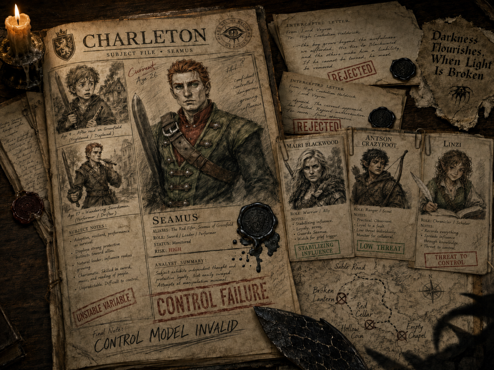

# The "Charleton" File

> [!side]
> :   

## Volantris Internal Archive

### Subject Dossier: Charleton

**Archive Classification:** Black Scale  
**Distribution:** Senior handlers only  
**Subject:** Seamus  
**Primary Designation:** CHARLETON  
**Other Designations:** The Fifer, Rostland Blade, Legionnaire, Minister  
**Origin:** Rural holding outside Restov  
**Current Affiliation:** Republic of Thumping Waters  
**Current Position:** Minister of Intelligence  
**Current Status:** **DORMANT**  
**Control Viability:** **UNDER REVIEW**  
**Standing Order:** Observe. Do not terminate without direct authorization.

> *A sharpened blade need not know whose hand directs it.*

---

### I. Initial Assessment

The subject demonstrated unusual persistence from an early age. Once committed to a goal, he excluded competing obligations and continued despite pain, exhaustion, or contrary advice.

His attachment to swordplay was established before his tenth year. His father, Mikhail, incurred financial obligations to secure the boy’s instruction. Mikhail was approached regarding revised terms and refused.

#### Handler’s Note

> The father possesses an inconvenient degree of moral certainty. He believes the boy’s future belongs to the boy.  
>   
> This belief could not be corrected through negotiation.

---

### II. The First Tree

A juvenile witness discovered Volantris activity near the knotted darkwood outside the family residence.

Reyoknar resolved the exposure personally.

The subject followed the witness into the woods and observed enough of the termination to establish a lasting fixation. He remained beyond immediate reach.

No pursuit was made.

The residence was burned.

Mikhail was recovered alive.

The subject’s sword and musical instrument were removed from the house before ignition and placed where he would locate them.

#### Operational Reasoning

> The sword would preserve direction.  
>   
> The instrument would preserve identity.  
>   
> The boy would require both.

#### Result

The subject survived and was taken in by Mairi Blackwood and Euan.

**This intervention was not anticipated.**

---

### III. Foundational Interference: Mairi Blackwood

**Classification:** Stabilizing influence  
**Threat to Control:** Severe  
**Direct Action:** Prohibited without Reyoknar’s authorization

Blackwood provided the subject with shelter, discipline, affection, and a replacement family structure following the first operation.

Her intervention prevented the subject from becoming wholly dependent upon the pursuit of Reyoknar. The subject may reject Blackwood’s advice, but continues to treat her judgment as morally significant.

#### Assessment

> Blackwood taught the subject that survival could itself be an act of defiance.  
>   
> This lesson has proven difficult to remove.

---

### IV. Paternal Status

Mikhail survived the destruction of the residence.

He was retained as a controlled asset and transferred among multiple Volantris holdings. No single cell was permitted to maintain custody for an extended period.

The subject was not informed whether Mikhail lived.

#### Standing Policy

Confirmation of Mikhail’s survival was not authorized.

> A living father creates an objective.  
>   
> A dead father creates a grievance.  
>   
> An uncertain father creates pursuit.

Rumors regarding Mikhail were to remain credible, contradictory, and impossible to confirm.

#### Approved Claims

- A prisoner matching Mikhail’s description had been seen in transit.
- Mikhail had died during questioning.
- Mikhail had escaped and assumed another name.
- Mikhail had been sold to foreign interests.
- Mikhail had willingly entered Reyoknar’s service.
- Reyoknar alone knew the truth.

**No claim was to be supported by definitive evidence.**

---

### V. Intercepted Correspondence

Mikhail attempted to contact the subject on numerous occasions.

**None of these messages were released.**

#### Intercepted Letter: Year One

> Seamus,  
>   
> I am alive. I do not know where they have taken me or how long I will remain here.  
>   
> You were a child. None of this was your fault.  
>   
> Do not give your life to the man who did this.  
>   
> Your father

**Disposition:** REJECTED  
**Reason:** Confirms survival. Reduces uncertainty.

#### Intercepted Letter: Year Four

> Seamus,  
>   
> They speak about you when they think I am sleeping.  
>   
> They say you are searching.  
>   
> Stop.  
>   
> Whatever they tell you, whatever trail they leave, ask yourself why they wanted you to find it.  
>   
> I would rather remain here than know you became their weapon.

**Disposition:** REJECTED  
**Reason:** Identifies operational method.

#### Intercepted Letter: Year Seven

> I heard one of them call you Charleton.  
>   
> I do not know that man.  
>   
> I remember a boy who practiced until his hands blistered and lied about the pain because he wanted me to believe the lessons were worth their cost.  
>   
> That boy owes me nothing.

**Disposition:** REJECTED  
**Reason:** Reinforces original identity. Discourages pursuit.

#### Intercepted Letter: Year Eleven

> They say you have become a soldier.  
>   
> I hope that means you found people worth standing beside, not merely enemies worth pursuing.  
>   
> I hope someone has taught you that courage is not the same thing as chasing whatever frightens you.  
>   
> I hope you are alive.

**Disposition:** REJECTED  
**Reason:** Encourages external attachments.

#### Intercepted Letter: Year Fifteen

> Seamus,  
>   
> If you have stopped looking, do not be ashamed.  
>   
> If you have found a home, remain there.  
>   
> If you have found people who love you, believe them.  
>   
> I have never blamed you.  
>   
> Not for one day.

**Disposition:** REJECTED  
**Reason:** Threatens primary control mechanism.

---

### VI. Daggermark Period

The subject departed Blackwood’s household during adolescence and entered Daggermark in pursuit of Volantris activity.

He was inexperienced, visible, and easily monitored.

He discovered a message reading:

> **Darkness Flourishes, When Light Is Broken.**

The message was placed where he would find it.

The meeting beyond the knotted darkwood had been relocated before his arrival.

#### Handler’s Annotation

> He still believes he stole this.

#### Assessment

The subject interpreted failure as evidence that he had arrived moments too late. This encouraged continued pursuit without revealing that the trail had been prepared for him.

---

### VII. The Charleton Identity

During his wandering years, the subject adopted the name “Charleton,” apparently as a humorous corruption of charlatan.

**Designation approved.**

The identity encouraged separation between the frightened child and the increasingly useful adult.

The subject financed himself through public performance, theft from patrons, fraudulent wagers, sale and transportation of stolen property, burglary, and selective robbery.

The subject demonstrated reluctance to harm uninvolved civilians. This moral limitation reduced the available targets but improved predictability.

#### Operational Assessment

> The subject can be directed against almost any target if that target is presented as cruel, corrupt, or connected to Mikhail’s disappearance.  
>   
> He prefers to believe his violence is righteous.  
>   
> This preference is exploitable.

---

### VIII. Port Ice and Legion Service

The subject was arrested in Port Ice for trafficking stolen goods across the Lake of Mists and Veils.

Local officials were encouraged to offer military service in place of extended imprisonment.

#### Purpose

Legion service was expected to:

- Improve the subject’s martial ability.
- Legitimize his travel.
- Expand the territory in which he could operate.
- Place him near hostile or expendable Volantris assets.
- Provide discipline without eliminating aggression.

#### Military Assessment

The subject performed well under immediate danger and poorly under uncertainty.

He inspired loyalty through confidence, humor, and visible personal risk. He frequently assumed danger personally rather than delegate it.

A credible lead concerning Mikhail or Reyoknar could override military obligations, personal safety, and strategic judgment.

---

### IX. Associated Individual: Antson Crazyfoot

**Classification:** Stabilizing influence  
**Operational Risk:** High  
**Recommended Action:** Observe. Do not remove without authorization.

Antson Crazyfoot accompanied the subject during portions of his Legion service and several unauthorized investigations.

He witnessed the subject in states of intoxication, fixation, uncontrolled anger, and despair.

Crazyfoot encouraged reckless behavior in controlled social settings but opposed pursuit when the subject’s judgment became visibly compromised.

#### Assessment

Crazyfoot’s presence reduced the subject’s isolation.

His death might destabilize the subject but would risk making him uncontrollable.

Continued observation was preferred.

---

### X. Directed Operations

The subject was repeatedly guided toward selected targets through rumors concerning Mikhail or Reyoknar.

The subject was never informed that the information originated with Volantris.

#### Operation: Broken Lantern

**Bait:** A discharged guard claimed that a Rostlander matching Mikhail’s description had been held beneath a warehouse.  
**Actual Target:** Volantris quartermaster suspected of withholding funds.  
**Truth of Claim:** Fabricated.  
**Result:** The subject located and killed the quartermaster. Secondary agents recovered the records after his departure.  
**Assessment:** Successful.

#### Operation: Hollow Coin

**Bait:** A prisoner manifest listed “M. S—, male, Restov hinterlands.”  
**Actual Target:** Independent traffickers disrupting Volantris routes across the Lake of Mists and Veils.  
**Truth of Claim:** Fabricated.  
**Result:** The trafficking operation was dismantled. Several minor members survived.  
**Assessment:** Useful but incomplete.

#### Operation: Red Cellar

**Bait:** A former Nightbat adherent claimed to have personally seen Mikhail alive.  
**Actual Target:** A Nightbat cell preparing to abandon Volantris.  
**Truth of Claim:** Partially accurate. The informant had guarded Mikhail years earlier. His information regarding Mikhail’s current location was false.  
**Result:** The subject and Crazyfoot killed or scattered the defecting cell.  
**Assessment:** Excellent.

> Genuine information should be incorporated periodically to maintain credibility.

#### Operation: Empty Chapel

**Bait:** Rumor that Reyoknar met with intermediaries beneath an abandoned shrine.  
**Actual Target:** A broker who had begun selling Volantris names to Daggermark authorities.  
**Truth of Claim:** Reyoknar had not visited the site.  
**Result:** Broker killed. Records destroyed before the subject arrived.  
**Assessment:** Successful.

The subject interpreted the destroyed records as another near miss.

#### Operation: Stranger Ascendant

**Bait:** Direct invitation issued under Reyoknar’s authority.  
**Purpose:** Test the subject’s mature combat ability, fixation, and response to possible confirmation of Mikhail’s survival.  
**Result:** The subject penetrated outer security, killed designated intermediaries, and confronted Reyoknar’s assumed form.

The subject inflicted an unexpected injury.

Reyoknar withdrew.

Three witnesses were terminated afterward.

#### Revised Assessment

The subject exceeded projected lethality.

Future direct contact was discouraged.

#### Annotation in Black Ink

> He has learned to bite the hand.  
>   
> Good.

---

### XI. Reward and Withdrawal

The subject received an honorable discharge and the Brevoy Medal of Valor.

Public recognition restricted his ability to continue operating as a conventional criminal.

The subject gradually ceased active pursuit.

Alcohol consumption increased temporarily. He later developed political, academic, and administrative interests.

#### Initial Recommendation

> Introduce a new rumor regarding Mikhail.

#### Reyoknar’s Response

> No.  
>   
> Observe what he builds without direction.

---

### XII. The Republic of Thumping Waters

The subject joined the expedition that founded the Republic of Thumping Waters.

He transformed personal charisma and battlefield experience into institutional authority.

He acquired political legitimacy, military allies, intelligence resources, wealth, public loyalty, trusted companions, and a permanent home.

Previous activation methods became increasingly dangerous.

> A false lead could no longer be expected to draw only one grieving swordsman.  
>   
> **It could mobilize a nation.**

#### Threat Assessment

**Extreme if confronted directly.**

Manageable only through emotional redirection.

---

### XIII. Associated Individual: Linzi

**Initial Classification:** Chronicler and political subordinate  
**Revised Classification:** Primary emotional attachment  
**Threat to Control:** High  
**Recommended Action:** Continued observation

The subject demonstrates unusual honesty in Linzi’s presence.

Linzi consistently reframes the subject’s history as a life continuing beyond the original injury. She encourages him to distinguish remembrance from obligation and has become a significant influence upon his willingness to remain disengaged from the pursuit.

Their relationship appears mutually reinforcing.

The subject permits Linzi to witness uncertainty he conceals from others. He does not appear to perform courage for her.

Direct action against Linzi is not recommended. Harm to her would likely reactivate the subject, but the resulting response would be indiscriminate, politically supported, and difficult to redirect.

#### Handler’s Observation

> She has not persuaded him to forget.  
>   
> She has taught him that remembering does not require obedience.

---

### XIV. Other Current Associates

#### Ally

**Classification:** Strategic and magical threat

Capable of converting personal information into coordinated state action. Likely to test evidence through magical and mundane means before permitting the subject to act upon it.

**Recommendation:** Any information intended for the subject must withstand scrutiny.

#### Fitzroy

**Classification:** Protective influence

Likely to prioritize the recovery of captives and the protection of companions over pursuit of fleeing handlers.

**Recommendation:** Do not rely upon divided loyalties. Fitzroy is more likely to expand the scope of a rescue than prevent one.

#### Matteo

**Classification:** Investigative threat

Difficult to deceive through conventional criminal methods. Likely to identify staged evidence, false routes, compromised locks, and deliberate omissions.

**Recommendation:** Where deception is necessary, employ genuine evidence arranged to support a false conclusion.

#### Elowyn

**Classification:** Unresolved variable

Demonstrates resistance to intimidation, strong protective instincts, and a willingness to pursue retreating agents.

Available observations remain insufficient for reliable prediction.

---

### XV. Subject Control Model

**Primary Motivation:** Determine Mikhail’s fate  
**Secondary Motivation:** Punish Reyoknar  
**Core Fear:** Mikhail remained alive and suffering while the subject abandoned the search  
**Core Shame:** Failure to protect his family  
**Primary Instrument:** Uncertainty  
**Predictable Response:** Pursues credible leads before they disappear  
**Behavioral Pattern:** Assumes personal responsibility and advances ahead of support  
**Operational Limitation:** Increasing willingness to rely upon companions  
**Long-Term Risk:** Subject may cease to regard pursuit as an obligation

---

### XVI. Current Assessment

The subject has entered a prolonged dormant state.

He has acquired political authority, trusted companions, public legitimacy, and a permanent home. These attachments have reduced the effectiveness of conventional activation methods.

The question of Mikhail’s fate remains unresolved.

This uncertainty remains viable, but future use must account for the possibility that the subject will no longer pursue a lead alone.

Repeated fabrication is not recommended.

The subject now possesses access to magical divination, professional investigators, government intelligence, and companions capable of examining evidence without sharing his emotional urgency.

Any information intended to reactivate the subject must therefore be genuine enough to survive scrutiny.

> It need not be complete.

---

### XVII. Archival References

The following obsolete designations appear repeatedly in earlier operational records:

- Broken Lantern
- Hollow Coin
- Red Cellar
- Empty Chapel
- Black Orchard
- Saint Orra’s Rest
- Northglass

Records associated with these designations are incomplete. Several sites have been abandoned, reassigned, or destroyed.

Additional controlled subjects are referenced by designation only:

- ORPHAN GLASS
- ASH HOUND
- LITTLE SAINT
- BRIDE WITHOUT A FACE
- WOLF PRINCE
- CHARLETON

Beside CHARLETON appears the notation:

> **Most successful.**

A second hand later added:

> **Most disappointing.**

---

### XVIII. Handler’s Note

> The subject believes that because he stopped following the road, he chose where it ended.  
>   
> He is mistaken.  
>   
> The road was never abandoned.  
>   
> **It was only permitted to grow quiet.**

## Supplemental Intelligence Report

**Prepared by:** Linzi  
**Subject:** Review of the Charleton Dossier  
**Classification:** Internal — Republic of Thumping Waters

---

### Summary

I have reviewed the recovered Charleton dossier in full. For clarity, this report will use the name **Seamus**. The designation “*Charleton*” appears throughout the file as part of Volantris’s effort to reduce a person to an operational asset, and I see no reason to continue that practice.

The dossier confirms that Seamus was observed, misled, and deliberately directed toward selected targets over a period of many years. Volantris concealed Mikhail’s survival because uncertainty was considered more useful than either grief or hope. Its own summary states:

> A living father creates an objective. A dead father creates a grievance. An uncertain father creates pursuit.

The analysis is precise. **The method is monstrous.**

---

### Findings

Volantris did not merely withhold information. It maintained a controlled state in which Seamus could neither mourn his father nor believe with confidence that he might still be saved. Rumors were introduced when useful, contradicted when necessary, and withdrawn before they could be confirmed. Several operations used information concerning Mikhail or Reyoknar to direct Seamus against defectors, rivals, and other inconvenient targets.

The reports consistently describe death as a result, grief as leverage, and friendship as interference. This language should not be mistaken for objectivity. **It is cruelty written in a tidy hand.**

#### Mikhail’s Letters

The file contains multiple letters written by Mikhail during his captivity. None were delivered. Each was rejected because it might reassure Seamus, expose the manipulation, or encourage him to build a life beyond the search. Mikhail has confirmed that the letters are genuine.

Their inclusion in the recovered dossier was not an administrative mistake or an act of honesty. Volantris withheld them when they might have comforted Seamus, then revealed them when reading them would cause the greatest possible pain.

---

### Assessment of the Document

The dossier appears substantially authentic, but it is not an impartial archive. Reyoknar intended Seamus to recover it. Its contents were selected with that purpose in mind, and every disclosure must therefore be considered both evidence and provocation.

The file attempts to persuade Seamus that every choice he made was anticipated, every relationship was measured, and every road remained under Reyoknar’s control. The evidence supports extensive surveillance and deliberate interference. It does not support Reyoknar’s claim to authorship over Seamus’s life.

> **Volantris repeatedly confused observation with ownership.**

---

### Associated Individuals

The organization understood that love, friendship, duty, and belonging weakened its influence over Seamus. It therefore classified Mairi Blackwood as “*foundational interference*,” Antson Crazyfoot as a “*stabilizing influence*,” and me as a “*threat to control*.”

These assessments are accurate, although not in the manner intended.

The dossier’s central error was its belief that Seamus’s attachments made him more vulnerable. In fact, they made him less isolated. Volantris expected a sufficiently powerful threat to force him to choose between his father and the life he had built. It failed to account for the possibility that his companions would go with him.

---

### Assessment of Seamus

Seamus was not manipulated because he was weak. **He was manipulated because he cared.** He believed his father might still be alive and that ignoring a lead could mean abandoning him. Volantris exploited that belief repeatedly.

The dossier also attempts to separate Seamus from the identity of Charleton, as though the latter were a creation owned by the organization. I reject that conclusion. Charleton was a name Seamus used while surviving what Volantris had done to him.

The claim that his sword and fife were deliberately preserved is especially revealing. Volantris believed the sword would preserve direction and the fife would preserve identity. It appears to have mistaken intention for ownership.

> A sword left to create a weapon may still defend a kingdom.  
>   
> A fife left to preserve grief may still be played at a victory festival.

---

### Operational Outcome

The events following recovery of the dossier clarify its intended purpose. Reyoknar expected the file, Mikhail’s captivity, and the uncertainty surrounding his fate to restore the old pattern: Seamus would pursue, isolate himself, and become Charleton again.

**That did not occur.**

Seamus followed the trail, but he did not follow it alone. His companions rescued Mikhail, preserved evidence, and forced Reyoknar to abandon the identity she had used against him. The operation failed because Volantris continued to treat loyalty as a weakness rather than a source of coordinated action.

---

### Risk Assessment and Recommendations

Seamus may experience guilt concerning those targeted during the directed operations described in the file. Each operation should be investigated separately. The dossier proves manipulation, but it does not establish that every target was innocent.

Seamus should be given the truth where it can be found, but he should not be encouraged to accept responsibility for decisions made by Ilthuliak and her agents. There is a difference between accepting responsibility for one’s actions and accepting someone else’s blame.

All operational names, routes, and coded references should be investigated, but the file itself warns that many listed sites are obsolete, reassigned, or destroyed. No entry should be treated as current without independent confirmation.

Mikhail should be consulted only when he chooses and should be treated first as a rescued prisoner and a father, not as an intelligence resource. The intercepted letters should be returned to Mikhail and Seamus. **They belong to them, not to an archive.**

Seamus should not be placed under further covert observation on the assumption that he may return to old patterns. Any concern regarding his judgment should be addressed openly by people he trusts.

**He has been watched enough.**

---

### Final Assessment

The dossier is valuable intelligence. It is also one final attempt to tell Seamus what his life means.

The file records his grief, observes his relationships, and claims credit for every decision that followed the destruction of his home. Observation is not authorship. Manipulation is not ownership.

> Volantris mistook grief for a chain, love for leverage, and a life for a weapon.

**That conclusion is rejected.**

### Seamus was never theirs.

---
